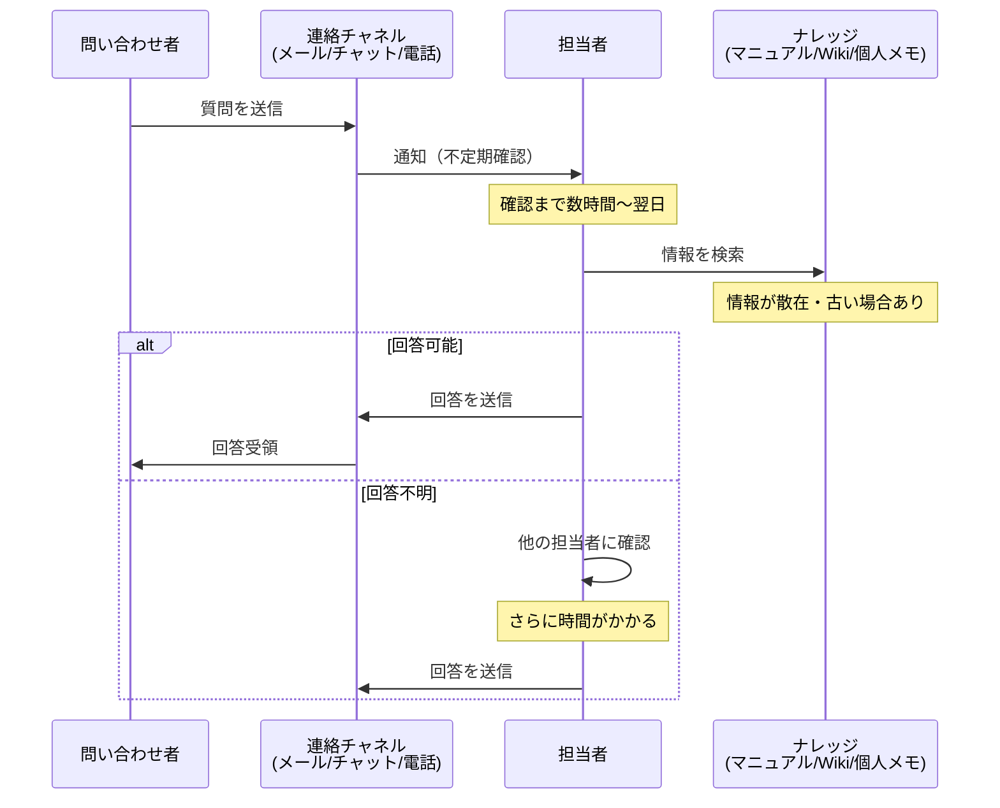
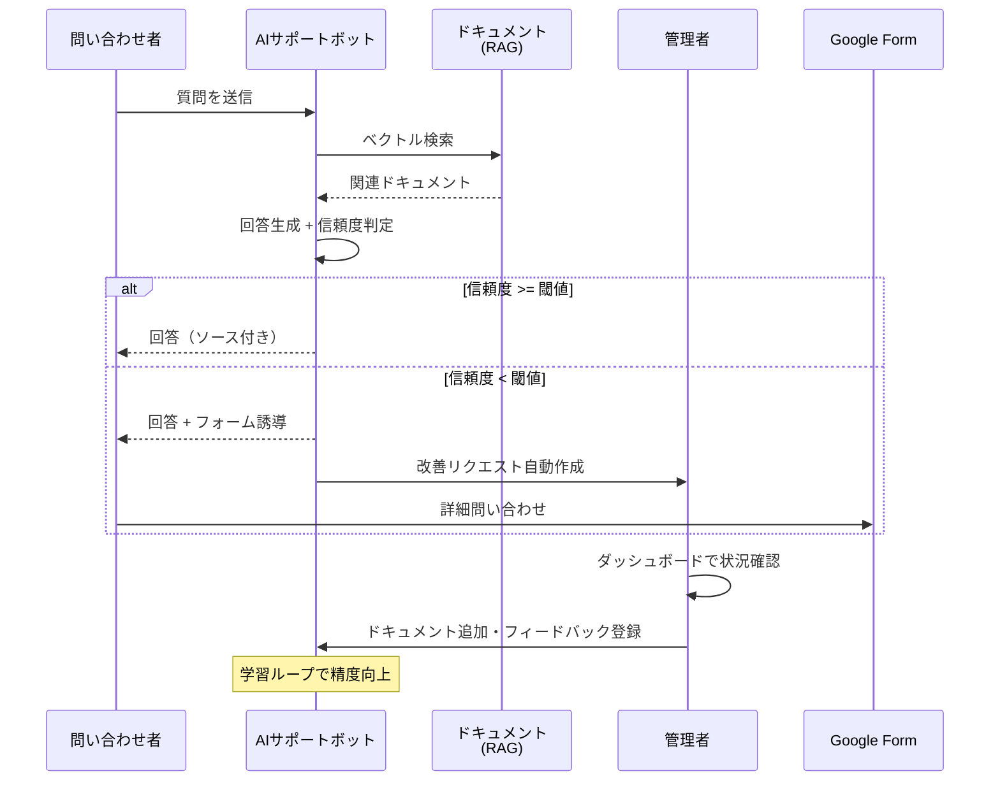

# 問い合わせ対応業務フロー

## 現状の業務フロー（AS-IS）

### 時系列フロー

### 各ステップの入出力

| ステップ | 入力 | 処理 | 出力 | 問題点 |
|---------|------|------|------|--------|
| 質問送信 | テキスト質問 | メール/チャット送信 | 問い合わせ記録 | チャネルが分散、統一管理されない |
| 通知確認 | 通知 | 担当者の手動確認 | 認知 | 確認漏れ・遅延が発生 |
| 情報検索 | 質問内容 | マニュアル・Wiki検索 | 関連情報 | 情報が散在、検索が困難 |
| 回答作成 | 関連情報 | 担当者が文章作成 | 回答テキスト | 品質が担当者に依存 |
| 回答送信 | 回答テキスト | チャネルで返信 | 対応完了 | 回答が記録として蓄積されない |

### 発生している非効率・ミス・ストレス

1. **時間の非効率:** 同じ質問に何度も回答（推定30-50%が既出の質問）
2. **品質のばらつき:** 担当者の知識・経験に依存し、回答の正確性に差がある
3. **知識の消失:** 退職・異動で蓄積された知見が失われる
4. **対応の遅延:** 営業時間外は対応不可。繁忙期はさらに遅延
5. **改善の停滞:** どの質問が多いか、何が問題かのデータがない

---

## 目標の業務フロー（TO-BE）

### 時系列フロー

### 改善効果

| 現状の問題 | TO-BE での解決 |
|-----------|---------------|
| 回答待ち時間（数時間〜翌日） | 即時回答（3-5秒） |
| 品質のばらつき | ドキュメントベースの一貫した回答 |
| 知識の属人化 | ドキュメントとして組織資産化 |
| 24/7対応不可 | 24時間365日稼働 |
| 改善サイクル欠如 | ダッシュボード・週次レポートによるデータドリブン改善 |
