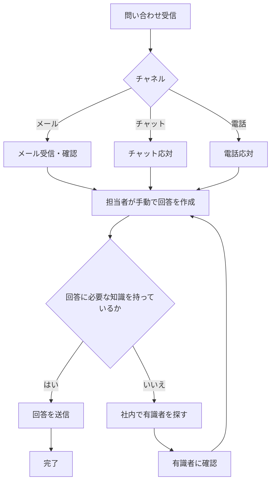
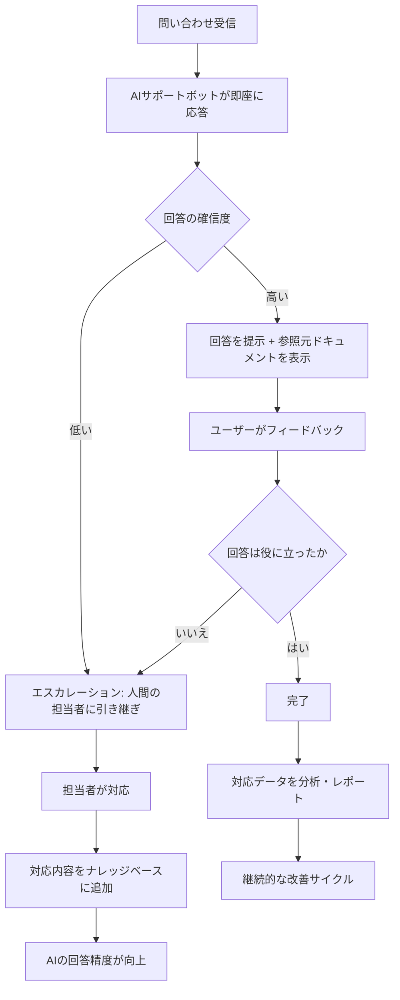

# Phase 0: 現状把握と目標設定

## 1. 顧客の業界と事業内容

- **業界:** IT/SaaS
- **事業内容:** 組織向けAIサポートボットサービスの開発・提供
- **対象顧客:** 社内外の問い合わせ対応業務を持つ組織（企業のカスタマーサポート部門、社内ヘルプデスク、自治体窓口など）
- **提供価値:** 組織が保有するドキュメント（マニュアル、FAQ、手順書など）を活用し、AIが即座に正確な回答を提供するサポートボットを構築・運用するプラットフォーム

## 2. 顧客業務の現状

### 現在の問い合わせ対応フロー

### 現状の課題

| 課題ID | 課題               | 詳細                                                                         |
| ------ | ------------------ | ---------------------------------------------------------------------------- |
| C-1    | 対応コストの増大   | 問い合わせ件数の増加に比例して人的コストが増加。スケーラビリティがない       |
| C-2    | 回答品質のばらつき | 担当者の知識・経験に依存し、同じ問い合わせに対して異なる回答が返される       |
| C-3    | 知識の属人化       | 特定の担当者にしか分からない知識が多数存在。退職・異動で知識が失われるリスク |
| C-4    | 情報の散在         | マニュアル、FAQ、過去の対応履歴が複数のシステム・フォーマットに分散          |
| C-5    | 改善サイクルの欠如 | 対応内容の分析・フィードバックが行われず、同じ問い合わせが繰り返される       |
| C-6    | 24時間対応の不在   | 営業時間外の問い合わせに対応できず、顧客満足度の低下や機会損失が発生         |

### 現状の運用体制

- **対応チャネル:** メール、チャット、電話
- **対応者:** カスタマーサポート担当者（人数は組織により異なる）
- **対応時間:** 営業時間内（平日9:00-18:00が一般的）
- **ナレッジ管理:** 各担当者の個人メモ、共有ドライブ上のドキュメント（更新頻度低）
- **品質管理:** 定期的なレビューなし、エスカレーションルールは属人的

## 3. 理想の姿

### 理想の問い合わせ対応フロー

### 理想状態の特徴

- **即時応答:** 24時間365日、問い合わせに対して即座にAIが回答を提供
- **一貫した品質:** 組織のドキュメントに基づく統一された回答品質
- **知識の集約:** 散在する情報がナレッジベースとして一元管理
- **継続的改善:** 対応データの分析に基づく回答精度の向上サイクル
- **スケーラビリティ:** 問い合わせ件数の増加に対してコストが線形に増加しない
- **透明性:** 回答の根拠（参照元ドキュメント）が明示され、信頼性を担保

## 4. 直近の目標地点（MVP）

### MVP の定義

**ドキュメントベースのRAGチャットボット + 管理者ダッシュボード**

### MVP に含める機能

| 機能                     | 説明                                                                     | 優先度 |
| ------------------------ | ------------------------------------------------------------------------ | ------ |
| ドキュメントアップロード | 管理者が組織のドキュメント（PDF、Word、テキスト等）をアップロード        | 必須   |
| ドキュメント処理         | アップロードされたドキュメントをチャンク分割・ベクトル化・インデックス化 | 必須   |
| チャットインターフェース | エンドユーザーが質問を入力し、回答を受け取るUI                           | 必須   |
| RAG回答生成              | 質問に関連するドキュメントを検索し、LLMで回答を生成                      | 必須   |
| 参照元表示               | 回答の根拠となったドキュメントの参照元を表示                             | 必須   |
| 確信度表示               | 回答の確信度を表示し、低い場合はエスカレーションを促す                   | 必須   |
| 会話履歴                 | 管理者が過去の会話を閲覧・分析できるダッシュボード                       | 必須   |
| FAQ管理                  | 頻出の質問と回答をFAQとして管理・公開                                    | 重要   |
| レポート                 | 問い合わせ傾向、回答精度などのKPIレポート                                | 重要   |

### MVP で含めない機能（将来対応）

- 複数チャネル統合（Slack、Teams、LINE等）
- 多言語対応
- 音声対応
- 外部システム連携（CRM、チケットシステム等）
- 高度なワークフロー自動化
