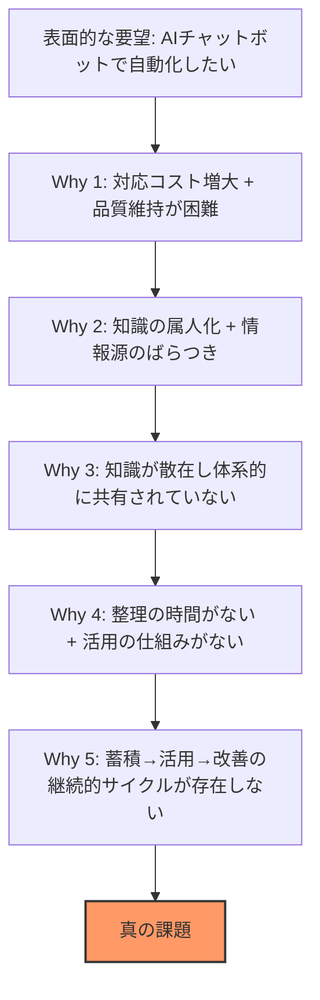

# Phase 1: 真の課題の追求

## 1. 表面的な要望の分析

### 顧客から聞こえる声

- 「問い合わせ対応に時間がかかりすぎる」
- 「担当者によって回答が違う」
- 「マニュアルがどこにあるか分からない」
- 「営業時間外に対応できない」
- 「新人が一人前になるまで時間がかかる」
- 「同じ質問に何度も答えている」

### 表面的な要望

「AIチャットボットを導入して、問い合わせ対応を自動化したい」

この要望をそのまま受け取ると「チャットボットの導入」がゴールになるが、チャットボットは手段であり目的ではない。真の課題を追求する。

## 2. 5 Whysによる深掘り

### Why 1: なぜ問い合わせ対応を自動化したいのか？

問い合わせ件数が増加し続けているのに、対応品質を維持しながらコストを抑えることが困難になっているため。

### Why 2: なぜ対応品質を維持しながらコストを抑えることが困難なのか？

回答に必要な知識が特定の担当者に属人化しており、新しい担当者を育成するのに時間とコストがかかるため。また、担当者ごとに参照する情報源が異なり、回答品質にばらつきが出るため。

### Why 3: なぜ知識が属人化しているのか？

組織の知識（マニュアル、手順書、過去の対応事例など）が複数のシステムやフォーマットに散在しており、体系的に整理・共有される仕組みがないため。ナレッジの蓄積・更新が個人の努力に依存している。

### Why 4: なぜ知識が体系的に整理・共有されないのか？

日常業務の対応に追われ、ナレッジの整理・更新に時間を割けない。また、整理しても活用される仕組み（検索性、アクセシビリティ）がないため、整理するモチベーションが生まれない。

### Why 5: なぜ整理しても活用される仕組みがないのか？

ナレッジの蓄積と活用が連動しておらず、「蓄積→検索→活用→フィードバック→改善」という継続的な改善サイクルが設計されていないため。情報を入れても使われず、使われないから更新されず、更新されないから信頼されない悪循環に陥っている。

### 5 Whys の構造図

## 3. 真の課題（True Problem Statement）

> **組織内の知識が属人化・散在しており、問い合わせ対応の品質・速度・コストが持続的に改善されない。**

### 真の課題の構造

この課題は以下の3つの要素で構成される:

| 要素 | 説明 |
|------|------|
| **知識の属人化** | 対応に必要な知識が特定の個人に集中し、組織としての知識資産になっていない |
| **情報の散在** | マニュアル、FAQ、対応履歴などが複数のシステム・フォーマットに分散し、必要な情報を見つけられない |
| **改善サイクルの欠如** | 対応データの分析・フィードバックが行われず、同じ問題が繰り返される。知識の蓄積と活用が連動していない |

## 4. 課題解決による期待成果

### 真の課題が解決された場合に期待される変化

| 観点 | 現状（Before） | 解決後（After） |
|------|---------------|----------------|
| **回答速度** | 担当者が情報を探す時間を含め数十分〜数時間 | AIが即座に回答（数秒以内） |
| **回答品質** | 担当者の知識・経験に依存、ばらつきあり | ドキュメントに基づく一貫した品質 |
| **対応可能時間** | 営業時間内のみ | 24時間365日 |
| **スケーラビリティ** | 件数増加に比例してコスト増加 | 限界費用が大幅に低下 |
| **知識の保全** | 退職・異動で知識喪失 | ナレッジベースとして組織に蓄積 |
| **改善サイクル** | なし（同じ問い合わせの繰り返し） | 対応データ分析に基づく継続的改善 |
| **新人育成** | OJTに数ヶ月 | ナレッジベースで即戦力化 |

### 定量的な成果指標（KPI候補）

- 平均回答時間の短縮率（目標: 80%以上短縮）
- 自動回答率（人間の介入なしに解決できた割合、目標: 60%以上）
- 回答の正確性（ユーザーフィードバックによる評価、目標: 80%以上の満足度）
- エスカレーション率の低下（目標: 月次で改善傾向）
- ナレッジベースのカバレッジ率（問い合わせに対応するドキュメントの存在率）
