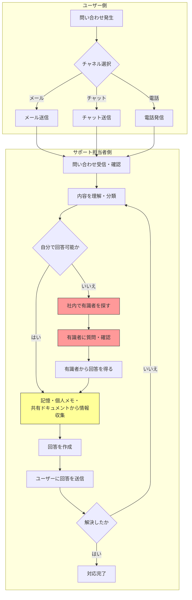
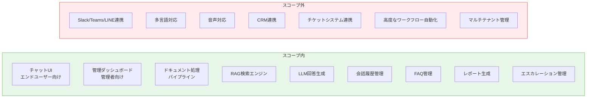
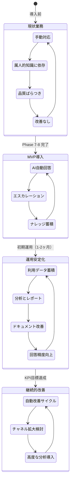

# Phase 2: 業務フロー定義

## 1. 現状の業務フロー（As-Is）

### 問い合わせ対応の全体フロー



### 現状フローの問題点

| ステップ             | 問題点                                         | 影響                                         |
| -------------------- | ---------------------------------------------- | -------------------------------------------- |
| チャネル選択         | 複数チャネルからの問い合わせが一元管理されない | 対応漏れ、重複対応のリスク                   |
| 内容理解・分類       | 担当者の経験に依存した判断                     | 分類のばらつき、不適切なエスカレーション     |
| 自分で回答可能か判断 | 知識が属人化しているため判断にばらつき         | 回答可能な問い合わせもエスカレーションされる |
| 情報収集             | 情報が散在、検索手段が限定的                   | 回答に時間がかかる                           |
| 有識者を探す         | 誰が何を知っているか不明確                     | 探索に時間がかかる、有識者に負荷集中         |
| 回答作成             | テンプレートなし、品質基準なし                 | 品質のばらつき                               |
| 営業時間外           | 対応不可                                       | 顧客満足度低下、機会損失                     |

---

## 2. 目標の業務フロー（To-Be）

### AI支援による問い合わせ対応フロー

```mermaid
flowchart TD
    subgraph ユーザー側
        A[問い合わせ発生] --> B[チャットボット画面を開く]
        B --> C[質問を入力]
    end

    subgraph AIサポートボット
        C --> D[質問をベクトル化]
        D --> E[ドキュメントインデックスを検索]
        E --> F[関連チャンクを取得]
        F --> G[LLMで回答を生成]
        G --> H[確信度を算出]
        H --> I{確信度が閾値以上か}
        I -->|はい| J[回答 + 参照元を表示]
        I -->|いいえ| K[エスカレーション案内を表示]
    end

    subgraph ユーザーフィードバック
        J --> L[ユーザーがフィードバック送信]
        K --> M[エスカレーションフォーム送信]
        L --> N[フィードバックを記録]
        M --> O[改善リクエストを作成]
    end

    subgraph 管理者側【継続的改善】
        O --> P[管理者に通知]
        N --> Q[会話履歴に蓄積]
        Q --> R[週次レポート自動生成]
        R --> S[ナレッジギャップを特定]
        P --> S
        S --> T[ドキュメント追加・更新]
        T --> U[再チャンク・再ベクトル化]
        U --> E
    end

    style J fill:#4CAF50,color:#fff
    style K fill:#FF9800,color:#fff
    style T fill:#2196F3,color:#fff
```

### 目標フローの改善ポイント

| 現状の問題                 | 目標フローでの解決策                    |
| -------------------------- | --------------------------------------- |
| 複数チャネルの一元管理なし | チャットボットに集約（MVPスコープ）     |
| 回答品質のばらつき         | ドキュメントに基づくLLM生成で一貫性確保 |
| 知識の属人化               | ナレッジベースとして組織に一元蓄積      |
| 情報の散在                 | ドキュメント管理でインデックス化        |
| 改善サイクルなし           | フィードバック→分析→改善の自動サイクル  |
| 営業時間外対応不可         | 24時間365日自動応答                     |

---

## 3. システム境界定義

### スコープ内（MVP）



### スコープの詳細

| カテゴリ                     | スコープ内（MVP）          | スコープ外（将来）                 |
| ---------------------------- | -------------------------- | ---------------------------------- |
| **ユーザーインターフェース** | Webチャット画面            | Slack、Teams、LINE等のチャネル統合 |
| **ドキュメント対応形式**     | PDF、Word、テキスト        | 画像内テキスト（OCR）、動画、音声  |
| **言語**                     | 日本語                     | 多言語対応                         |
| **認証**                     | メールアドレスベースの認証 | SSO、SAML、LDAP連携                |
| **テナント**                 | シングルテナント           | マルチテナント                     |
| **分析**                     | 基本KPI、週次レポート      | 高度なアナリティクス、予測分析     |
| **外部連携**                 | なし（スタンドアロン）     | CRM、チケットシステム、メール      |

---

## 4. 運用上の制約条件

### 技術的制約

| 項目               | 制約内容                                                    |
| ------------------ | ----------------------------------------------------------- |
| **応答時間**       | ユーザーへの回答表示は5秒以内を目標とする                   |
| **同時利用者数**   | MVP段階では50人程度の同時利用を想定                         |
| **ドキュメント量** | 初期段階で数百ファイル、合計数万ページを想定                |
| **LLMコスト**      | API呼び出しコストの管理が必要。トークン使用量のモニタリング |
| **データ保持期間** | 会話履歴は最低1年間保持                                     |

### セキュリティ・コンプライアンス制約

| 項目             | 制約内容                                                       |
| ---------------- | -------------------------------------------------------------- |
| **データ保管**   | 組織のドキュメントは暗号化して保管                             |
| **アクセス制御** | 管理者とエンドユーザーの権限分離                               |
| **外部API**      | LLM APIへの送信データに個人情報を含めない方針                  |
| **監査ログ**     | 管理操作（ドキュメント追加・削除、設定変更等）の操作ログを保持 |

### 運用制約

| 項目                       | 制約内容                                                                   |
| -------------------------- | -------------------------------------------------------------------------- |
| **メンテナンスウィンドウ** | 定期メンテナンス時以外は24時間稼働                                         |
| **バックアップ**           | ドキュメントデータ・会話履歴の日次バックアップ                             |
| **障害時**                 | ボットが利用不可の場合、エスカレーションフォームのみ表示するフォールバック |
| **ドキュメント更新反映**   | アップロード後、検索に反映されるまで最大10分を許容                         |

---

## 5. 業務フロー遷移の全体像


