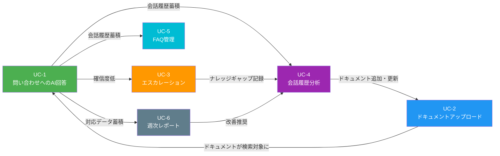

# Phase 2: ユースケース定義

## ユースケース一覧

| ID   | ユースケース名                       | 主アクター              |
| ---- | ------------------------------------ | ----------------------- |
| UC-1 | 問い合わせへのAI回答                 | エンドユーザー          |
| UC-2 | 組織ドキュメントのアップロードと処理 | 管理者                  |
| UC-3 | 回答不能時のエスカレーション         | エンドユーザー / ボット |
| UC-4 | 会話履歴の分析とナレッジ改善         | 管理者                  |
| UC-5 | FAQ管理と公開                        | 管理者                  |
| UC-6 | 週次レポートの自動生成               | システム / 管理者       |

---

## UC-1: 問い合わせへのAI回答

### 概要

エンドユーザーが製品の使い方やサービスに関する質問をチャットボットに入力し、組織のドキュメントに基づいた回答を即座に受け取る。

### アクター

- **主アクター:** エンドユーザー（問い合わせを行う人）
- **システムアクター:** AIサポートボット

### 事前条件

- 管理者が関連ドキュメントをアップロード・インデックス化済み
- エンドユーザーがチャット画面にアクセスできる状態

### メインフロー

1. エンドユーザーがチャット画面を開く
2. エンドユーザーが質問をテキストで入力し、送信する
3. システムが質問文をベクトル化し、ドキュメントインデックスから関連チャンクを検索する
4. システムが検索結果（関連チャンク群）とユーザーの質問をLLMに渡し、回答を生成する
5. システムが回答の確信度を算出する
6. 確信度が閾値以上の場合、回答を表示する
7. 回答とともに参照元ドキュメント名・該当箇所を表示する
8. エンドユーザーが回答に対して「役に立った / 役に立たなかった」のフィードバックを送信する
9. システムがフィードバックを記録する

### 事後条件

- エンドユーザーが質問に対する回答を受け取っている
- 会話履歴とフィードバックがシステムに記録されている
- 参照元ドキュメントが明示されている

### 代替フロー

- **A1: 確信度が閾値未満の場合** → UC-3（エスカレーション）に遷移
- **A2: 関連ドキュメントが見つからない場合** → 「該当する情報が見つかりませんでした」と表示し、エスカレーションを案内
- **A3: ユーザーが追加質問をする場合** → 会話コンテキストを保持した上でステップ3から繰り返す

---

## UC-2: 組織ドキュメントのアップロードと処理

### 概要

管理者が組織のドキュメント（マニュアル、FAQ、手順書など）をシステムにアップロードし、RAG検索に利用可能な状態にする。

### アクター

- **主アクター:** 管理者
- **システムアクター:** ドキュメント処理パイプライン

### 事前条件

- 管理者が管理画面にログイン済み
- アップロードするドキュメントファイルを用意済み

### メインフロー

1. 管理者が管理ダッシュボードの「ドキュメント管理」画面を開く
2. 管理者がドキュメントファイル（PDF、Word、テキスト等）をアップロードする
3. システムがファイル形式を検証し、受付を確認する
4. システムがドキュメントからテキストを抽出する
5. システムがテキストを適切なサイズのチャンクに分割する
6. システムが各チャンクをベクトル化（エンベディング生成）する
7. システムがベクトルデータをインデックスに登録する
8. システムが処理完了を管理者に通知する
9. 管理者がドキュメント一覧で登録内容（チャンク数、処理ステータス等）を確認する

### 事後条件

- ドキュメントがチャンク分割・ベクトル化され、検索インデックスに登録されている
- 管理画面でドキュメントの管理（一覧表示、削除、再処理）が可能
- 以降のユーザー問い合わせで当該ドキュメントの内容が検索対象に含まれる

### 代替フロー

- **A1: サポート外のファイル形式の場合** → エラーメッセージを表示し、対応形式を案内
- **A2: ファイルサイズが上限を超える場合** → エラーメッセージを表示し、分割アップロードを案内
- **A3: テキスト抽出に失敗した場合** → 部分的な処理結果を保存し、失敗箇所を管理者に通知
- **A4: 同名ドキュメントが既に存在する場合** → 上書き・バージョン追加・キャンセルの選択肢を提示

---

## UC-3: 回答不能時のエスカレーション

### 概要

ボットが十分な確信度で回答できない場合、エンドユーザーにエスカレーション手段を提示し、改善リクエストを作成する。

### アクター

- **主アクター:** エンドユーザー
- **システムアクター:** AIサポートボット
- **副アクター:** 管理者（後続対応）

### 事前条件

- UC-1で回答の確信度が閾値未満と判定されている
- または、エンドユーザーが「役に立たなかった」フィードバックを送信した

### メインフロー

1. システムが「この質問については十分な回答ができませんでした」と表示する
2. システムがエスカレーション用のフォームURLを表示する
3. エンドユーザーがフォームにアクセスし、質問内容と補足情報を入力して送信する
4. システムが改善リクエストを作成し、以下の情報を記録する:
   - 元の質問文
   - ボットの回答（あれば）
   - 検索で取得されたドキュメントチャンク
   - ユーザーの補足情報
5. システムが管理者に改善リクエストの通知を送信する
6. エンドユーザーに「担当者に引き継ぎました」の確認メッセージを表示する

### 事後条件

- 改善リクエストが作成され、管理者に通知されている
- エンドユーザーが人間による対応を期待できる状態になっている
- 回答できなかった質問がナレッジギャップとして記録されている

### 代替フロー

- **A1: エンドユーザーがフォーム送信をキャンセルした場合** → 会話を継続可能。改善リクエストは作成されないが、低確信度の会話ログは記録される
- **A2: ボットが部分的に回答できた場合** → 部分的な回答を表示した上で「より詳しい回答が必要な場合はこちら」とフォームURLを提示

---

## UC-4: 会話履歴の分析とナレッジ改善

### 概要

管理者が会話履歴を閲覧・分析し、ナレッジベースのギャップを特定して、ドキュメントの追加・更新を行う。

### アクター

- **主アクター:** 管理者

### 事前条件

- 一定期間の会話履歴が蓄積されている
- 管理者が管理ダッシュボードにログイン済み

### メインフロー

1. 管理者が管理ダッシュボードの「会話履歴」画面を開く
2. 管理者がフィルター条件（期間、確信度範囲、フィードバック種別など）を設定する
3. システムが条件に合致する会話一覧を表示する
4. 管理者が個別の会話を選択し、質問・回答・参照ドキュメント・フィードバックを確認する
5. 管理者が「役に立たなかった」フィードバックのある会話や低確信度の会話を重点的に確認する
6. 管理者がナレッジギャップ（回答できなかった質問領域）を特定する
7. 管理者がギャップを埋めるためにドキュメントを追加・更新する（UC-2に遷移）

### 事後条件

- ナレッジギャップが特定され、対応方針が決まっている
- 必要なドキュメントの追加・更新が実施されている（またはタスクとして記録されている）

### 代替フロー

- **A1: ギャップがドキュメント不足ではなく検索精度の問題の場合** → チャンク分割方法やエンベディングモデルの調整を検討
- **A2: 大量の未対応会話がある場合** → 頻出質問カテゴリ別にグルーピングし、優先度の高いカテゴリから対応

---

## UC-5: FAQ管理と公開

### 概要

管理者が会話履歴から頻出の質問と回答をFAQとして選定・編集し、エンドユーザーに公開する。

### アクター

- **主アクター:** 管理者
- **システムアクター:** FAQ自動生成エンジン

### 事前条件

- 一定期間の会話履歴が蓄積されている
- 管理者が管理ダッシュボードにログイン済み

### メインフロー

1. 管理者が管理ダッシュボードの「FAQ管理」画面を開く
2. システムが会話履歴を分析し、頻出の質問パターンをFAQ候補として自動生成する
3. 各FAQ候補には以下が含まれる:
   - 質問文（類似質問を統合・整理したもの）
   - 推奨回答文（過去の回答から生成）
   - 出現頻度
   - 関連する会話履歴へのリンク
4. 管理者がFAQ候補一覧を確認する
5. 管理者が公開するFAQを選択し、必要に応じて質問文・回答文を編集する
6. 管理者がカテゴリ・タグを設定する
7. 管理者が「公開」ボタンを押す
8. システムがFAQをエンドユーザー向けのFAQページに反映する

### 事後条件

- 選定されたFAQがエンドユーザー向けに公開されている
- FAQページでカテゴリ別・キーワード検索が可能
- 公開済みFAQはチャットボットの回答時にも優先的に参照される

### 代替フロー

- **A1: 管理者がFAQ候補を不採用にした場合** → 不採用理由を記録し、次回の自動生成で類似候補の優先度を調整
- **A2: 管理者が手動でFAQを新規作成する場合** → 自動生成に依存せず、質問文・回答文を直接入力して公開
- **A3: 既存FAQの更新が必要な場合** → 既存FAQを編集し、変更履歴を保持した上で再公開

---

## UC-6: 週次レポートの自動生成

### 概要

システムが週次で問い合わせ対応のKPI、トレンド、改善推奨事項をまとめたレポートを自動生成し、管理者に通知する。

### アクター

- **主アクター:** システム（スケジュール実行）
- **副アクター:** 管理者（レポート閲覧）

### 事前条件

- 1週間分の会話履歴・フィードバックデータが蓄積されている
- レポート生成スケジュールが設定済み

### メインフロー

1. システムがスケジュールに従い（毎週月曜日朝など）レポート生成処理を開始する
2. システムが対象期間のデータを集計する:
   - 総問い合わせ件数
   - 自動回答率（人間の介入なしに解決された割合）
   - 平均確信度スコア
   - ユーザー満足度（フィードバック集計）
   - エスカレーション件数と理由の内訳
   - 頻出質問カテゴリのランキング
3. システムが前週比・トレンドを算出する
4. システムがデータに基づく改善推奨事項を生成する:
   - 「〇〇カテゴリのドキュメントを追加すると自動回答率がN%向上する見込み」
   - 「△△の質問で確信度が低い傾向。関連ドキュメントの更新を推奨」
5. システムがレポートをダッシュボードに保存する
6. システムが管理者にレポート生成完了の通知を送信する
7. 管理者がダッシュボードでレポートを閲覧する

### 事後条件

- 週次レポートが生成され、ダッシュボードで閲覧可能
- 管理者に通知が送信されている
- 過去のレポートとの比較が可能

### 代替フロー

- **A1: データが不十分な場合（初期運用時など）** → 利用可能なデータのみでレポートを生成し、「データ不足のため一部指標は参考値」と注記
- **A2: 管理者がレポート期間をカスタマイズする場合** → ダッシュボードから任意の期間を指定してオンデマンドレポートを生成
- **A3: 異常値を検知した場合** → レポートに警告を付与し、即時通知を管理者に送信

---

## ユースケース間の関係

