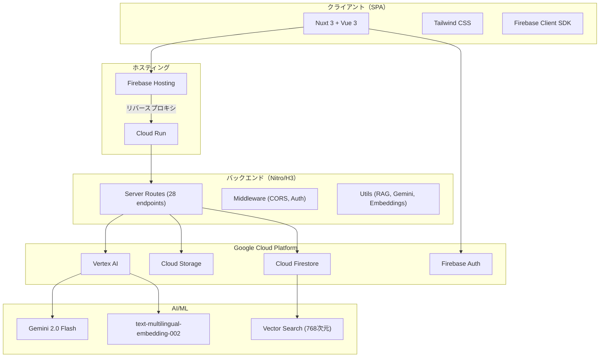
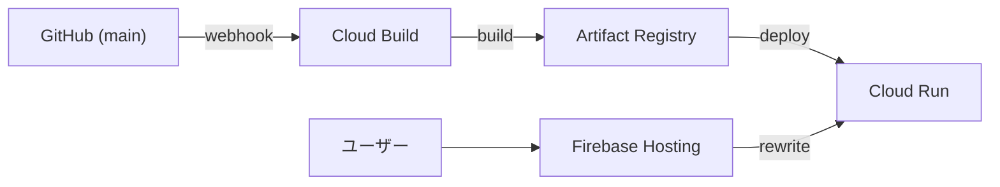

# Phase 4: 技術スタック確定

## アーキテクチャ概要

## 技術選定一覧

### フロントエンド

| 項目              | 選定技術           | バージョン          |
| ----------------- | ------------------ | ------------------- |
| フレームワーク    | Nuxt 3             | v3.16+              |
| UIフレームワーク  | Vue 3              | v3.5+               |
| 言語              | TypeScript         | strict mode         |
| CSSフレームワーク | Tailwind CSS       | @nuxtjs/tailwindcss |
| SSR               | 無効（SPA モード） | ssr: false          |

**選定理由:**

- Nuxt 3: Vue エコシステムとの親和性、Server Routes によるフルスタック開発、Firebase SDK との統合が容易
- Tailwind CSS: ユーティリティファーストで迅速なUI構築、レスポンシブ対応が容易
- SSR無効: Firebase Client SDK はブラウザAPIに依存、SPA で十分な要件

**検討した代替案:**
| 代替案 | 不採用理由 |
|--------|-----------|
| Next.js (React) | Vue/Nuxt の既存知見を活用、React への移行コスト |
| Vite + Vue | Server Routes の統合、ファイルベースルーティングの利便性で Nuxt を選択 |
| Vuetify / PrimeVue | Tailwind のカスタマイズ柔軟性を優先 |

### バックエンド

| 項目         | 選定技術                  |
| ------------ | ------------------------- |
| ランタイム   | Node.js (Nitro/H3)        |
| API方式      | Nuxt Server Routes        |
| デプロイ形態 | サーバーレス（Cloud Run） |

**選定理由:**

- Nuxt Server Routes: フロントエンドと同一プロジェクトで管理、型共有が容易（shared/types/）
- Nitro/H3: 軽量・高速なHTTPサーバー、Cloud Run との親和性
- 別途バックエンドサービス不要でインフラ管理コスト削減

**検討した代替案:**
| 代替案 | 不採用理由 |
|--------|-----------|
| Express.js 単体 | Nuxt Server Routes で統合管理可能、別プロジェクト管理の負担 |
| Cloud Functions | コールドスタートの影響大、Nuxt との統合が複雑 |
| NestJS | フレームワーク規模に対してオーバースペック |

### データベース

| 項目         | 選定技術                       |
| ------------ | ------------------------------ |
| メインDB     | Cloud Firestore（NoSQL）       |
| 名前付きDB   | kotonoha                       |
| ベクトル検索 | Firestore native Vector Search |
| 次元数       | 768次元（flat index）          |

**選定理由:**

- Firestore: Firebase Auth との統合、Security Rules による宣言的アクセス制御、リアルタイム機能（将来活用可能）
- ネイティブベクトル検索: 別途ベクトルDBを管理する必要がなく、運用コスト低減
- 名前付きデータベース: 環境分離（開発/ステージング/本番）

**検討した代替案:**
| 代替案 | 不採用理由 |
|--------|-----------|
| PostgreSQL + pgvector | マネージドサービスの運用コスト、Firebase Auth 統合の追加実装 |
| Pinecone / Weaviate | 別途ベクトルDB管理の運用負荷、コスト |
| MongoDB Atlas | Firestore の Security Rules・Auth 統合を優先 |

**リスクと緩和策:**

- ベクトル検索のスケーラビリティ → 大規模化時に Vertex AI Vector Search への移行パスを事前設計
- Firestore クエリ制約 → 複合インデックスの事前定義（firestore.indexes.json）

### ファイルストレージ

| 項目         | 選定技術                   |
| ------------ | -------------------------- |
| ストレージ   | Cloud Storage for Firebase |
| バケット     | kotonoha                   |
| アクセス制御 | Storage Security Rules     |

**選定理由:**

- Firebase エコシステムとの一体管理
- Security Rules による宣言的アクセス制御（管理者のみアップロード）
- GCS の高可用性・冗長性

### AI/ML

| 項目           | 選定技術                        |
| -------------- | ------------------------------- |
| LLM            | Vertex AI Gemini 2.0 Flash      |
| 埋め込みモデル | text-multilingual-embedding-002 |
| 次元数         | 768次元                         |
| リージョン     | asia-northeast1                 |

**選定理由:**

- Gemini 2.0 Flash: 高速応答（3-5秒）、日本語対応、GCP ネイティブ統合
- text-multilingual-embedding-002: 多言語対応、768次元で検索精度と効率のバランス
- GCP 統合: 認証・ネットワークがシームレス、別途API キー管理不要

**検討した代替案:**
| 代替案 | 不採用理由 |
|--------|-----------|
| OpenAI GPT-4 | 外部API依存、GCP統合のシームレスさを優先 |
| Claude (Anthropic) | 同上 |
| OpenAI Embeddings | GCPネイティブ統合を優先、多言語モデルの日本語精度 |

### 認証・認可

| 項目       | 選定技術                                     |
| ---------- | -------------------------------------------- |
| 認証基盤   | Firebase Authentication                      |
| プロバイダ | メール/パスワード、Google OAuth              |
| トークン   | Firebase ID Token (JWT)                      |
| 認可       | Firestore Security Rules + Server Middleware |

**選定理由:**

- Firebase Auth: Firestore Security Rules との統合、クライアント SDK の成熟度
- マルチプロバイダ対応が容易（将来的にSAML/OIDC追加可能）

### インフラ・デプロイ

| 項目                 | 選定技術                    |
| -------------------- | --------------------------- |
| コンテナホスティング | Cloud Run (asia-northeast1) |
| CDN/リバースプロキシ | Firebase Hosting            |
| CI/CD                | Cloud Build (GitHub連携)    |
| コンテナレジストリ   | Artifact Registry           |

**選定理由:**

- Cloud Run: サーバーレス、自動スケーリング、ゼロダウンタイムデプロイ
- Firebase Hosting: カスタムドメイン、CDN、Cloud Run へのリバースプロキシ
- Cloud Build: GitHub webhook によるmainブランチ自動デプロイ

### テスト・品質管理

| 項目           | 選定技術               |
| -------------- | ---------------------- |
| ユニットテスト | Vitest                 |
| E2Eテスト      | Playwright             |
| Linter         | ESLint (@nuxt/eslint)  |
| Formatter      | Prettier               |
| 型チェック     | TypeScript strict mode |

### パッケージ管理

| 項目                   | 選定技術                      |
| ---------------------- | ----------------------------- |
| パッケージマネージャー | npm workspaces                |
| モノレポ構成           | packages/sdk、packages/widget |

**ワークスペース構成:**

- `packages/sdk`: チャットクライアントSDK（kotonohaChatClient）
- `packages/widget`: Web Component（kotonoha-chat-widget）

### ドキュメント解析

| 対応形式   | ライブラリ       |
| ---------- | ---------------- |
| PDF        | pdf-parse        |
| DOCX       | mammoth          |
| HTML       | cheerio          |
| TXT/CSV/MD | 標準テキスト処理 |

## 環境構成

| 環境         | インフラ             | データベース                   | 用途           |
| ------------ | -------------------- | ------------------------------ | -------------- |
| 開発         | ローカル（nuxt dev） | Firestore Emulator or named DB | 開発・デバッグ |
| ステージング | Cloud Run            | Firestore (kotonoha)           | 検証・UAT      |
| 本番         | Cloud Run            | Firestore (kotonoha)           | 本番運用       |

## マルチテナンシー戦略

- **初期:** 単一テナント（セルフホスト型）
- **将来:** マルチテナント対応（オンデマンド）
- **設計方針:** 全コレクションに `organizationId` を初期から含め、Security Rules で組織単位分離を実装済み
- **移行パス:** organizationId によるデータ分離が既に実装されているため、マルチテナント化は認証フロー（組織選択）の追加のみで対応可能

## デプロイ構成

**デプロイフロー:**

1. mainブランチへのpush → Cloud Build トリガー
2. Dockerイメージビルド → Artifact Registry保存
3. Cloud Runへ自動デプロイ（環境変数は事前設定）
4. Firebase Hosting がリバースプロキシとして Cloud Run にルーティング
