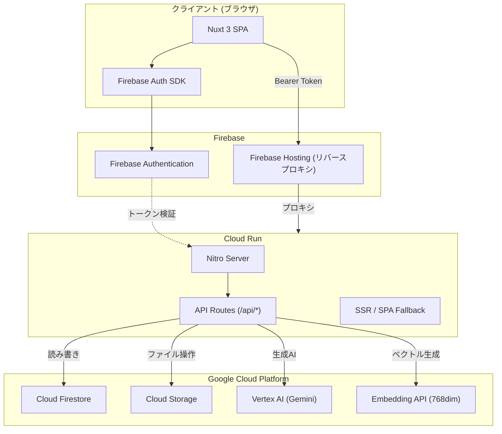
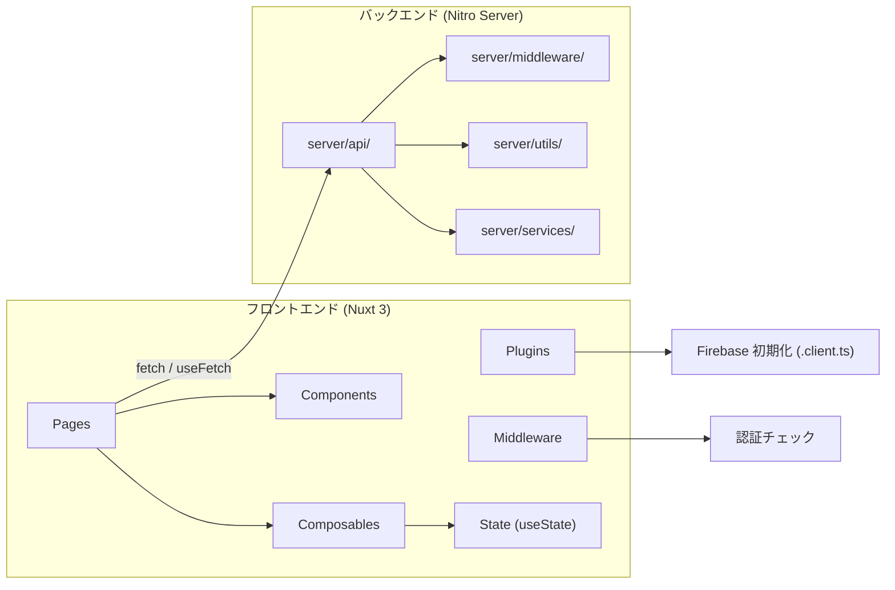
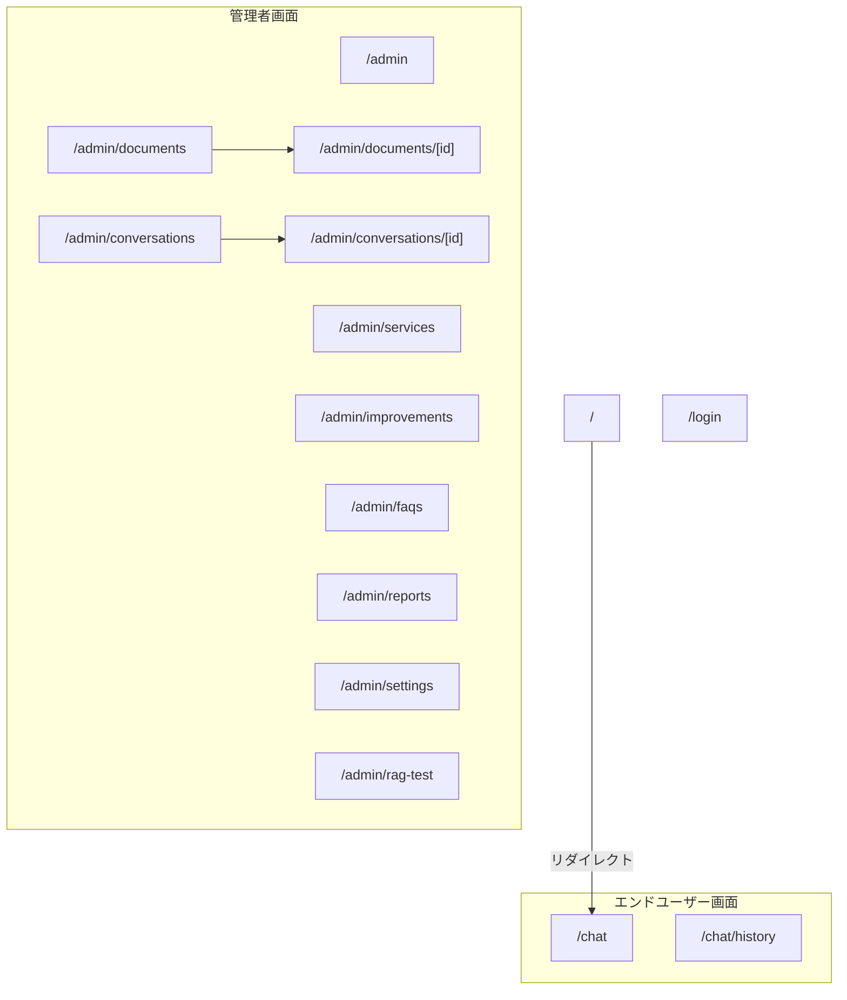
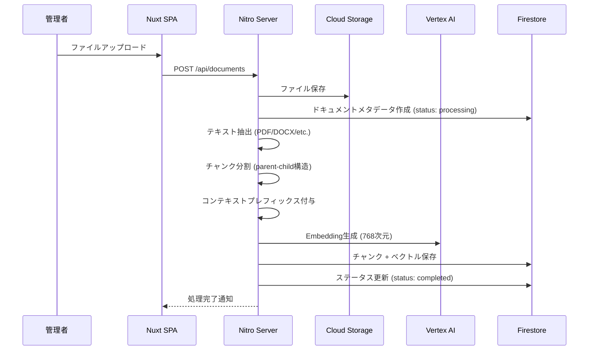
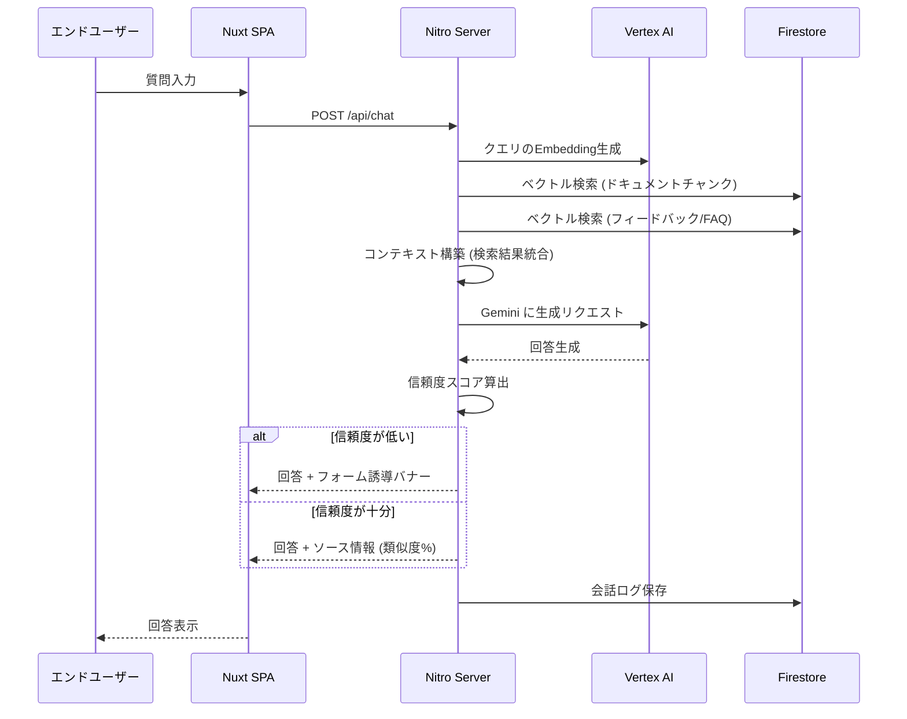
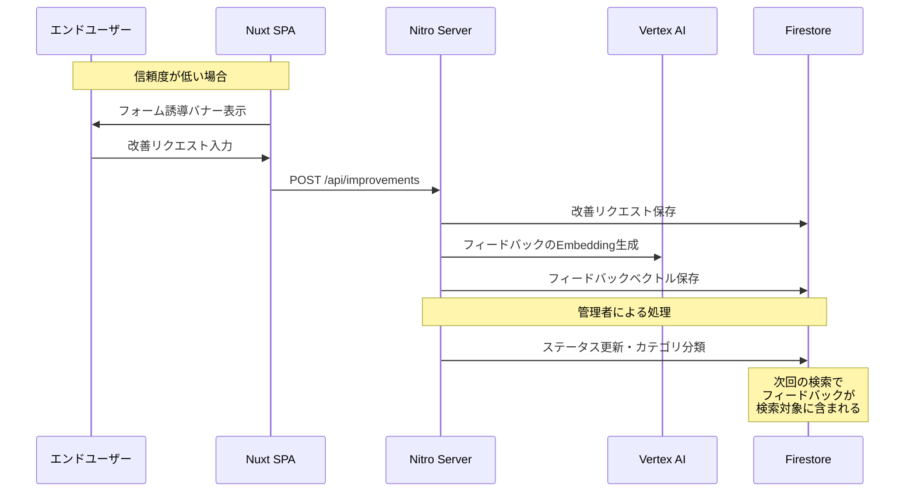
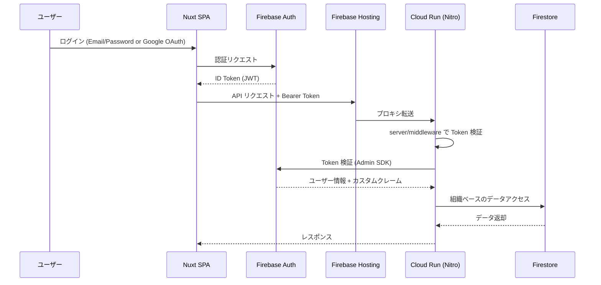
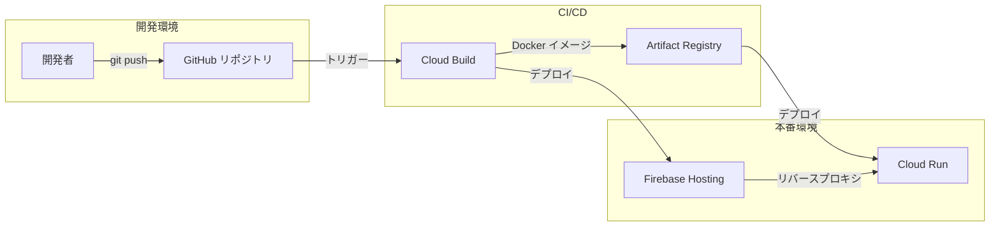
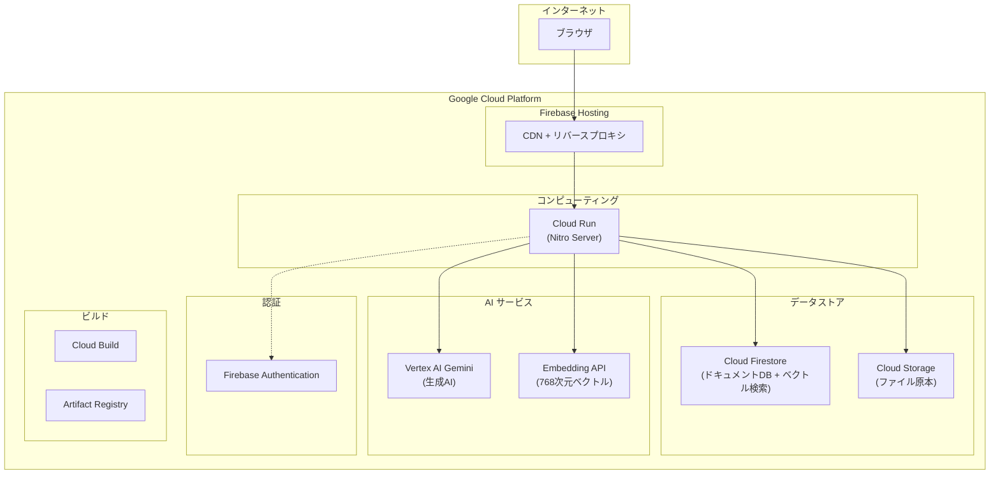

# アーキテクチャ設計書

> **フェーズ:** Phase 5 - 設計ドキュメント生成
> **更新日:** 2026-03-24

---

## 1. システムアーキテクチャ

### 1.1 全体構成図



### 1.2 コンポーネントアーキテクチャ



---

## 2. サイトマップ

```
/ (リダイレクト → /chat)
├── /login (ログイン画面)
├── /chat
│   ├── /chat (チャット画面)
│   └── /chat/history (会話履歴)
├── /admin
│   ├── /admin (ダッシュボード)
│   ├── /admin/services (サービス管理)
│   ├── /admin/documents (ドキュメント管理)
│   ├── /admin/documents/[id] (ドキュメント詳細)
│   ├── /admin/conversations (会話一覧)
│   ├── /admin/conversations/[id] (会話詳細)
│   ├── /admin/improvements (改善管理)
│   ├── /admin/faqs (FAQ管理)
│   ├── /admin/reports (レポート)
│   ├── /admin/settings (設定)
│   └── /admin/rag-test (RAG診断)
```

### ルーティング構成図



---

## 3. データフロー

### 3.1 ドキュメント登録フロー



**処理詳細:**
1. **Upload:** 管理者がファイルをアップロード（単一 / 一括対応）
2. **Storage:** Cloud Storage にファイル原本を保存
3. **Extract:** ファイル形式に応じたテキスト抽出
4. **Chunk:** 親子構造のチャンク分割（文脈を保持）
5. **Context prefix:** 各チャンクにコンテキスト情報を付与
6. **Embed:** Vertex AI Embedding API で768次元ベクトルを生成
7. **Firestore:** チャンクデータとベクトルを保存

### 3.2 チャットフロー



**処理詳細:**
1. **Query → Embed:** ユーザーの質問をベクトル化
2. **Vector Search:** ドキュメントチャンク + フィードバックデータの両方を検索
3. **Context build:** 検索結果を統合してコンテキストを構築
4. **Gemini:** コンテキスト付きプロンプトで回答生成
5. **Confidence check:** 信頼度スコアを算出
6. **Response:** ソース情報（類似度%）付きで回答を返却。低信頼度時はフォーム誘導

### 3.3 フィードバック・学習ループ



**学習ループの仕組み:**
1. **Low confidence:** 信頼度が閾値を下回ると、フォーム誘導バナーを表示
2. **Form guidance:** ユーザーが改善リクエストを入力
3. **Improvement request:** リクエストをFirestoreに保存
4. **Feedback embedding:** フィードバック内容をベクトル化して保存
5. **Learning loop:** 次回以降のベクトル検索でフィードバックも検索対象となり、回答精度が向上

---

## 4. セキュリティアーキテクチャ

### 4.1 認証・認可フロー



### 4.2 セキュリティレイヤー

| レイヤー | 実装 | 説明 |
|----------|------|------|
| 認証 | Firebase Authentication | Email/Password + Google OAuth |
| トークン検証 | Server Middleware | Bearer Token をサーバー側で検証 |
| データ分離 | Firestore Security Rules | 組織ベースのアイソレーション |
| ストレージ制御 | Storage Rules | 管理者のみアップロード可能 |
| 通信制御 | CORS Whitelist | 許可オリジンのみアクセス可能 |
| ロール管理 | カスタムクレーム | admin / user ロールの分離 |

### 4.3 Firestore Security Rules の設計方針

- **組織ベース分離:** 全てのデータは `organizationId` でスコープされ、他組織のデータにはアクセス不可
- **list vs get の考慮:** クエリ（list）と単一取得（get）でルール評価が異なることを考慮した設計
- **管理者権限:** ドキュメント管理・設定変更は admin ロールのみ許可

---

## 5. インフラ構成

### 5.1 デプロイメントパイプライン



### 5.2 インフラ構成図



### 5.3 環境構成

| 項目 | 設定 |
|------|------|
| ランタイム | Node.js (Cloud Run) |
| フレームワーク | Nuxt 3 (Nitro) |
| コンテナレジストリ | Artifact Registry |
| CDN | Firebase Hosting |
| データベース | Cloud Firestore |
| オブジェクトストレージ | Cloud Storage |
| 認証 | Firebase Authentication |
| AI | Vertex AI (Gemini + Embedding) |
| CI/CD | Cloud Build |

---

## 6. Source of Truth (SoT) 宣言

| データ領域 | SoT | キャッシュ/派生 | 同期方式 |
|-----------|-----|---------------|---------|
| ユーザー認証情報 | Firebase Authentication | Firestore (ユーザープロファイル) | 認証イベントトリガー |
| ドキュメント原本 | Cloud Storage | Firestore (メタデータ + チャンク) | アップロード時に同期処理 |
| ベクトルデータ | Firestore (Embedding) | - | ドキュメント登録時に生成 |
| 会話ログ | Firestore | - | リアルタイム書込 |
| 改善リクエスト | Firestore | - | リアルタイム書込 |
| 組織設定 | Firestore | - | 管理画面から更新 |
