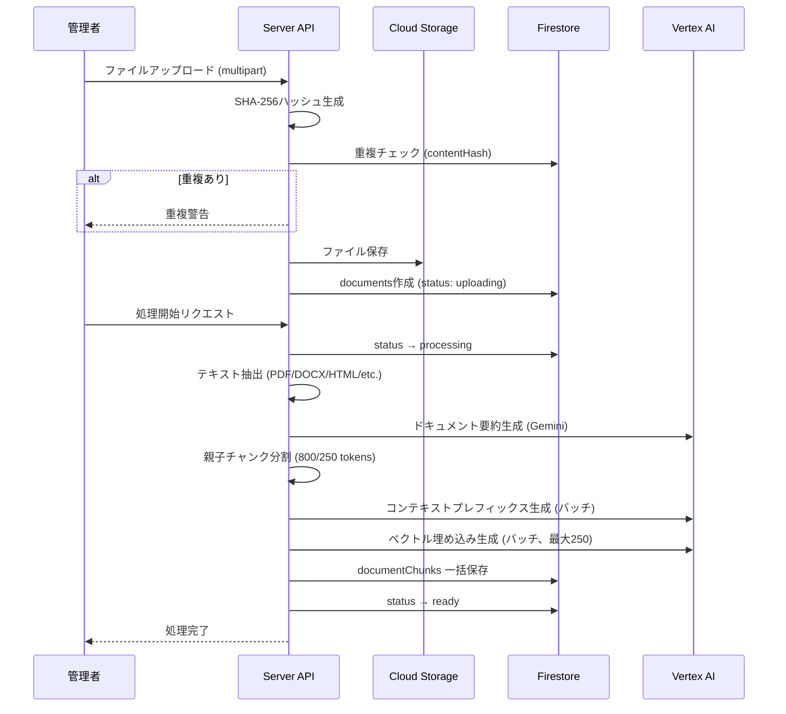
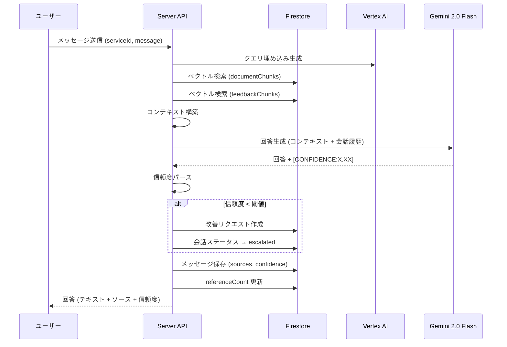

# Phase 5: データ設計

## コレクション一覧

| #   | コレクション        | 用途                            | SoT                                             |
| --- | ------------------- | ------------------------------- | ----------------------------------------------- |
| 1   | organizations       | 組織情報                        | Firestore                                       |
| 2   | users               | ユーザー情報                    | Firebase Auth (認証) / Firestore (プロファイル) |
| 3   | services            | サポートサービス定義            | Firestore                                       |
| 4   | documents           | 登録ドキュメントメタデータ      | Firestore (メタ) / Cloud Storage (原本)         |
| 5   | documentChunks      | ドキュメントチャンク + ベクトル | Firestore                                       |
| 6   | conversations       | 会話セッション                  | Firestore                                       |
| 7   | messages (sub)      | 会話メッセージ                  | Firestore                                       |
| 8   | improvementRequests | 改善リクエスト                  | Firestore                                       |
| 9   | faqs                | FAQ                             | Firestore                                       |
| 10  | weeklyReports       | 週次レポート                    | Firestore                                       |
| 11  | settings            | 組織設定                        | Firestore                                       |
| 12  | feedbackChunks      | フィードバック学習ベクトル      | Firestore                                       |

---

## コレクション詳細

### 1. organizations

| フィールド | 型        | 必須 | 説明                       |
| ---------- | --------- | ---- | -------------------------- |
| id         | string    | ○    | ドキュメントID（自動生成） |
| name       | string    | ○    | 組織名                     |
| plan       | string    | ×    | 契約プラン                 |
| createdAt  | Timestamp | ○    | 作成日時                   |

### 2. users

| フィールド     | 型                  | 必須 | 説明              |
| -------------- | ------------------- | ---- | ----------------- |
| id             | string              | ○    | Firebase Auth UID |
| email          | string              | ○    | メールアドレス    |
| displayName    | string              | ×    | 表示名            |
| role           | 'admin' \| 'member' | ○    | ユーザーロール    |
| organizationId | string              | ○    | 所属組織ID        |
| createdAt      | Timestamp           | ○    | 作成日時          |

### 3. services

| フィールド     | 型        | 必須 | 説明                          |
| -------------- | --------- | ---- | ----------------------------- |
| id             | string    | ○    | ドキュメントID                |
| organizationId | string    | ○    | 所属組織ID                    |
| name           | string    | ○    | サービス名                    |
| description    | string    | ×    | 説明                          |
| isActive       | boolean   | ○    | 有効フラグ                    |
| googleFormUrl  | string    | ×    | エスカレーション先フォームURL |
| createdAt      | Timestamp | ○    | 作成日時                      |
| updatedAt      | Timestamp | ○    | 更新日時                      |

### 4. documents

| フィールド     | 型                                                | 必須 | 説明                          |
| -------------- | ------------------------------------------------- | ---- | ----------------------------- |
| id             | string                                            | ○    | ドキュメントID                |
| organizationId | string                                            | ○    | 所属組織ID                    |
| serviceId      | string                                            | ○    | 対象サービスID                |
| fileName       | string                                            | ○    | ファイル名                    |
| fileType       | string                                            | ○    | MIME タイプ                   |
| fileSize       | number                                            | ○    | ファイルサイズ（バイト）      |
| storagePath    | string                                            | ○    | Cloud Storage パス            |
| contentHash    | string                                            | ○    | SHA-256ハッシュ（重複検出用） |
| status         | 'uploading' \| 'processing' \| 'ready' \| 'error' | ○    | 処理ステータス                |
| chunkCount     | number                                            | ×    | 生成チャンク数                |
| tags           | string[]                                          | ×    | タグ                          |
| createdAt      | Timestamp                                         | ○    | 作成日時                      |
| updatedAt      | Timestamp                                         | ○    | 更新日時                      |

### 5. documentChunks

| フィールド     | 型          | 必須 | 説明                                |
| -------------- | ----------- | ---- | ----------------------------------- |
| id             | string      | ○    | ドキュメントID                      |
| documentId     | string      | ○    | 親ドキュメントID                    |
| organizationId | string      | ○    | 所属組織ID                          |
| serviceId      | string      | ○    | 対象サービスID                      |
| content        | string      | ○    | チャンクテキスト（子チャンク）      |
| parentContent  | string      | ×    | 親チャンクテキスト                  |
| contextPrefix  | string      | ×    | コンテキストプレフィックス（1-2文） |
| documentTitle  | string      | ×    | 元ドキュメント名                    |
| chunkIndex     | number      | ○    | チャンク順序                        |
| tokenCount     | number      | ×    | 推定トークン数                      |
| embedding      | vector(768) | ○    | ベクトル埋め込み                    |
| contentHash    | string      | ○    | チャンク内容ハッシュ（差分検出用）  |
| referenceCount | number      | ×    | 参照カウンター                      |
| createdAt      | Timestamp   | ○    | 作成日時                            |

### 6. conversations

| フィールド     | 型                                    | 必須 | 説明                                   |
| -------------- | ------------------------------------- | ---- | -------------------------------------- |
| id             | string                                | ○    | ドキュメントID                         |
| organizationId | string                                | ○    | 所属組織ID                             |
| serviceId      | string                                | ○    | 対象サービスID                         |
| userId         | string                                | ×    | ユーザーID（未認証時null）             |
| title          | string                                | ×    | 会話タイトル（最初の質問から自動設定） |
| status         | 'active' \| 'resolved' \| 'escalated' | ○    | 会話ステータス                         |
| messageCount   | number                                | ○    | メッセージ数                           |
| lastMessageAt  | Timestamp                             | ○    | 最終メッセージ日時                     |
| createdAt      | Timestamp                             | ○    | 作成日時                               |

### 7. messages（conversations のサブコレクション）

| フィールド | 型                    | 必須 | 説明                    |
| ---------- | --------------------- | ---- | ----------------------- |
| id         | string                | ○    | ドキュメントID          |
| role       | 'user' \| 'assistant' | ○    | 送信者ロール            |
| content    | string                | ○    | メッセージ本文          |
| sources    | MessageSource[]       | ×    | 参照元ドキュメント情報  |
| confidence | number                | ×    | 信頼度スコア（0.0-1.0） |
| formUrl    | string                | ×    | フォーム誘導URL         |
| createdAt  | Timestamp             | ○    | 作成日時                |

**MessageSource 型:**
| フィールド | 型 | 説明 |
|-----------|-----|------|
| documentId | string | 参照元ドキュメントID |
| documentTitle | string | ドキュメント名 |
| content | string | 該当チャンクテキスト |
| similarity | number | 類似度スコア |

### 8. improvementRequests

| フィールド        | 型                                                   | 必須 | 説明                             |
| ----------------- | ---------------------------------------------------- | ---- | -------------------------------- |
| id                | string                                               | ○    | ドキュメントID                   |
| organizationId    | string                                               | ○    | 所属組織ID                       |
| serviceId         | string                                               | ○    | 対象サービスID                   |
| conversationId    | string                                               | ×    | 関連会話ID                       |
| question          | string                                               | ○    | ユーザーの質問                   |
| aiAnswer          | string                                               | ×    | AIの回答                         |
| category          | string                                               | ×    | AI分類カテゴリ                   |
| status            | 'open' \| 'in_progress' \| 'resolved' \| 'dismissed' | ○    | 対応ステータス                   |
| feedback          | string                                               | ×    | 管理者フィードバック（正解回答） |
| feedbackEmbedding | vector(768)                                          | ×    | フィードバック埋め込み           |
| createdAt         | Timestamp                                            | ○    | 作成日時                         |
| updatedAt         | Timestamp                                            | ○    | 更新日時                         |

### 9. faqs

| フィールド     | 型          | 必須 | 説明           |
| -------------- | ----------- | ---- | -------------- |
| id             | string      | ○    | ドキュメントID |
| organizationId | string      | ○    | 所属組織ID     |
| serviceId      | string      | ○    | 対象サービスID |
| question       | string      | ○    | 質問文         |
| answer         | string      | ○    | 回答文         |
| isPublished    | boolean     | ○    | 公開フラグ     |
| embedding      | vector(768) | ×    | 質問文ベクトル |
| createdAt      | Timestamp   | ○    | 作成日時       |
| updatedAt      | Timestamp   | ○    | 更新日時       |

### 10. weeklyReports

| フィールド      | 型          | 必須 | 説明                  |
| --------------- | ----------- | ---- | --------------------- |
| id              | string      | ○    | ドキュメントID        |
| organizationId  | string      | ○    | 所属組織ID            |
| serviceId       | string      | ×    | 対象サービスID        |
| period          | object      | ○    | 集計期間 {start, end} |
| stats           | ReportStats | ○    | 統計データ            |
| insights        | string[]    | ×    | AIインサイト          |
| recommendations | string[]    | ×    | 改善推奨事項          |
| createdAt       | Timestamp   | ○    | 作成日時              |

### 11. settings

| フィールド    | 型        | 必須 | 説明                            |
| ------------- | --------- | ---- | ------------------------------- |
| id            | string    | ○    | organizationId をキーとして使用 |
| botConfig     | BotConfig | ○    | ボット設定                      |
| googleFormUrl | string    | ×    | グローバルフォームURL           |
| updatedAt     | Timestamp | ○    | 更新日時                        |

**BotConfig 型:**
| フィールド | 型 | 説明 |
|-----------|-----|------|
| confidenceThreshold | number | 信頼度閾値（デフォルト: 0.7） |
| systemPrompt | string | カスタムシステムプロンプト |
| maxTokens | number | 最大生成トークン数 |

### 12. feedbackChunks

| フィールド          | 型          | 必須 | 説明                       |
| ------------------- | ----------- | ---- | -------------------------- |
| id                  | string      | ○    | ドキュメントID             |
| organizationId      | string      | ○    | 所属組織ID                 |
| serviceId           | string      | ○    | 対象サービスID             |
| question            | string      | ○    | 元の質問                   |
| answer              | string      | ○    | 正解回答（フィードバック） |
| embedding           | vector(768) | ○    | 回答ベクトル               |
| sourceImprovementId | string      | ×    | 元の改善リクエストID       |
| createdAt           | Timestamp   | ○    | 作成日時                   |

---

## ベクトルインデックス定義

| コレクション   | フィールド | 次元数 | インデックス方式 | 距離関数 |
| -------------- | ---------- | ------ | ---------------- | -------- |
| documentChunks | embedding  | 768    | FLAT             | COSINE   |
| faqs           | embedding  | 768    | FLAT             | COSINE   |
| feedbackChunks | embedding  | 768    | FLAT             | COSINE   |

---

## 複合インデックス（主要）

| コレクション        | フィールド構成                                        | 用途               |
| ------------------- | ----------------------------------------------------- | ------------------ |
| documents           | organizationId ASC, serviceId ASC, createdAt DESC     | ドキュメント一覧   |
| documentChunks      | organizationId ASC, serviceId ASC, embedding VECTOR   | RAGベクトル検索    |
| conversations       | organizationId ASC, serviceId ASC, lastMessageAt DESC | 会話一覧           |
| conversations       | userId ASC, createdAt DESC                            | ユーザー自身の会話 |
| improvementRequests | organizationId ASC, status ASC, createdAt DESC        | 改善リクエスト一覧 |
| faqs                | organizationId ASC, serviceId ASC, isPublished ASC    | FAQ一覧            |
| weeklyReports       | organizationId ASC, createdAt DESC                    | レポート一覧       |

---

## Firestore Security Rules 概要

```
organizations: 認証必須、所属メンバーのみ読取、管理者のみ書込
users: 本人のみ読取・書込
services: 認証必須で読取（公開APIは別パス）、管理者のみ書込
documents: 所属組織メンバー読取、管理者のみ書込
documentChunks: 所属組織メンバー読取、管理者のみ書込
conversations: 本人 or 管理者が読取、本人のみ作成
messages: 親会話のアクセス権に準拠
improvementRequests: 管理者のみ全操作
faqs: 管理者のみ全操作
weeklyReports: 管理者のみ全操作
settings: 管理者のみ全操作
```

---

## データフロー図

### ドキュメント登録フロー



### チャット応答フロー



---

## SoT（Source of Truth）宣言

| データ             | SoT                      | キャッシュ/副本                                           | 復元可能性                       |
| ------------------ | ------------------------ | --------------------------------------------------------- | -------------------------------- |
| ユーザー認証情報   | Firebase Auth            | users コレクション（プロファイル）                        | Auth → users で復元可            |
| ドキュメント原本   | Cloud Storage            | documents コレクション（メタデータのみ）                  | Storage から再取得可             |
| チャンクテキスト   | documentChunks           | なし                                                      | ドキュメント原本から再生成可     |
| ベクトル埋め込み   | documentChunks / faqs    | L1メモリキャッシュ（30分）、L2 Firestoreキャッシュ（7日） | Vertex AI で再生成可             |
| 会話履歴           | conversations + messages | なし                                                      | SoT自体（復元不可）              |
| フィードバック学習 | feedbackChunks           | なし                                                      | improvementRequests から再生成可 |

---

## 設計原則の適用

| 原則             | 適用状況                                                    |
| ---------------- | ----------------------------------------------------------- |
| 正規化           | 各コレクション独立、organizationIdによるリレーション        |
| ユニークID PK    | 全コレクションで自動生成ID使用                              |
| 複合キー不使用   | リレーションはID参照、複合キー制約なし                      |
| マスタデータ分類 | services: 動的マスタ（CRUD機能あり）、organizations: 準静的 |
