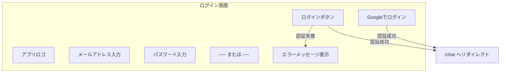
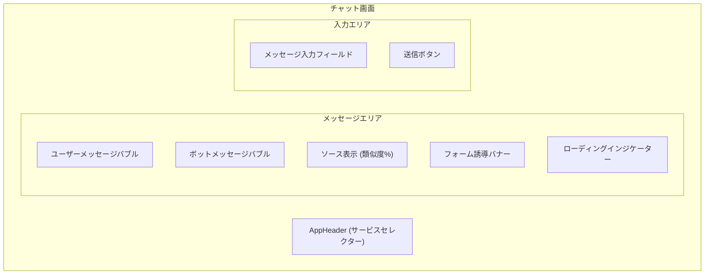
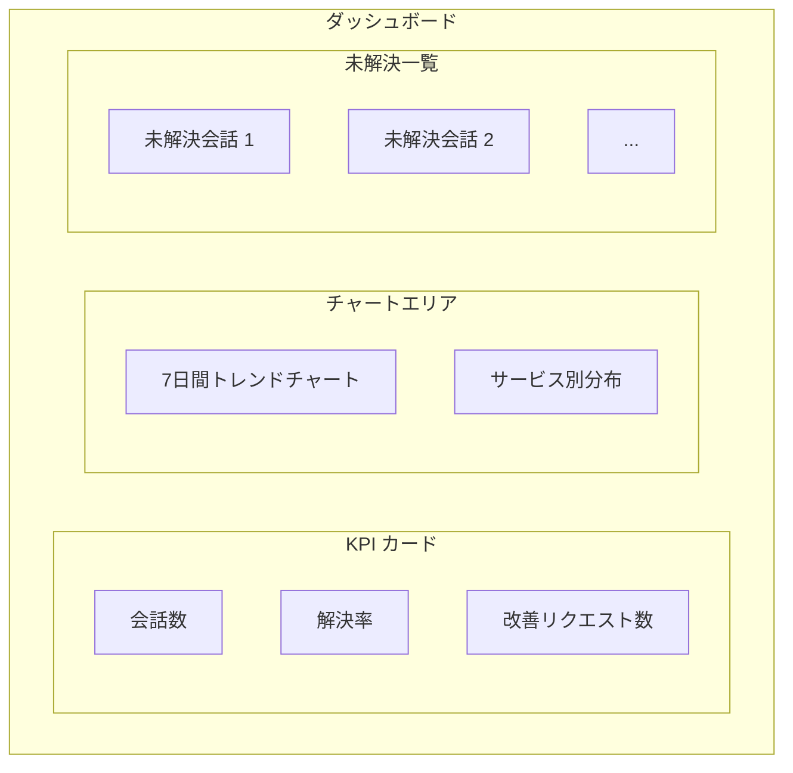
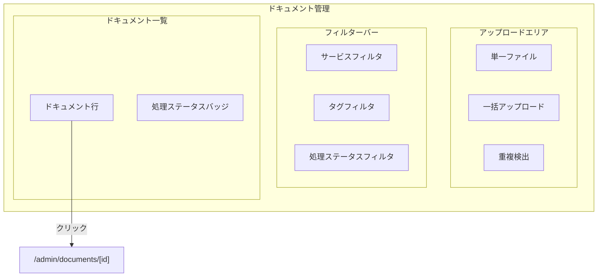
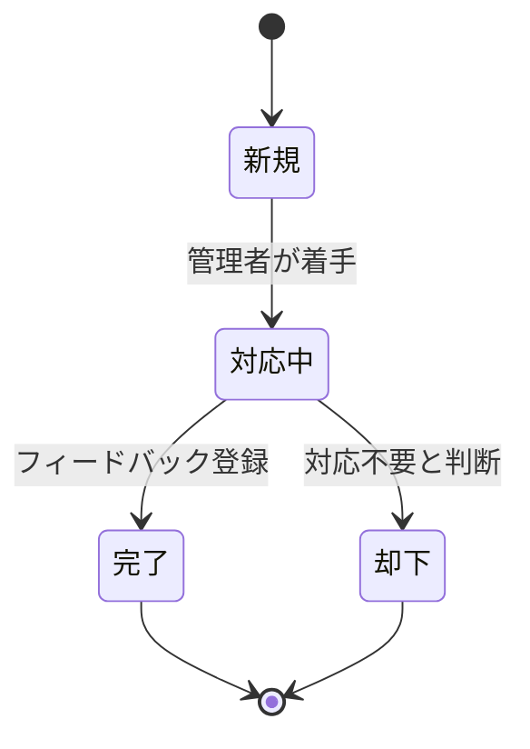
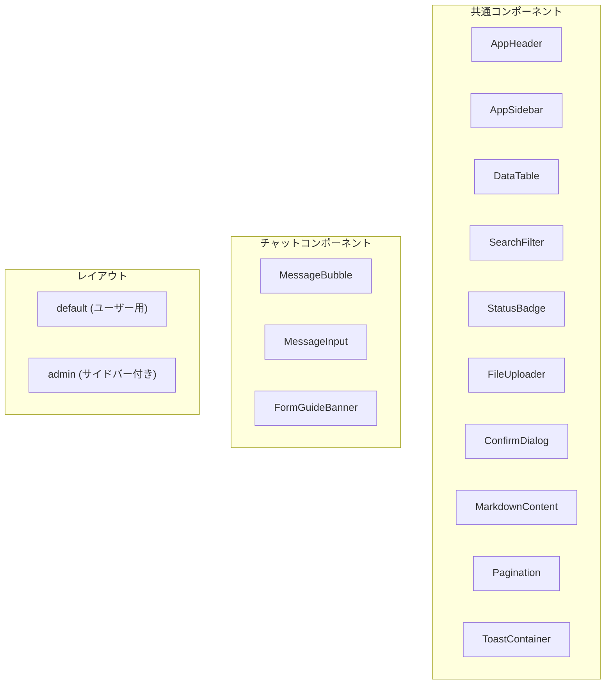
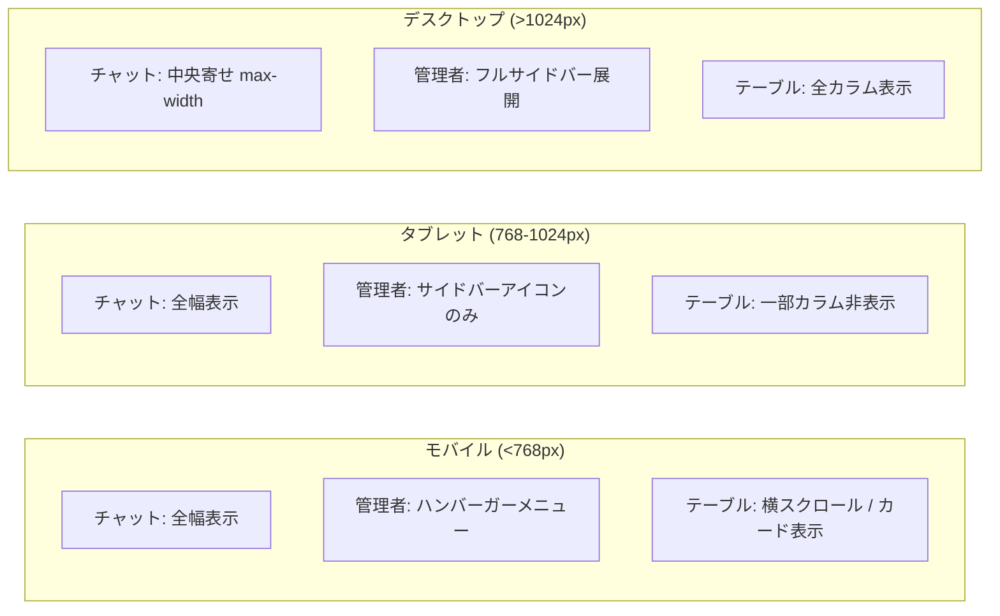

# 画面設計書

> **フェーズ:** Phase 5 - 設計ドキュメント生成
> **更新日:** 2026-03-24

---

## 1. エンドユーザー画面

### EU-1: ログイン画面 (`/login`)

**概要:** ユーザー認証を行う画面。Email/Password 認証と Google OAuth に対応。

| 要素 | 仕様 |
|------|------|
| メールアドレス | 必須、メール形式バリデーション |
| パスワード | 必須、最小文字数バリデーション |
| Google OAuth | Firebase Auth の Google プロバイダー |
| エラー表示 | 認証失敗時にインラインでエラーメッセージ表示 |
| リダイレクト | 認証成功後 `/chat` へ遷移 |

---

### EU-2: チャット画面 (`/chat`)

**概要:** AIチャットボットとの対話画面。サービス選択、メッセージ送受信、ソース表示、フォーム誘導を行う。

| 要素 | 仕様 |
|------|------|
| サービスセレクター | ヘッダー内。ユーザーが所属組織のサービスを選択 |
| メッセージバブル (user) | 右寄せ、ユーザー発言を表示 |
| メッセージバブル (bot) | 左寄せ、Markdown レンダリング対応 |
| ソース表示 | ボット回答の参照元ドキュメントを類似度(%)付きで表示 |
| フォーム誘導バナー | 信頼度が低い場合に表示。Google フォームへの誘導リンク |
| ローディング状態 | AI 回答生成中にスケルトン / アニメーション表示 |
| メッセージ入力 | テキストエリア、Enter で送信（Shift+Enter で改行） |

---

### EU-3: 会話履歴画面 (`/chat/history`)

**概要:** 過去の会話一覧を閲覧する画面。

| 要素 | 仕様 |
|------|------|
| 会話リスト | 日時降順で表示、最初のメッセージをプレビュー |
| ステータスフィルタ | 解決済み / 未解決 / 全て で絞り込み |
| 会話選択 | クリックで該当チャットを再表示 |

---

## 2. 管理者画面

### AD-1: ダッシュボード (`/admin`)

**概要:** システム全体のKPIと状況を俯瞰する画面。

| 要素 | 仕様 |
|------|------|
| KPI カード | 会話数、解決率、改善リクエスト数をカード形式で表示 |
| 7日間トレンド | 直近7日間の会話数推移を折れ線グラフで表示 |
| サービス分布 | サービス別の会話数を円グラフ / 棒グラフで表示 |
| 未解決一覧 | 未解決の会話をリスト表示、クリックで詳細へ遷移 |

---

### AD-2: サービス管理 (`/admin/services`)

**概要:** チャットボットが対応するサービスのCRUD管理。

| 要素 | 仕様 |
|------|------|
| サービス一覧 | DataTable でサービスを一覧表示 |
| 新規作成 | ダイアログ / ページでサービスを追加 |
| 編集 | サービス名、説明、Google フォーム URL の編集 |
| 削除 | 確認ダイアログ後に削除 |
| Google フォーム URL | サービスごとにフォーム誘導先 URL を設定 |

---

### AD-3: ドキュメント管理 (`/admin/documents`)

**概要:** RAG用ドキュメントのアップロード・管理画面。

| 要素 | 仕様 |
|------|------|
| ファイルアップロード | ドラッグ&ドロップ / ファイル選択。単一・一括対応 |
| 重複検出 | 同一ファイル名・ハッシュの重複を検出して警告 |
| サービスフィルタ | サービス別でドキュメントを絞り込み |
| タグフィルタ | タグ別でドキュメントを絞り込み |
| 処理ステータス | `processing` / `completed` / `error` をバッジ表示 |
| ドキュメント詳細 | クリックで `/admin/documents/[id]` へ遷移 |

---

### AD-4: 会話一覧 (`/admin/conversations`)

**概要:** 全会話を一覧・検索する画面。

| 要素 | 仕様 |
|------|------|
| 会話テーブル | DataTable で日時、ユーザー、サービス、ステータスを表示 |
| サービスフィルタ | サービス別絞り込み |
| ステータスフィルタ | 解決済み / 未解決 / フォーム誘導済み |
| 日付フィルタ | 期間指定での絞り込み |
| 検索 | メッセージ内容のテキスト検索 |
| 詳細遷移 | クリックで `/admin/conversations/[id]` へ遷移 |

---

### AD-5: 会話詳細 (`/admin/conversations/[id]`)

**概要:** 個別の会話内容を詳細に確認する画面。

| 要素 | 仕様 |
|------|------|
| メッセージ履歴 | ユーザーとボットのやり取りを時系列で表示 |
| 信頼度スコア | 各ボット回答の信頼度スコアを表示 |
| ソース参照 | 回答に使用されたドキュメントチャンクと類似度を表示 |
| メタ情報 | 会話日時、サービス、ステータス |

---

### AD-6: 改善管理 (`/admin/improvements`)

**概要:** ユーザーからの改善リクエストを管理する画面。

| 要素 | 仕様 |
|------|------|
| リクエスト一覧 | DataTable で改善リクエストを一覧表示 |
| 自動カテゴリ分類 | AI によるリクエスト内容の自動分類 |
| ステータス管理 | 新規 → 対応中 → 完了 / 却下 のワークフロー |
| フィードバック登録 | 改善内容をフィードバックとして登録（ベクトル化して学習ループに反映） |

---

### AD-7: FAQ管理 (`/admin/faqs`)

**概要:** FAQの自動生成・手動編集・公開管理を行う画面。

| 要素 | 仕様 |
|------|------|
| FAQ一覧 | 質問と回答のペアを一覧表示 |
| 自動生成 | 会話ログから AI がFAQ候補を自動生成 |
| 手動編集 | 質問・回答のインライン編集 |
| 公開切替 | トグルスイッチで公開 / 非公開を切替 |
| サービス紐付け | FAQをサービスに紐付けて管理 |

---

### AD-8: レポート (`/admin/reports`)

**概要:** 週次レポートの表示と生成を行う画面。

| 要素 | 仕様 |
|------|------|
| レポート一覧 | 生成済みレポートを日付順で表示 |
| レポート表示 | 選択したレポートの詳細を表示 |
| 生成トリガー | 手動でレポート生成を実行するボタン |

---

### AD-9: 設定 (`/admin/settings`)

**概要:** ボットの動作設定やフォームURLを管理する画面。

| 要素 | 仕様 |
|------|------|
| ボット設定 | 信頼度閾値、最大トークン数、応答スタイル等 |
| フォーム URL | Google フォームのURL設定（グローバル / サービス別） |
| 組織情報 | 組織名、ロゴ等の基本設定 |

---

### AD-10: RAG診断 (`/admin/rag-test`)

**概要:** RAG（検索拡張生成）の動作をテスト・診断する画面。

| 要素 | 仕様 |
|------|------|
| テストクエリ入力 | 検索クエリを入力してRAG結果を確認 |
| 検索結果表示 | ヒットしたチャンクと類似度スコアの詳細表示 |
| コンテキスト確認 | AI に渡されるコンテキスト全文のプレビュー |

---

## 3. コンポーネント構成

### 3.1 コンポーネント一覧

### 3.2 共通コンポーネント詳細

| コンポーネント | 説明 | 使用箇所 |
|--------------|------|---------|
| `AppHeader` | アプリケーションヘッダー。ロゴ、ナビゲーション、ユーザーメニュー | 全画面 |
| `AppSidebar` | 管理者画面のサイドバーナビゲーション | 管理者画面全体 |
| `DataTable` | ソート・フィルタ・ページネーション対応のテーブル | AD-2, AD-3, AD-4, AD-6, AD-7 |
| `SearchFilter` | 検索・フィルタリングコントロール群 | AD-3, AD-4, AD-6 |
| `StatusBadge` | ステータスをカラーバッジで表示 | AD-3, AD-4, AD-6 |
| `FileUploader` | ドラッグ&ドロップ対応ファイルアップロード | AD-3 |
| `ConfirmDialog` | 確認ダイアログ（削除操作等） | 全管理者画面 |
| `MarkdownContent` | Markdown テキストのレンダリング | EU-2, AD-5 |
| `Pagination` | ページネーションコントロール | AD-3, AD-4, AD-6, AD-7 |
| `ToastContainer` | 通知トースト表示 | 全画面 |

### 3.3 チャット専用コンポーネント

| コンポーネント | 説明 |
|--------------|------|
| `MessageBubble` | チャットメッセージの表示。user/bot で左右・スタイルを分離。ソース表示を内包 |
| `MessageInput` | テキスト入力フィールド + 送信ボタン。Enter 送信、Shift+Enter 改行 |
| `FormGuideBanner` | 信頼度低下時のフォーム誘導バナー。Google フォームへのリンクを含む |

### 3.4 レイアウト

| レイアウト | 説明 | 適用画面 |
|-----------|------|---------|
| `default` | ヘッダー + コンテンツ領域のシンプルレイアウト | EU-1, EU-2, EU-3 |
| `admin` | ヘッダー + サイドバー + コンテンツ領域の管理者用レイアウト | AD-1 〜 AD-10 |

---

## 4. レスポンシブ対応

### 4.1 ブレークポイント定義

| ブレークポイント | 画面幅 | 分類 |
|----------------|--------|------|
| sm | < 768px | モバイル |
| md | 768px - 1024px | タブレット |
| lg | > 1024px | デスクトップ |

### 4.2 レスポンシブ対応方針

### 4.3 画面別対応詳細

| 画面 | モバイル (<768px) | タブレット (768-1024px) | デスクトップ (>1024px) |
|------|-----------------|----------------------|---------------------|
| チャット (EU-2) | 全幅表示、入力欄固定 | 全幅表示 | 中央寄せ、max-width 制限 |
| 管理者サイドバー | ハンバーガーメニュー → オーバーレイ表示 | アイコンのみの縮小サイドバー | フルサイドバー展開（テキスト + アイコン） |
| DataTable | 横スクロール or カード表示に切替 | 優先度の低いカラムを非表示 | 全カラム表示 |
| ダッシュボード (AD-1) | KPI カード縦積み | KPI カード 2列 | KPI カード 3列 + チャート横並び |
| ファイルアップロード (AD-3) | 全幅ドロップゾーン | 全幅ドロップゾーン | コンテンツ幅内のドロップゾーン |
