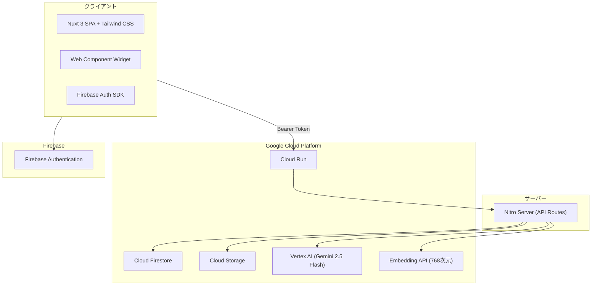

# Kotonoha — AI ナレッジサポートプラットフォーム

組織が保有するドキュメント（マニュアル、FAQ、手順書など）を活用し、AIが即座に正確な回答を提供するサポートチャットボットを構築・運用するマルチテナント対応SaaSプラットフォームです。

---

## 主な特徴

| 特徴 | 説明 |
|------|------|
| **RAGベースの高精度回答** | 組織のドキュメントをベクトル化し、関連情報を検索して回答を生成。回答根拠の参照元を明示 |
| **信頼度スコアと自動エスカレーション** | 回答の確信度を数値化。低信頼度の場合は自動的に有人対応へ誘導 |
| **マルチテナント対応** | 組織単位でデータを完全分離。複数組織が安全に同一プラットフォームを利用可能 |
| **管理者ダッシュボード** | 会話分析、KPI可視化、改善リクエスト管理、週次レポート自動生成 |
| **Web Component 埋め込み** | `<kotonoha-chat-widget>` タグで外部サイトにチャットボットを簡単に埋め込み |
| **フィードバックループ** | 低信頼度回答 → 改善リクエスト → 管理者の是正 → 回答品質向上の継続的改善サイクル |
| **対応ファイル形式** | PDF、DOCX、Markdown、テキスト、HTML、CSV、JSON |

---

## 技術スタック



| 層 | 技術 |
|---|---|
| フロントエンド | Nuxt 3、Vue 3、Tailwind CSS |
| バックエンド | Nitro Server（Nuxt Server API） |
| データベース | Cloud Firestore（ベクトル検索対応） |
| ストレージ | Cloud Storage |
| AI/ML | Vertex AI（Gemini 2.5 Flash）、Text Multilingual Embedding（768次元） |
| 認証 | Firebase Authentication（Email/Password、Google OAuth） |
| デプロイ | Docker、Cloud Run、Cloud Build |
| テスト | Vitest（単体）、Playwright（E2E） |

---

## 主な機能

### エンドユーザー向け
- **チャット** — サービスを選択してAIに質問。参照元ドキュメントと信頼度スコアを表示
- **会話履歴** — 過去の会話を一覧・検索・再開

### 管理者向け
- **ダッシュボード** — KPI（会話数、解決率、改善リクエスト数）、トレンドグラフ、サービス別分析
- **サービス管理** — サポートサービスのCRUD、エスカレーションフォームURL設定
- **ドキュメント管理** — ファイルアップロード、サービス紐付け、処理ステータス監視、重複検出
- **会話管理** — 全会話の閲覧・フィルタ、詳細メッセージ履歴、ステータス管理
- **改善管理** — 低信頼度回答の追跡、AIカテゴリ自動分類、ステータス管理
- **FAQ管理** — 手動作成、会話からの自動生成、公開/非公開切替
- **レポート** — 週次サマリー自動生成、会話トレンド・ドキュメント利用分析
- **学習** — テスト質問でRAG検索結果と回答品質を検証、フィードバック学習
- **RAGテスト** — 検索パイプラインのデバッグ、マルチクエリ展開テスト
- **設定** — 信頼度閾値、Top-K、類似度閾値、システムプロンプト、HyDE設定
- **Widget設定** — 外部サイト埋め込み用コード生成
- **ユーザー管理** — 招待、ロール管理（admin/member）

---

## セットアップ

### 前提条件
- Node.js 20+
- Google Cloud プロジェクト（Firestore、Cloud Storage、Vertex AI 有効化済み）
- Firebase プロジェクト（Authentication 有効化済み）

### インストール

```bash
git clone https://github.com/higepapa-hinaleon/kotonoha.git
cd kotonoha
npm install
```

### 環境変数

`.env.example` を `.env` にコピーし、各値を設定:

```bash
cp .env.example .env
```

主な環境変数:
- `NUXT_FIREBASE_PROJECT_ID` — Firebase プロジェクトID
- `NUXT_FIREBASE_CLIENT_EMAIL` — サービスアカウントメール
- `NUXT_FIREBASE_PRIVATE_KEY` — サービスアカウント秘密鍵
- `NUXT_FIREBASE_STORAGE_BUCKET` — Cloud Storage バケット名
- `NUXT_VERTEX_AI_LOCATION` — Vertex AI リージョン（デフォルト: `asia-northeast1`）

### 開発サーバー

```bash
npm run dev
```

### テスト

```bash
npm run test          # 単体テスト（Vitest）
npm run test:e2e      # E2Eテスト（Playwright）
```

### デプロイ

```bash
# Docker ビルド
docker build -t kotonoha .

# Cloud Build（本番デプロイ）
gcloud builds submit --config cloudbuild.yaml
```

---

## プロジェクト構造

```
kotonoha/
├── app/                      # フロントエンド（Nuxt 3）
│   ├── pages/                # ページコンポーネント
│   ├── components/           # UIコンポーネント
│   ├── composables/          # 共通ロジック（useApi, useAuth 等）
│   ├── middleware/            # 認証・認可ミドルウェア
│   └── plugins/              # Firebase 初期化等
├── server/                   # バックエンド（Nitro Server）
│   ├── api/                  # APIルートハンドラ
│   ├── utils/                # ビジネスロジック（RAG, 埋め込み生成, チャット処理）
│   └── middleware/           # サーバーミドルウェア（認証, CORS）
├── shared/                   # 共有型定義
│   └── types/                # models.ts, api.ts
├── packages/                 # モノレポパッケージ
│   ├── sdk/                  # チャットクライアントSDK（@kotonoha/chat-sdk）
│   └── widget/               # 埋め込みウィジェット（@kotonoha/chat-widget）
├── tests/                    # テストスイート
├── docs/                     # ドキュメント
├── .ai-native/               # AI ネイティブ開発方法論
│   ├── methodology/          # 方法論定義（ロール、フェーズ、レビュー基準）
│   ├── outputs/              # フェーズ成果物
│   └── domain-context/       # ドメインコンテキスト
├── firestore.rules           # Firestore セキュリティルール
├── storage.rules              # Cloud Storage セキュリティルール
└── firestore.indexes.json    # 複合インデックス定義
```

---

## AI ネイティブ開発方法論

本プロジェクトは、8つの専門AIロールが相互に牽制し合い品質を保証する「AI ネイティブ開発方法論」に基づいて開発されています。

詳細は以下を参照:
- [方法論の全体構成](.ai-native/methodology/INDEX.md)
- [最上位原則と構造原則](.ai-native/methodology/common/core-principles.md)
- [フェーズ定義](.ai-native/methodology/common/phase-definitions.md)
- [レビュー基準](.ai-native/methodology/common/review-standards.md)
- [ロール定義](.ai-native/methodology/roles/)

---

## ライセンス

Apache License 2.0 - 詳細は [LICENSE](LICENSE) ファイルを参照してください。
