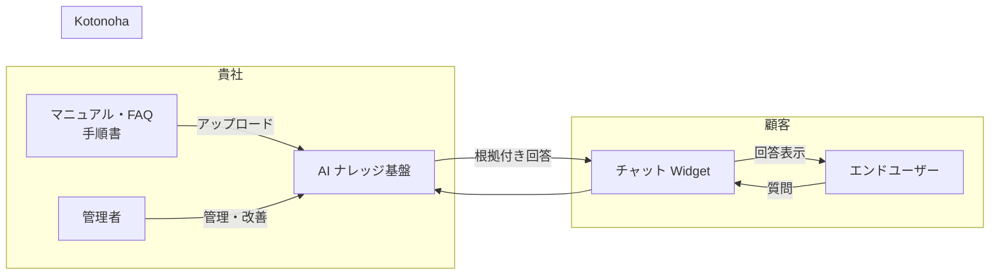
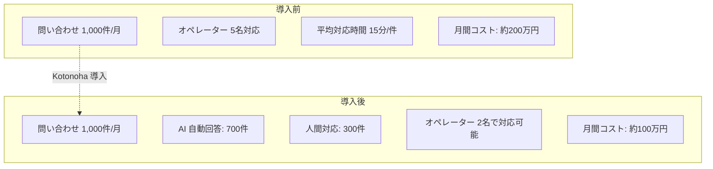
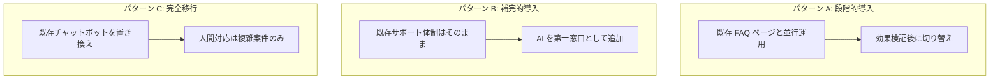
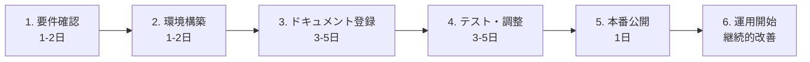
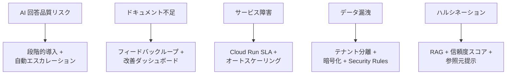

# Kotonoha 導入意思決定者向け資料

> 本ドキュメントは、Kotonoha（RAG ベース AI カスタマーサポート SaaS）の導入を検討される意思決定者（経営層・事業部門長）向けに、導入メリット・コスト効果・リスク・導入プロセスを包括的にまとめたものです。

---

## 目次

1. [エグゼクティブサマリー](#エグゼクティブサマリー)
2. [Kotonoha とは](#kotonoha-とは)
3. [導入メリット](#導入メリット)
4. [コスト効果分析](#コスト効果分析)
5. [競合製品との比較優位](#競合製品との比較優位)
6. [既存システムとの共存](#既存システムとの共存)
7. [セキュリティ担保](#セキュリティ担保)
8. [導入プロセス概要](#導入プロセス概要)
9. [導入タイムライン](#導入タイムライン)
10. [リスクと対策](#リスクと対策)
11. [成功指標（KPI）](#成功指標kpi)
12. [導入判断チェックリスト](#導入判断チェックリスト)

---

## エグゼクティブサマリー

Kotonoha は、貴社のナレッジ（マニュアル・FAQ・手順書等）を AI が学習し、顧客からの問い合わせに 24 時間 365 日、根拠付きの回答を自動提供するクラウドサービスです。

**導入の要点:**

- 問い合わせ対応コストの **40〜60% 削減** が見込める
- 導入から稼働まで **最短 2 週間**
- 既存の Web サイトにタグ 1 行で埋め込み可能
- 国内リージョン（東京）でのデータ保管によるセキュリティ担保
- 回答できない質問は自動で人間にエスカレーション（対応漏れゼロ）

---

## Kotonoha とは

Kotonoha は RAG（Retrieval-Augmented Generation）技術を活用し、貴社固有のドキュメントに基づいた正確な回答を生成します。一般的な AI チャットボットとは異なり、「根拠のない回答」を生成するリスクを最小化する仕組みが組み込まれています。

### 主要な特長

| 特長 | 説明 |
|------|------|
| 根拠付き回答 | 回答には必ず参照元ドキュメントと信頼度スコアが付与される |
| 自動エスカレーション | AI の信頼度が低い場合、人間のサポート担当者に自動転送 |
| 継続的品質改善 | 低信頼度回答 → 改善リクエスト → 管理者修正のフィードバックループ |
| マルチテナント | 組織単位でのデータ完全分離 |
| かんたん導入 | Web Component による 1 行タグ埋め込み |

---

## 導入メリット

### 1. コスト削減

- **人件費削減:** 定型的な問い合わせの 60〜70% を AI が自動対応
- **対応時間短縮:** AI 回答は 3〜5 秒（人間の平均 15 分と比較して大幅短縮）
- **24 時間対応:** 夜間・休日の問い合わせにもリアルタイム対応

### 2. 顧客満足度向上

| 指標 | 導入前（想定） | 導入後（目標） |
|------|-------------|-------------|
| 初回応答時間 | 数時間〜1 営業日 | 3〜5 秒 |
| 24 時間対応 | 不可（営業時間のみ） | 可能 |
| 回答の一貫性 | オペレーターにより差異 | ナレッジベースに基づく一貫した回答 |
| 対応漏れ | 発生しうる | エスカレーションにより漏れゼロ |

### 3. ナレッジの資産化

- 散在するマニュアル・FAQ を一元管理
- AI の回答品質データから「よくある質問」「不足しているドキュメント」を可視化
- 管理ダッシュボードで改善ポイントを定量的に把握

### 4. 段階的な導入が可能

- まず一部の問い合わせカテゴリから開始し、効果を検証してから拡大可能
- AI の回答品質が一定水準に達するまでは、全件エスカレーション設定も可能

---

## コスト効果分析

### 想定コスト構造

| コスト項目 | 内容 |
|-----------|------|
| 初期導入費用 | セットアップ、初期ドキュメント登録支援 |
| 月額利用料 | テナント基本料 + 問い合わせ件数ベースの従量課金 |
| 運用コスト | 管理者によるドキュメント更新・品質改善（社内工数） |

### ROI シミュレーション（月間 1,000 件の問い合わせを想定）

| 項目 | 金額（月額） |
|------|------------|
| **削減コスト** | |
| オペレーター人件費削減（3 名分） | ▲ 120 万円 |
| 夜間・休日対応の外注費削減 | ▲ 30 万円 |
| **追加コスト** | |
| Kotonoha 月額利用料 | + 20〜50 万円 |
| 管理者運用工数（0.2 人月） | + 10 万円 |
| **月間純削減額** | **90〜120 万円** |
| **年間純削減額** | **1,080〜1,440 万円** |
| **投資回収期間** | **1〜2 ヶ月** |

> ※ 上記は一般的な試算です。実際の効果は問い合わせの内容・量・複雑さにより変動します。

### 定性的メリット

- オペレーターが複雑な案件に集中でき、対応品質が向上
- ナレッジの属人化を解消
- 問い合わせデータの蓄積による経営判断材料の充実

---

## 競合製品との比較優位

| 比較項目 | Kotonoha | 一般的な FAQ チャットボット | 汎用 LLM ソリューション |
|---------|----------|----------------------|---------------------|
| 回答の根拠提示 | 参照元・信頼度スコア付き | シナリオベース（固定回答） | 根拠なし（ハルシネーションリスク） |
| 自動エスカレーション | 信頼度ベースで自動判定 | 未対応が多い | なし |
| 継続的品質改善 | フィードバックループ内蔵 | 手動メンテナンス必要 | 困難 |
| ドキュメント対応形式 | PDF, DOCX, Markdown 等 | 限定的 | 要カスタマイズ |
| 導入の容易さ | タグ 1 行 | 中程度 | 高い技術力が必要 |
| データセキュリティ | 国内リージョン + テナント分離 | 製品による | 要注意（外部 API 送信） |

---

## 既存システムとの共存

### 導入パターン

### 既存システムへの影響

| 項目 | 影響 |
|------|------|
| 既存 Web サイト | Widget タグの追加のみ（既存機能への影響なし、Shadow DOM で CSS 分離） |
| 既存のサポートツール | 併用可能（エスカレーション先として連携可能） |
| 既存の CRM | API 連携による会話データの連携が可能 |
| 社内ネットワーク | HTTPS 通信の許可のみ（特別な VPN 等は不要） |

---

## セキュリティ担保

### データ保護

| 保護対策 | 詳細 |
|---------|------|
| データ所在地 | 日本国内（Google Cloud asia-northeast1 / 東京リージョン） |
| データ分離 | マルチテナント設計により組織間のデータは完全分離 |
| 通信暗号化 | 全通信が HTTPS（TLS 1.2 以上）で暗号化 |
| 保存時暗号化 | Google Cloud 標準の AES-256 暗号化 |
| アクセス制御 | ロールベース（admin / member）の権限管理 |
| 認証 | Firebase Auth（Email/Password + Google OAuth） |

### コンプライアンス対応

- Google Cloud のセキュリティ認証（SOC 2, ISO 27001 等）に基づくインフラ
- データの国外転送なし（全データが東京リージョンに保管）
- アカウント削除時の完全データ削除対応

---

## 導入プロセス概要

| ステップ | 期間 | 内容 |
|---------|------|------|
| 1. 要件確認 | 1〜2 日 | 対象範囲、ドキュメント種別、埋め込み先の確認 |
| 2. 環境構築 | 1〜2 日 | テナント作成、管理者アカウント設定 |
| 3. ドキュメント登録 | 3〜5 日 | 既存マニュアル・FAQ のアップロード、ベクトル化 |
| 4. テスト・調整 | 3〜5 日 | テスト質問による品質確認、閾値調整 |
| 5. 本番公開 | 1 日 | Widget 埋め込み、CORS 設定、本番切り替え |
| 6. 運用開始 | 継続 | 品質モニタリング、フィードバック対応、ドキュメント更新 |

**最短 2 週間で本番稼働が可能です。**

---

## 導入タイムライン

### フェーズ 1: パイロット導入（1〜2 ヶ月目）

- 限定的な範囲（特定カテゴリ、特定ページ）で運用開始
- 効果測定と品質チューニング
- 管理者トレーニング

### フェーズ 2: 範囲拡大（3〜4 ヶ月目）

- 対象カテゴリ・ページの拡大
- ドキュメントの追加登録
- KPI の達成度確認

### フェーズ 3: 本格運用（5 ヶ月目以降）

- 全範囲での運用
- 継続的な品質改善サイクルの確立
- 週次レポートに基づくナレッジ最適化

---

## リスクと対策

| リスク | 影響度 | 発生可能性 | 対策 |
|--------|-------|-----------|------|
| AI の回答品質が低い | 高 | 中 | 段階的導入でリスク限定、信頼度閾値による自動エスカレーション |
| ドキュメント不足で回答できない | 中 | 高 | 改善リクエスト機能で不足領域を可視化し、優先的にドキュメント追加 |
| サービス障害 | 中 | 低 | Cloud Run オートスケーリング + ゼロダウンタイムデプロイ、SLA 99.5% |
| データ漏洩 | 高 | 低 | テナント分離、暗号化、国内リージョン、Firestore Security Rules |
| 社内の利用定着が進まない | 中 | 中 | 管理ダッシュボードで効果を定量的に可視化、成功事例の社内共有 |
| LLM のハルシネーション | 高 | 低 | RAG による根拠ベースの回答生成、信頼度スコアによるフィルタリング |
| コスト超過 | 低 | 低 | 従量課金の上限設定、利用量モニタリング |

### リスク対策の全体像

---

## 成功指標（KPI）

### 導入効果を測定する KPI

| KPI | 測定方法 | 目標値 |
|-----|---------|--------|
| AI 自動回答率 | 自動回答件数 / 全問い合わせ件数 | 60% 以上 |
| 回答満足度 | ユーザーフィードバック | 80% 以上（良い評価） |
| エスカレーション率 | エスカレーション件数 / 全件数 | 30% 以下 |
| 平均回答時間 | システムログ | 5 秒以内 |
| オペレーター工数削減率 | 人間対応工数の前後比較 | 40% 以上削減 |
| ナレッジカバー率 | 回答可能な質問の割合 | 80% 以上 |

### KPI の確認方法

Kotonoha の管理ダッシュボードで以下がリアルタイムに確認可能です:

- 問い合わせ件数推移
- AI 回答率・エスカレーション率
- 信頼度スコアの分布
- 低信頼度回答の改善状況
- 週次レポート（自動生成）

---

## 導入判断チェックリスト

以下の条件に当てはまる場合、Kotonoha の導入効果が高いと考えられます:

- [ ] 月間の問い合わせ件数が 100 件以上ある
- [ ] 問い合わせの 50% 以上が定型的な内容である
- [ ] マニュアルや FAQ が既に存在する（デジタル形式）
- [ ] 24 時間対応、または迅速な初回応答が求められている
- [ ] オペレーターの採用・教育コストが課題になっている
- [ ] ナレッジの属人化を解消したい
- [ ] 顧客満足度の向上が経営課題である

**3 つ以上に該当する場合、Kotonoha の導入を強く推奨します。**

---

> 導入のご相談・デモのご依頼は、Kotonoha セールスチームまでお気軽にお問い合わせください。
