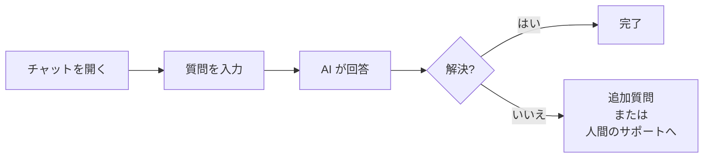
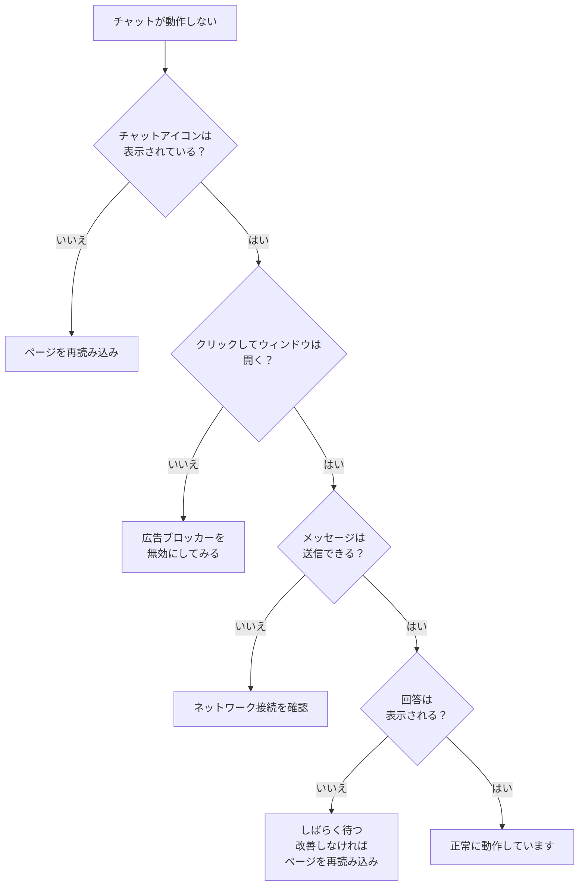

# Kotonoha ご利用ガイド（エンドユーザー向け）

> このガイドは、Kotonoha のチャットサポートをご利用いただくお客様向けの説明書です。チャットの使い方、回答の見方、困ったときの対処法をわかりやすくご案内します。

---

## 目次

1. [Kotonoha チャットサポートとは](#kotonoha-チャットサポートとは)
2. [チャットの始め方](#チャットの始め方)
3. [質問のしかた](#質問のしかた)
4. [回答の見方](#回答の見方)
5. [参照元の確認方法](#参照元の確認方法)
6. [信頼度スコアについて](#信頼度スコアについて)
7. [FAQ の活用方法](#faq-の活用方法)
8. [人間のサポート担当者への接続](#人間のサポート担当者への接続)
9. [フィードバックの送り方](#フィードバックの送り方)
10. [よくある質問（Q&A）](#よくある質問qa)
11. [困ったときの対処法](#困ったときの対処法)
12. [プライバシーとセキュリティ](#プライバシーとセキュリティ)

---

## Kotonoha チャットサポートとは

Kotonoha チャットサポートは、AI が皆さまの質問に自動でお答えするサービスです。

### 特長

- **24 時間 365 日対応:** いつでもすぐに回答が得られます
- **根拠のある回答:** 回答には「どのドキュメントを参考にしたか」が表示されます
- **すぐに回答:** 通常 3〜5 秒で回答が表示されます
- **安心のエスカレーション:** AI が回答に自信がない場合は、人間のサポート担当者に自動的につなぎます

### 利用の流れ



---

## チャットの始め方

### ステップ 1: チャットウィンドウを開く

Web サイトの画面右下に表示されるチャットアイコンをクリックしてください。

```
┌─────────────────────────┐
│                         │
│     Web サイト          │
│                         │
│                         │
│                    ┌──┐ │
│                    │💬│ │ ← このアイコンをクリック
│                    └──┘ │
└─────────────────────────┘
```

### ステップ 2: チャットウィンドウが開く

アイコンをクリックすると、チャットウィンドウが開きます。

```
┌─────────────────────────┐
│ サポートアシスタント    │
├─────────────────────────┤
│                         │
│ こんにちは！            │
│ ご質問をどうぞ。        │
│                         │
├─────────────────────────┤
│ メッセージを入力...     │
│                    送信 │
└─────────────────────────┘
```

### ステップ 3: 質問を入力して送信

テキスト入力欄に質問を入力し、「送信」ボタンをクリック（または Enter キーを押す）してください。

---

## 質問のしかた

### 効果的な質問のコツ

AI がより正確に回答できるよう、以下のポイントを意識して質問すると便利です。

#### よい質問の例

| よい質問 | 理由 |
|---------|------|
| 「パスワードのリセット方法を教えてください」 | 具体的で明確 |
| 「請求書の発行手順を知りたいです」 | 何をしたいかが明確 |
| 「プラン変更の締め切りはいつですか？」 | 具体的な情報を求めている |
| 「エラーコード E-1234 が表示されました」 | 具体的な状況が伝わる |

#### 改善の余地がある質問の例

| 質問 | 改善案 | 理由 |
|------|--------|------|
| 「使い方がわかりません」 | 「アカウント登録の手順を教えてください」 | 具体的にすると的確な回答が得られる |
| 「エラーです」 | 「ログイン時にエラーコード E-1234 が出ます」 | エラーの詳細を伝えると解決が早い |
| 「全部教えて」 | 「料金プランの一覧を教えてください」 | 範囲を絞ると回答精度が上がる |

### 会話を続ける

最初の回答で解決しない場合は、追加の質問を送ることができます。AI は会話の流れを理解して回答します。

```
あなた: パスワードの変更方法を教えてください
AI:    パスワードの変更は、設定画面から行えます...

あなた: 設定画面はどこにありますか？    ← 追加質問
AI:    画面右上のアイコンをクリックし...
```

---

## 回答の見方

### 回答の構成要素

AI の回答には、以下の要素が含まれます:

```
┌─────────────────────────────────────┐
│ 【回答本文】                        │
│ パスワードの変更は以下の手順で      │
│ 行えます：                          │
│ 1. 画面右上の設定アイコンをクリック  │
│ 2. 「アカウント設定」を選択          │
│ 3. 「パスワード変更」をクリック      │
│ 4. 現在のパスワードと新しい          │
│    パスワードを入力                  │
│ 5. 「保存」をクリック                │
│                                     │
│ 📄 参照元: アカウント管理マニュアル  │ ← 参照元
│    第3章 セキュリティ設定            │
│                                     │
│ 信頼度: ●●●●○ 高い                  │ ← 信頼度スコア
│                                     │
│ この回答は役に立ちましたか？         │
│ [👍 はい] [👎 いいえ]                │ ← フィードバック
└─────────────────────────────────────┘
```

| 要素 | 説明 |
|------|------|
| 回答本文 | AI が生成した回答テキスト |
| 参照元 | 回答の根拠となったドキュメント名（クリックで詳細表示） |
| 信頼度スコア | AI が回答にどの程度自信があるかの指標 |
| フィードバック | 回答の品質を評価するボタン |

---

## 参照元の確認方法

### 参照元とは

AI の回答には、「どのドキュメントを参考にして回答を作成したか」が表示されます。これにより、回答の根拠を確認できます。

### 参照元の確認手順

1. 回答の下部に表示される「参照元」リンクをクリック
2. 参照されたドキュメントの該当部分が表示される
3. 元のドキュメントの内容を直接確認できる

### 参照元が複数ある場合

複数のドキュメントが参照されている場合は、それぞれの参照元が一覧で表示されます。

```
📄 参照元:
  1. アカウント管理マニュアル - 第3章
  2. よくある質問集 - パスワード関連
```

---

## 信頼度スコアについて

### 信頼度スコアとは

信頼度スコアは、AI が「この回答がどの程度正確であるか」を数値で示したものです。

### 信頼度の目安

| 表示 | スコア範囲 | 意味 |
|------|-----------|------|
| ●●●●● とても高い | 0.9〜1.0 | 非常に高い確度で正確な回答 |
| ●●●●○ 高い | 0.7〜0.9 | 高い確度で正確な回答 |
| ●●●○○ 中程度 | 0.5〜0.7 | 概ね正確だが、一部不確実な部分がある可能性 |
| ●●○○○ 低い | 0.3〜0.5 | 不確実な部分が多い。確認を推奨 |
| ●○○○○ とても低い | 0.0〜0.3 | 自動的に人間のサポートにエスカレーション |

### 信頼度が低い場合

信頼度が一定の水準を下回る場合、AI は自動的に人間のサポート担当者への接続を提案します。これは安全のための仕組みであり、不正確な情報をお伝えしないための対策です。

---

## FAQ の活用方法

### FAQ とは

FAQ（よくある質問）は、利用者から頻繁に寄せられる質問とその回答をまとめたものです。

### FAQ の利用方法

チャットで質問する際に、FAQ に該当する質問をした場合は、AI が FAQ の内容をもとに正確な回答を提供します。FAQ の回答は通常、高い信頼度スコアとなります。

### FAQ の活用例

```
あなた: 営業時間を教えてください

AI:    営業時間は以下の通りです：
       ・平日: 9:00〜18:00
       ・土日祝日: 休業

       📄 参照元: FAQ - 営業時間について
       信頼度: ●●●●● とても高い
```

---

## 人間のサポート担当者への接続

### 自動エスカレーション

以下の場合、AI が自動的に人間のサポート担当者への接続を提案します:

- AI の信頼度スコアが低い場合
- AI が「この質問にはお答えできません」と判断した場合
- 登録されたドキュメントに該当する情報がない場合

### エスカレーション時の表示

```
┌─────────────────────────────────────┐
│ 申し訳ございません。この質問に      │
│ ついては十分な回答ができません。    │
│                                     │
│ 人間のサポート担当者にお繋ぎ        │
│ いたします。                        │
│                                     │
│ [サポート担当者に接続する]           │
│                                     │
│ 担当者の対応までしばらくお待ち      │
│ ください。                          │
└─────────────────────────────────────┘
```

### 手動でサポート担当者を希望する場合

AI の回答で解決しない場合は、以下のように入力してください:

- 「人間のサポートに繋いでください」
- 「担当者と話したいです」
- 「オペレーターをお願いします」

---

## フィードバックの送り方

### フィードバックの重要性

皆さまのフィードバックは、AI の回答品質を向上させるために非常に重要です。回答の後に表示される評価ボタンをぜひご活用ください。

### フィードバックの送信方法

1. 回答の下部に表示される評価ボタンを確認
2. 回答が役に立った場合は「はい」をクリック
3. 回答が役に立たなかった場合は「いいえ」をクリック

```
この回答は役に立ちましたか？
[👍 はい]  [👎 いいえ]
```

### 「いいえ」を選択した場合

「いいえ」を選択すると、改善のために追加情報を入力できる場合があります:

- どの部分が不正確だったか
- 期待していた回答は何か
- その他のコメント

この情報はサービスの改善に活用されます。

---

## よくある質問（Q&A）

### チャットの利用について

**Q: チャットの利用に料金はかかりますか？**
A: いいえ、チャットサポートは無料でご利用いただけます。

**Q: チャットは何時まで利用できますか？**
A: AI チャットは 24 時間 365 日ご利用いただけます。ただし、人間のサポート担当者への接続は、運営組織の営業時間に依存します。

**Q: スマートフォンからも利用できますか？**
A: はい、スマートフォンのブラウザからも問題なくご利用いただけます。チャットウィンドウはレスポンシブ対応しています。

**Q: チャットの履歴は残りますか？**
A: 同じブラウザセッション内であれば、会話の履歴は保持されます。

### 回答について

**Q: AI の回答は信頼できますか？**
A: AI は登録されたドキュメント（マニュアル、FAQ 等）に基づいて回答を生成します。回答には必ず参照元と信頼度スコアが表示されるため、根拠を確認できます。信頼度が低い場合は自動的に人間のサポートにつなぎます。

**Q: AI が間違った回答をすることはありますか？**
A: まれに不正確な回答が生成される可能性はあります。その場合は信頼度スコアが低く表示されます。不正確な回答を見つけた場合は、フィードバック機能でお知らせください。

**Q: 回答に表示される「参照元」とは何ですか？**
A: AI が回答を作成する際に参考にしたドキュメント（マニュアルや FAQ）の名前と該当箇所です。クリックすると元のドキュメントの内容を確認できます。

**Q: 「信頼度」とは何ですか？**
A: AI が回答にどの程度自信があるかを示す指標です。高いほど正確な回答である可能性が高くなります。詳しくは[信頼度スコアについて](#信頼度スコアについて)をご覧ください。

### トラブルについて

**Q: チャットが表示されません。**
A: ブラウザを最新版に更新してください。また、広告ブロッカーが有効な場合は、当サイトを除外設定してください。

**Q: 回答が表示されるまで時間がかかります。**
A: 通常 3〜5 秒で回答が表示されます。ネットワーク環境によっては多少時間がかかる場合があります。長時間表示されない場合は、ページを再読み込みしてお試しください。

**Q: 文字化けが起きます。**
A: ブラウザのエンコーディング設定を UTF-8 に変更してください。通常、最新のブラウザでは自動的に正しいエンコーディングが選択されます。

---

## 困ったときの対処法

### チャットが動作しない場合



### 対処法一覧

| 状況 | 対処法 |
|------|--------|
| チャットアイコンが表示されない | ページを再読み込み / ブラウザを最新版に更新 |
| チャットウィンドウが開かない | 広告ブロッカーを無効化 / 別のブラウザで試す |
| メッセージが送信できない | ネットワーク接続を確認 / ページを再読み込み |
| 回答が表示されない | しばらく待つ（最大 10 秒程度） / ページを再読み込み |
| 回答が的外れ | 質問を具体的に言い換える / 人間のサポートを希望する |
| 文字化けが起きる | ブラウザを最新版に更新 |

### それでも解決しない場合

上記の対処法で解決しない場合は、以下の方法でお問い合わせください:

- チャットで「サポート担当者に接続してください」と入力
- 運営組織が提供するその他のサポート窓口（電話、メール等）をご利用ください

---

## プライバシーとセキュリティ

### お客様のデータの取り扱い

| 項目 | 内容 |
|------|------|
| 会話データの保管 | 日本国内のデータセンター（東京）に保管 |
| 通信の暗号化 | 全ての通信は HTTPS で暗号化 |
| 個人情報の保護 | 会話データは運営組織のみがアクセス可能 |
| データの利用目的 | サポート品質の向上、回答精度の改善 |

### 安全にご利用いただくために

- チャットでパスワードやクレジットカード番号などの機密情報を送信しないでください
- 個人を特定できる情報（住所、電話番号等）の送信は最小限にしてください
- 不審な回答や動作を発見した場合は、運営組織にお知らせください

---

> このガイドに記載されていないご質問は、チャットで「サポート担当者に接続してください」とお伝えいただくか、運営組織のサポート窓口までお問い合わせください。
