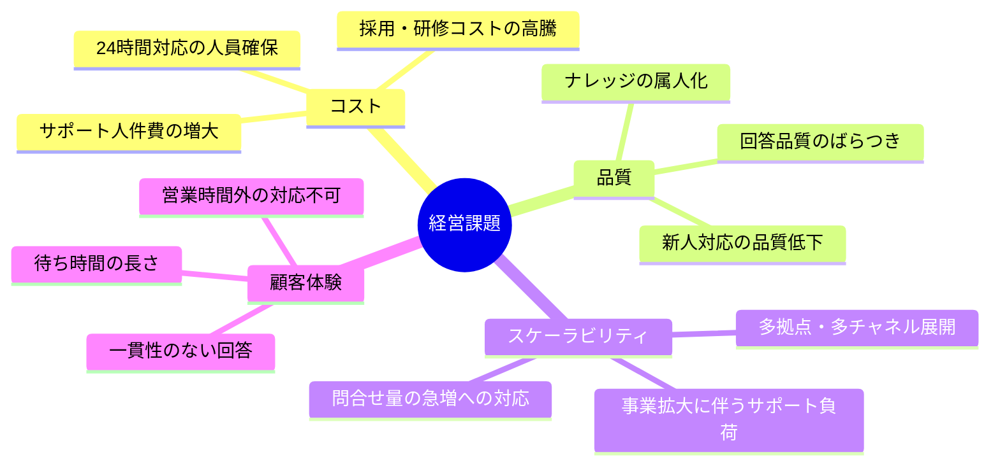
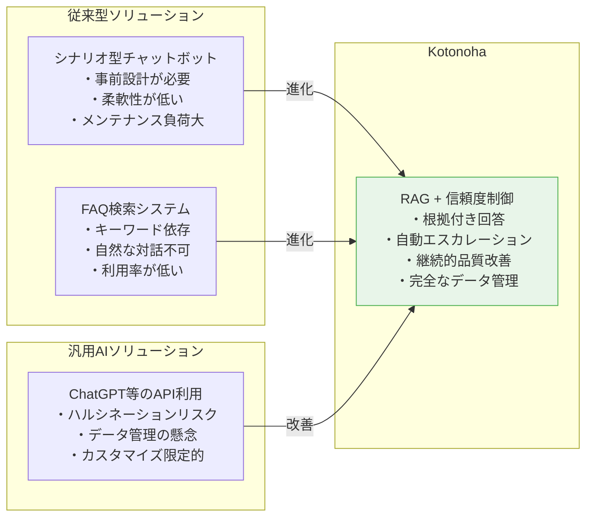
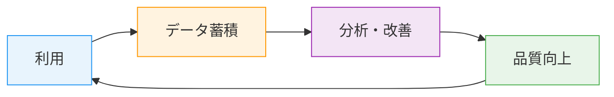
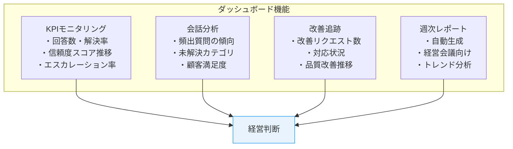
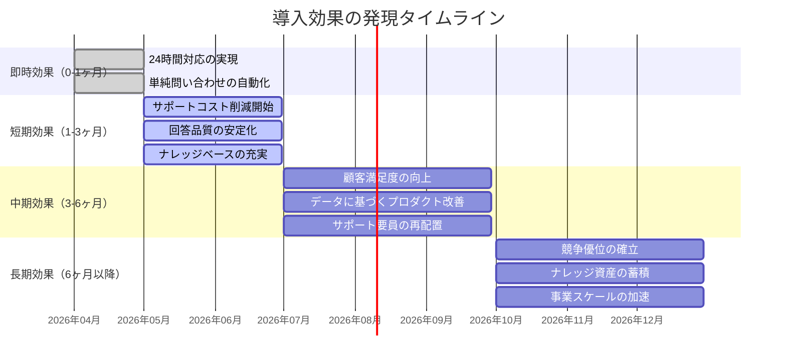
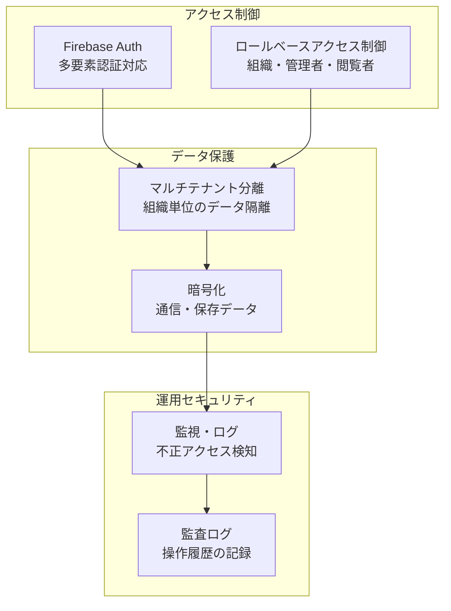
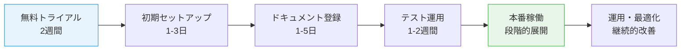

# Kotonoha — 経営層向けドキュメント

## エグゼクティブサマリー

Kotonohaは、組織が保有するナレッジ資産をAIチャットボットとして即座に活用できるSaaSプラットフォームです。カスタマーサポートの品質向上・コスト削減・スケーラビリティの3つを同時に実現し、企業の競争力強化に直結する価値を提供します。

本ドキュメントでは、経営判断に必要なビジネス価値、ROI、競争優位性、リスク管理について整理します。

---

## ビジネス価値の全体像

### Kotonohaが解決する経営課題



### 提供価値の構造

| 経営課題             | Kotonohaの解決策            | 期待効果               |
| -------------------- | --------------------------- | ---------------------- |
| サポートコストの増大 | AIによる一次対応の自動化    | 人件費30〜50%削減      |
| 回答品質のばらつき   | ナレッジベースからのRAG回答 | 品質の均一化・向上     |
| ナレッジの属人化     | ドキュメント一元管理        | 組織知の資産化         |
| 24時間対応の困難さ   | AIチャットボットの常時稼働  | 24/365の即時対応       |
| 問合せ急増への対応   | 自動スケーリング基盤        | 追加人員不要でスケール |
| 顧客満足度の低下     | 即時回答＋根拠提示          | NPS・CSAT向上          |

---

## ROI分析

### 定量的効果（中規模企業モデル: サポート担当10名想定）

```mermaid
graph TD
    subgraph 導入前（年間コスト）
        A1["サポート人件費<br/>6,000万円"]
        A2["研修・離職コスト<br/>500万円"]
        A3["機会損失<br/>300万円"]
        A4["合計: 6,800万円/年"]
    end

    subgraph 導入後（年間コスト）
        B1["Kotonoha利用料<br/>120万円"]
        B2["サポート人件費（7名）<br/>4,200万円"]
        B3["管理運用コスト<br/>100万円"]
        B4["合計: 4,420万円/年"]
    end

    A4 -->|"削減効果: 2,380万円/年"| B4

    style A4 fill:#ffcdd2,stroke:#F44336
    style B4 fill:#c8e6c9,stroke:#4CAF50
```

### ROI試算

| 項目                   | 金額                      |
| ---------------------- | ------------------------- |
| **導入前の年間コスト** | 6,800万円                 |
| **導入後の年間コスト** | 4,420万円                 |
| **年間削減効果**       | 2,380万円                 |
| **Kotonoha年間費用**   | 120万円（ビジネスプラン） |
| **ROI**                | **1,983%**                |
| **投資回収期間**       | 約0.6ヶ月                 |

### 定性的効果

| 効果領域               | 内容                                             |
| ---------------------- | ------------------------------------------------ |
| **従業員満足度向上**   | 単純反復問い合わせからの解放、高度な業務への集中 |
| **ナレッジ資産化**     | 暗黙知がドキュメントとして組織に蓄積             |
| **データドリブン経営** | 問い合わせデータの可視化によるプロダクト改善     |
| **ブランド価値向上**   | 即時・正確な対応による顧客信頼の獲得             |
| **リスク低減**         | 回答根拠の明示によるコンプライアンスリスク軽減   |

---

## 競争優位性

### 市場における差別化ポジション



### 競合に対する5つの優位性

#### 1. 信頼度に基づくインテリジェントルーティング

AIの回答信頼度をリアルタイムで評価し、低信頼度の場合は自動的に人間にエスカレーション。**AIの弱点を人間が補完する協調型アーキテクチャ**により、顧客体験を損なわずにAI活用を推進できます。

#### 2. 自己改善型プラットフォーム



低信頼度回答から自動生成される改善リクエスト、管理者の修正、ナレッジベースへの反映。この**継続的改善ループ**により、利用すればするほど回答精度が向上します。

#### 3. 透明性と説明責任

全ての回答に参照元ドキュメントと信頼度スコアを付与。コンプライアンス要件の厳しい業界でも安心して導入できる**説明可能なAI**を実現しています。

#### 4. ゼロコード導入

Web Componentとして提供されるチャットウィジェットは、HTMLタグ1行で既存サイトに統合可能。IT部門の大規模な開発プロジェクトなしに**即日導入**が可能です。

#### 5. 完全なデータ主権

マルチテナントアーキテクチャにより組織データは完全に分離。国内のGoogle Cloudインフラ上で稼働し、**データの国外流出リスクゼロ**を実現しています。

---

## 管理ダッシュボードによる経営可視化

### KPIモニタリング

Kotonohaの管理ダッシュボードは、カスタマーサポートの実態をリアルタイムで可視化します。



| ダッシュボード機能 | 経営への活用                 |
| ------------------ | ---------------------------- |
| KPIモニタリング    | サポート体制の最適化判断     |
| 会話分析           | プロダクト改善の優先順位付け |
| 改善追跡           | ナレッジ品質のガバナンス     |
| 週次レポート       | 経営会議での進捗報告         |

---

## 導入効果の時系列



| フェーズ | 期間    | 主な効果                         |
| -------- | ------- | -------------------------------- |
| 即時     | 0-1ヶ月 | 24/365対応、一次対応の自動化     |
| 短期     | 1-3ヶ月 | コスト削減開始、品質安定化       |
| 中期     | 3-6ヶ月 | CSAT向上、データ活用、人員最適化 |
| 長期     | 6ヶ月〜 | 競争優位確立、ナレッジ資産蓄積   |

---

## リスク管理

### リスクマトリクス

| リスク                         | 影響度 | 発生確率 | 対策                                          | 残余リスク |
| ------------------------------ | ------ | -------- | --------------------------------------------- | ---------- |
| **AI誤回答による顧客クレーム** | 高     | 中       | 信頼度スコア閾値設定、自動エスカレーション    | 低         |
| **データ漏洩**                 | 高     | 低       | マルチテナント分離、Firebase Auth、暗号化通信 | 低         |
| **サービス停止**               | 中     | 低       | Cloud Runの自動復旧、Firestoreの高可用性      | 低         |
| **AIモデルの精度劣化**         | 中     | 中       | 継続的モニタリング、モデル切替の柔軟性        | 低         |
| **ベンダーロックイン**         | 中     | 中       | 標準技術の採用、データエクスポート機能        | 中         |
| **規制変更**                   | 中     | 中       | 根拠提示による透明性、規制動向のモニタリング  | 中         |

### セキュリティ対策



---

## 導入プロセス

### 標準導入フロー



| ステップ           | 所要時間 | 必要なリソース     |
| ------------------ | -------- | ------------------ |
| 無料トライアル申込 | 即日     | 経営判断のみ       |
| 初期セットアップ   | 1-3日    | IT担当者（最小限） |
| ドキュメント登録   | 1-5日    | ナレッジ管理担当   |
| テスト運用         | 1-2週間  | サポートチーム     |
| 本番稼働           | 段階的   | 全体管理者         |

**最短2週間で本番稼働可能** — 大規模なシステムインテグレーションは不要です。

---

## 経営判断のポイント

### 導入を推奨する条件

- カスタマーサポートの問い合わせが月間500件以上
- サポート担当者が3名以上
- 対応品質のばらつきが課題となっている
- 営業時間外の問い合わせ対応ニーズがある
- ナレッジの属人化が進んでいる

### 期待される経営成果

| 指標               | 導入前  | 導入6ヶ月後（目安）     |
| ------------------ | ------- | ----------------------- |
| 一次対応の自動化率 | 0%      | 40-60%                  |
| 平均対応時間       | 30分    | 5分（AI即時対応分含む） |
| サポートコスト     | 100%    | 60-70%                  |
| 顧客満足度（CSAT） | 3.2/5.0 | 4.0/5.0                 |
| 営業時間外対応率   | 0%      | 100%                    |

---

## まとめ

Kotonohaは、カスタマーサポートのAI化を**低リスク・高リターン**で実現するプラットフォームです。

1. **即効性**: 最短2週間で導入完了、即日から効果を実感
2. **高ROI**: 投資回収期間1ヶ月未満、年間数千万円のコスト削減
3. **低リスク**: 信頼度制御・自動エスカレーションによるAIリスクの最小化
4. **継続的改善**: 使うほど賢くなる自己改善型プラットフォーム
5. **経営可視化**: ダッシュボードによるデータドリブンな意思決定支援

**今すぐ始められる、未来のカスタマーサポート基盤** — それがKotonohaです。
