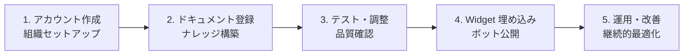
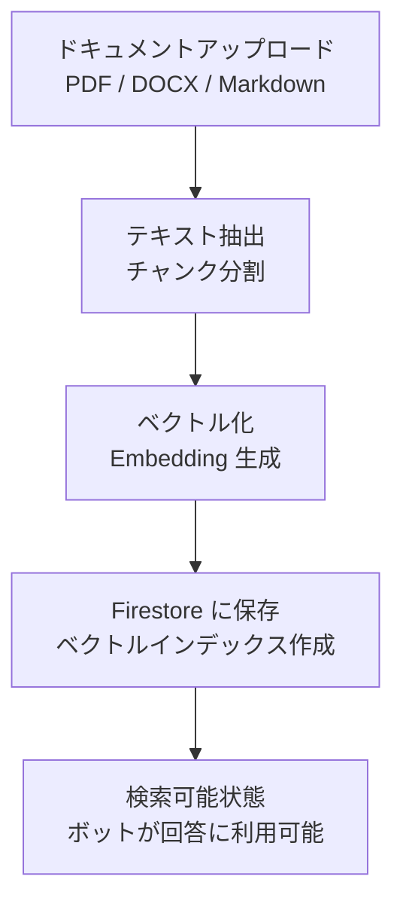
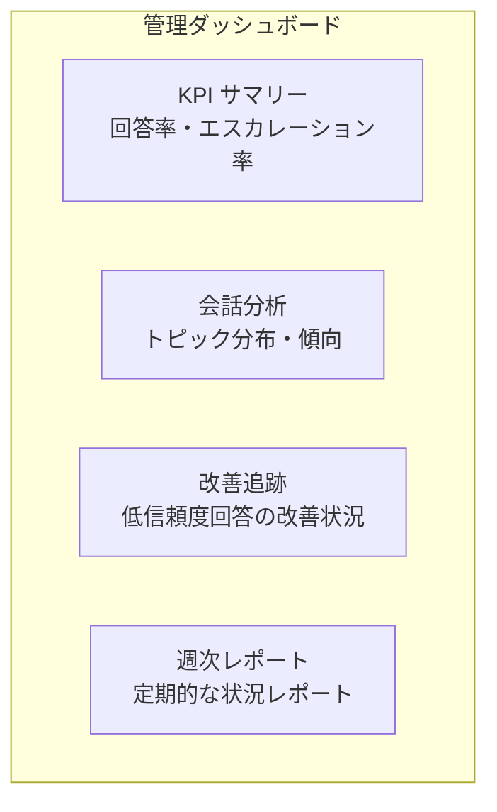
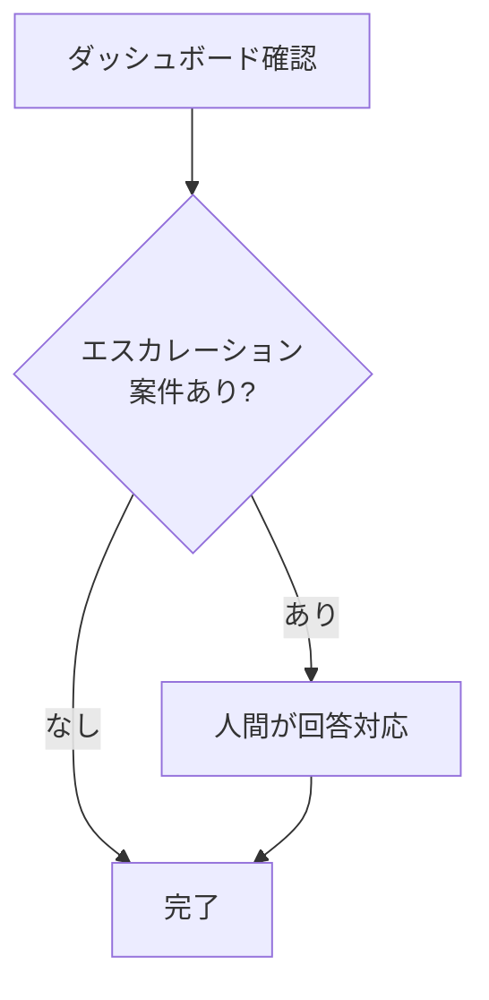
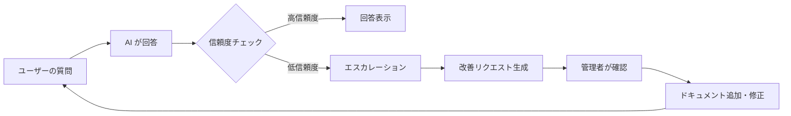

# Kotonoha 導入社向けガイド

> 本ドキュメントは、Kotonoha を導入する組織の管理者向けに、初期セットアップから運用開始、継続的な品質改善までの手順を網羅的に説明します。

---

## 目次

1. [はじめに](#はじめに)
2. [導入前の準備](#導入前の準備)
3. [初期セットアップ](#初期セットアップ)
4. [ドキュメント登録](#ドキュメント登録)
5. [FAQ 管理](#faq-管理)
6. [チャットボットのテスト](#チャットボットのテスト)
7. [Widget 埋め込み手順](#widget-埋め込み手順)
8. [管理ダッシュボードの使い方](#管理ダッシュボードの使い方)
9. [運用フロー](#運用フロー)
10. [品質改善サイクル](#品質改善サイクル)
11. [メンバー管理](#メンバー管理)
12. [エスカレーション設定](#エスカレーション設定)
13. [トラブルシューティング](#トラブルシューティング)
14. [運用チェックリスト](#運用チェックリスト)

---

## はじめに

Kotonoha は、貴社のナレッジを AI が学習し、エンドユーザーに根拠付きの自動回答を提供するプラットフォームです。本ガイドでは、管理者が Kotonoha を導入し、運用するために必要な全ステップを説明します。

### 導入の全体フロー



---

## 導入前の準備

### 必要なもの

| 項目 | 詳細 |
|------|------|
| 管理者メールアドレス | 組織の管理者として登録するメールアドレス |
| 登録するドキュメント | マニュアル、FAQ、手順書等（PDF, DOCX, Markdown 形式） |
| Widget 埋め込み先 URL | チャットボットを設置する Web サイトの URL |
| ブラウザ | Google Chrome（推奨）、Firefox、Edge の最新版 |

### ドキュメント整備のポイント

AI の回答品質は登録ドキュメントの品質に直結します。以下を事前に確認してください:

- **最新版であること:** 古い情報が含まれていると、誤った回答の原因になります
- **明確な記述:** 曖昧な表現を避け、具体的に記述されていること
- **網羅性:** よくある質問に対応するドキュメントが揃っていること
- **対応形式:** PDF、DOCX、Markdown ファイル

---

## 初期セットアップ

### ステップ 1: アカウント作成

1. Kotonoha のログインページにアクセス
2. 「新規登録」をクリック
3. 認証方式を選択:
   - **メールアドレス + パスワード** で登録
   - **Google アカウント** で登録（Google OAuth）
4. メールアドレス認証（メール/パスワード登録の場合）を完了

### ステップ 2: 組織の作成

1. 初回ログイン時に組織作成画面が表示される
2. 以下の情報を入力:
   - **組織名:** 貴社名またはプロジェクト名
   - **組織の説明:** （任意）用途や目的の説明
3. 「作成」をクリック

> 組織を作成したユーザーが自動的に admin（管理者）ロールに設定されます。

### ステップ 3: 基本設定

管理画面の「設定」から以下を設定:

| 設定項目 | 説明 | 推奨値 |
|---------|------|--------|
| 信頼度閾値 | この値未満の回答は自動エスカレーション | 0.6〜0.7 |
| エスカレーション先 | 低信頼度時の転送先設定 | サポート担当者のメール |
| CORS 許可ドメイン | Widget を埋め込むドメイン | 貴社 Web サイトのドメイン |
| ボット名 | チャットに表示される名前 | 「サポートアシスタント」等 |

---

## ドキュメント登録

### ドキュメント登録フロー



### 登録手順

1. 管理画面の「ドキュメント管理」を開く
2. 「ドキュメントを追加」をクリック
3. ファイルを選択（ドラッグ＆ドロップも可能）
4. 以下のメタ情報を入力:
   - **タイトル:** ドキュメントの名称
   - **カテゴリ:** 分類タグ（任意）
   - **説明:** 内容の概要（任意）
5. 「アップロード」をクリック
6. 処理状況が表示される（テキスト抽出 → ベクトル化 → 完了）

### 対応ファイル形式

| 形式 | 拡張子 | 備考 |
|------|--------|------|
| PDF | .pdf | テキスト抽出可能な PDF（スキャン画像のみの PDF は非対応） |
| Word | .docx | Microsoft Word 形式 |
| Markdown | .md | プレーンテキスト + Markdown 記法 |

### ドキュメント登録のベストプラクティス

- **1 ドキュメント 1 トピック:** 大きなマニュアルはトピック別に分割するとAIの検索精度が向上
- **見出し構造を活用:** 見出し（H1, H2, H3...）で構造化されたドキュメントは検索精度が高い
- **定期的な更新:** 古い情報は誤回答の原因になるため、定期的に最新版に差し替え
- **カテゴリの活用:** 適切なカテゴリ分けで管理の効率が向上

---

## FAQ 管理

### FAQ の登録

FAQ は「質問 + 回答」のペアとして登録します。定型的な質問に対して確実に正確な回答を返したい場合に有効です。

1. 管理画面の「FAQ 管理」を開く
2. 「FAQ を追加」をクリック
3. 以下を入力:
   - **質問:** ユーザーが尋ねる可能性のある質問文
   - **回答:** その質問に対する正式な回答
   - **カテゴリ:** 分類タグ
4. 「保存」をクリック

### FAQ とドキュメントの使い分け

| 項目 | FAQ | ドキュメント |
|------|-----|------------|
| 用途 | 定型的な Q&A | 包括的なナレッジ |
| 回答精度 | 完全一致で高精度 | AI が文脈から生成 |
| メンテナンス | 個別に編集しやすい | ファイル単位で差し替え |
| 推奨場面 | よくある質問 TOP 20 | マニュアル、手順書 |

---

## チャットボットのテスト

### テスト手順

本番公開前に、管理画面のテスト機能で回答品質を確認します。

1. 管理画面の「テスト」を開く
2. テスト質問を入力して送信
3. 以下を確認:
   - **回答内容:** 正確かつ適切か
   - **参照元:** 正しいドキュメントが引用されているか
   - **信頼度スコア:** 妥当な値か
4. 問題がある場合は、ドキュメントの追加・修正で対応

### テストチェックリスト

- [ ] よくある質問 TOP 10 に正しく回答できるか
- [ ] ドキュメントにない質問に対して適切にエスカレーションされるか
- [ ] 信頼度スコアが妥当な範囲に収まっているか
- [ ] 回答の参照元が正しいドキュメントを指しているか
- [ ] 複数のカテゴリにまたがる質問にも対応できるか
- [ ] 日本語の表記揺れ（送り仮名、カタカナ等）にも対応できるか

---

## Widget 埋め込み手順

### ステップ 1: 埋め込みコードの取得

管理画面の「Widget 設定」から埋め込みコードを取得します。

### ステップ 2: Web サイトへの埋め込み

Widget を設置したいページの `</body>` タグの直前に、以下のコードを追加します:

```html
<!-- Kotonoha チャット Widget -->
<kotonoha-chat-widget
  org-id="your-organization-id"
  theme="light"
></kotonoha-chat-widget>
<script src="https://[your-instance].run.app/widget.js"></script>
```

### ステップ 3: CORS 設定の確認

Widget を埋め込むドメインが、Kotonoha の CORS ホワイトリストに登録されていることを確認します。

1. 管理画面の「設定」→「CORS 設定」を開く
2. Widget 設置先のドメインが登録されていることを確認
3. 未登録の場合は追加して保存

### Widget のカスタマイズ

| 属性 | 説明 | 値 |
|------|------|----|
| `org-id` | 組織 ID（必須） | 管理画面で確認 |
| `theme` | テーマ設定 | `light` / `dark` |

### 技術的な注意事項

- Widget は **Shadow DOM** を使用しており、既存サイトの CSS に影響を与えません
- 逆に、既存サイトの CSS も Widget には影響しません
- Widget のスクリプトは非同期で読み込まれ、ページの表示速度に影響を与えません

### CSP（Content Security Policy）設定

Web サイトで CSP ヘッダーを設定している場合、以下の追加が必要です:

```
script-src: https://[your-instance].run.app
connect-src: https://[your-instance].run.app
```

---

## 管理ダッシュボードの使い方

### ダッシュボード概要



### 主要画面

| 画面 | 内容 |
|------|------|
| KPI サマリー | 問い合わせ件数、AI 自動回答率、エスカレーション率、平均信頼度 |
| 会話一覧 | 全会話の一覧、フィルタリング、詳細表示 |
| 会話分析 | トピック分布、時間帯別傾向、よくある質問 |
| 改善リクエスト | 低信頼度回答の一覧、改善ステータス管理 |
| 週次レポート | 自動生成される週次サマリーレポート |
| ドキュメント管理 | 登録ドキュメントの一覧、追加、編集、削除 |
| FAQ 管理 | FAQ の登録、編集、削除 |
| 設定 | 組織設定、Widget 設定、メンバー管理 |

---

## 運用フロー

### 日次運用



1. 管理ダッシュボードで KPI を確認
2. エスカレーションされた案件があれば人間が対応
3. 回答品質に問題がある場合はドキュメントを修正

### 週次運用

1. 週次レポートを確認
2. 低信頼度回答の傾向を分析
3. 改善リクエストの対応（ドキュメント追加・修正）
4. FAQ の追加・更新

### 月次運用

1. KPI の月次トレンドを確認
2. ドキュメントの棚卸し（古い情報の更新）
3. 新しいドキュメントの追加計画
4. 運用レポートの作成（経営層報告用）

---

## 品質改善サイクル

### フィードバックループ



### 改善リクエストの対応手順

1. 管理画面の「改善リクエスト」を開く
2. 未対応のリクエストを確認
3. 原因を分析:
   - **ドキュメント不足:** 該当するドキュメントがない → ドキュメントを追加
   - **ドキュメント不明瞭:** ドキュメントはあるが記述が曖昧 → ドキュメントを修正
   - **FAQ で対応可能:** 定型的な質問 → FAQ として登録
4. 対応完了後、改善リクエストのステータスを「完了」に更新

### 品質改善の優先度

| 優先度 | 基準 | 対応目安 |
|--------|------|---------|
| 高 | 頻出する質問で信頼度が低い | 即日対応 |
| 中 | 週に数件発生する低信頼度回答 | 週次で対応 |
| 低 | まれに発生する低信頼度回答 | 月次で対応 |

---

## メンバー管理

### メンバーの招待

1. 管理画面の「設定」→「メンバー管理」を開く
2. 「メンバーを招待」をクリック
3. 招待するメンバーのメールアドレスを入力
4. ロールを選択:
   - **admin:** 全権限（ドキュメント管理、設定変更、メンバー管理）
   - **member:** 閲覧中心（ダッシュボード閲覧、会話履歴閲覧）
5. 「招待」をクリック

### ロール権限一覧

| 機能 | admin | member |
|------|-------|--------|
| ダッシュボード閲覧 | 可 | 可 |
| 会話履歴閲覧 | 可 | 可 |
| ドキュメント管理 | 可 | 不可 |
| FAQ 管理 | 可 | 不可 |
| Widget 設定 | 可 | 不可 |
| メンバー管理 | 可 | 不可 |
| 組織設定変更 | 可 | 不可 |

---

## エスカレーション設定

### エスカレーションの仕組み

AI の回答の信頼度スコアが設定した閾値を下回った場合、自動的にエスカレーションが発生します。

### 設定手順

1. 管理画面の「設定」→「エスカレーション設定」を開く
2. 以下を設定:
   - **信頼度閾値:** エスカレーションが発動する信頼度スコアの下限値
   - **通知先:** エスカレーション発生時の通知先メールアドレス
3. 「保存」をクリック

### 閾値の調整ガイド

| 閾値 | 特徴 | 推奨場面 |
|------|------|---------|
| 0.8 以上 | 厳格（多くの回答がエスカレーション） | 導入初期、品質重視 |
| 0.6〜0.7 | バランス型 | 通常運用（推奨） |
| 0.5 以下 | 緩め（AI の自動回答が多い） | ドキュメントが十分に揃った後 |

---

## トラブルシューティング

### よくある問題と対処法

| 問題 | 原因 | 対処法 |
|------|------|--------|
| Widget が表示されない | CORS 設定の不備 | 管理画面で埋め込み先ドメインを CORS に追加 |
| Widget が表示されない | CSP ヘッダーの制限 | Kotonoha ドメインを CSP に追加 |
| 回答品質が低い | ドキュメント不足 | 改善リクエストを確認し、ドキュメントを追加 |
| 回答品質が低い | ドキュメントの記述が曖昧 | ドキュメントをより具体的に書き直し |
| エスカレーションが多すぎる | 信頼度閾値が高すぎる | 閾値を 0.6 程度に調整 |
| エスカレーションが少なすぎる | 信頼度閾値が低すぎる | 閾値を 0.7〜0.8 に調整 |
| ログインできない | 認証情報の誤り | パスワードリセット、または Google OAuth で再ログイン |
| ドキュメントのアップロードが失敗 | ファイル形式の非対応 | PDF, DOCX, Markdown のいずれかに変換して再アップロード |

---

## 運用チェックリスト

### 導入完了チェックリスト

- [ ] 管理者アカウントが作成されている
- [ ] 組織が作成され、基本設定が完了している
- [ ] 主要なドキュメントが登録されている
- [ ] FAQ が登録されている（主要なもの）
- [ ] テストで回答品質が確認されている
- [ ] Widget が正しく埋め込まれている
- [ ] CORS 設定が正しく行われている
- [ ] エスカレーション設定が完了している
- [ ] メンバーが招待されている（必要に応じて）

### 日次チェックリスト

- [ ] エスカレーション案件の確認と対応
- [ ] ダッシュボードの KPI 確認

### 週次チェックリスト

- [ ] 週次レポートの確認
- [ ] 改善リクエストの対応
- [ ] FAQ の追加・更新（必要に応じて）

### 月次チェックリスト

- [ ] ドキュメントの棚卸し（最新性の確認）
- [ ] KPI トレンドの分析
- [ ] 運用レポートの作成
- [ ] メンバーの棚卸し（退職者等のアカウント整理）

---

> 導入・運用でお困りの場合は、Kotonoha サポートチームまでお問い合わせください。
