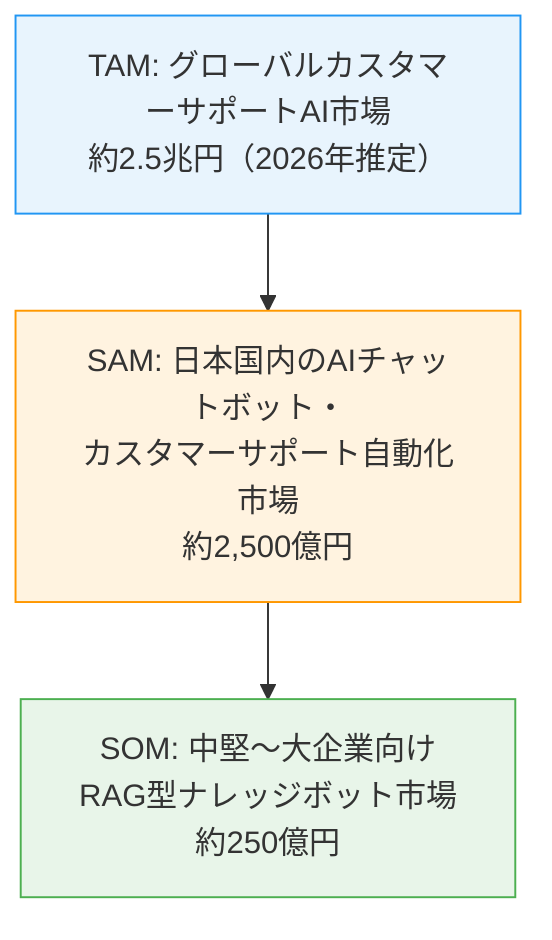
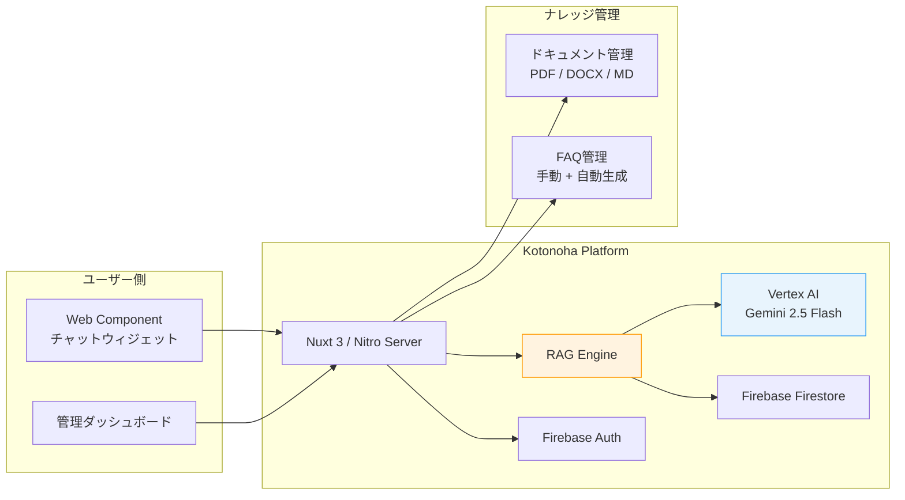
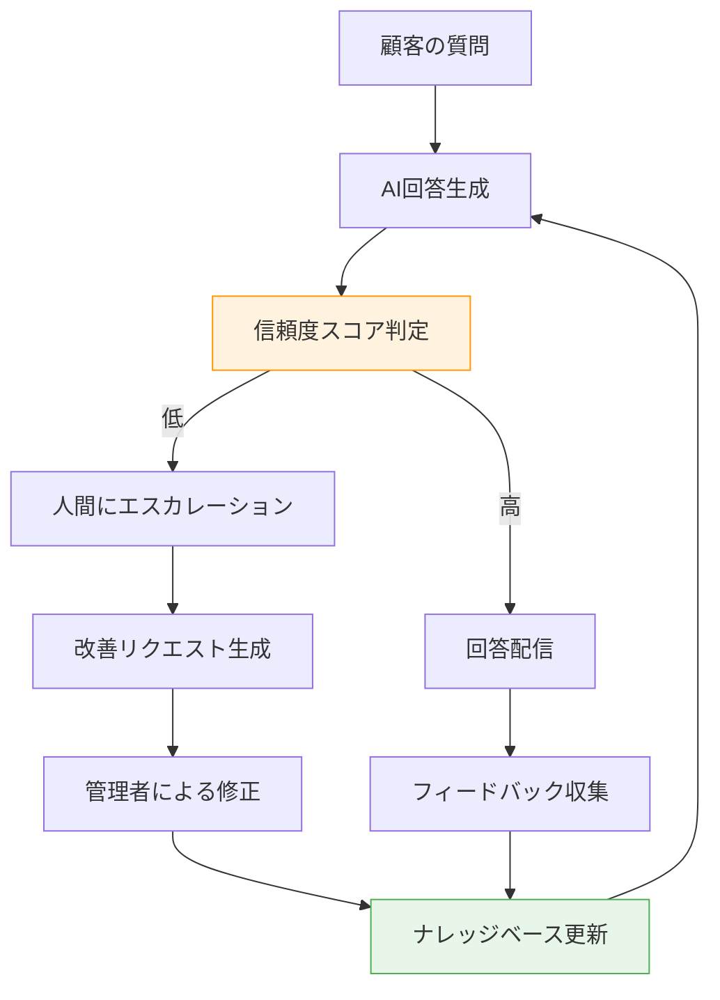
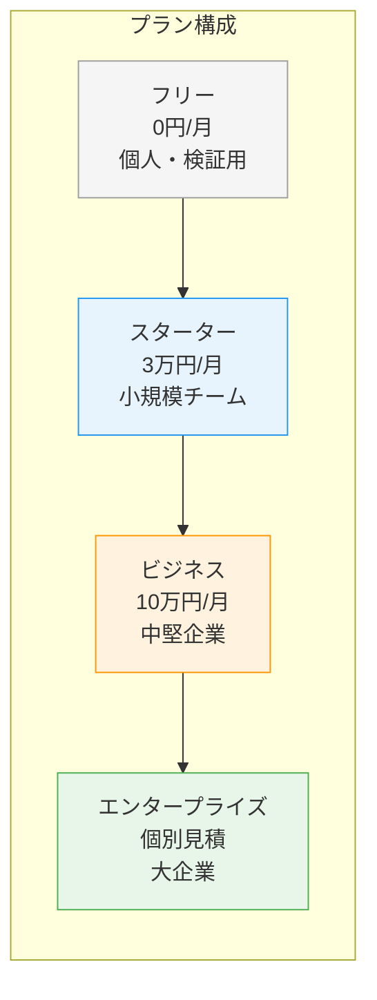
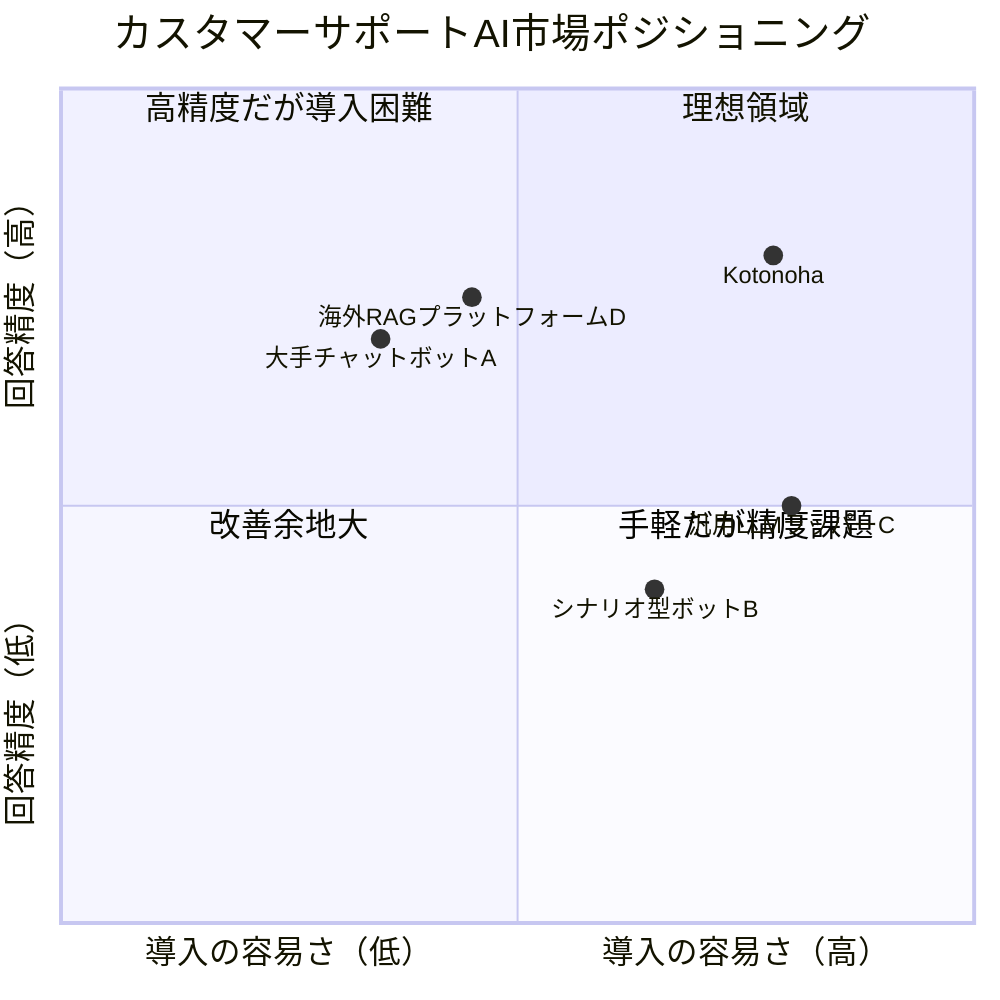
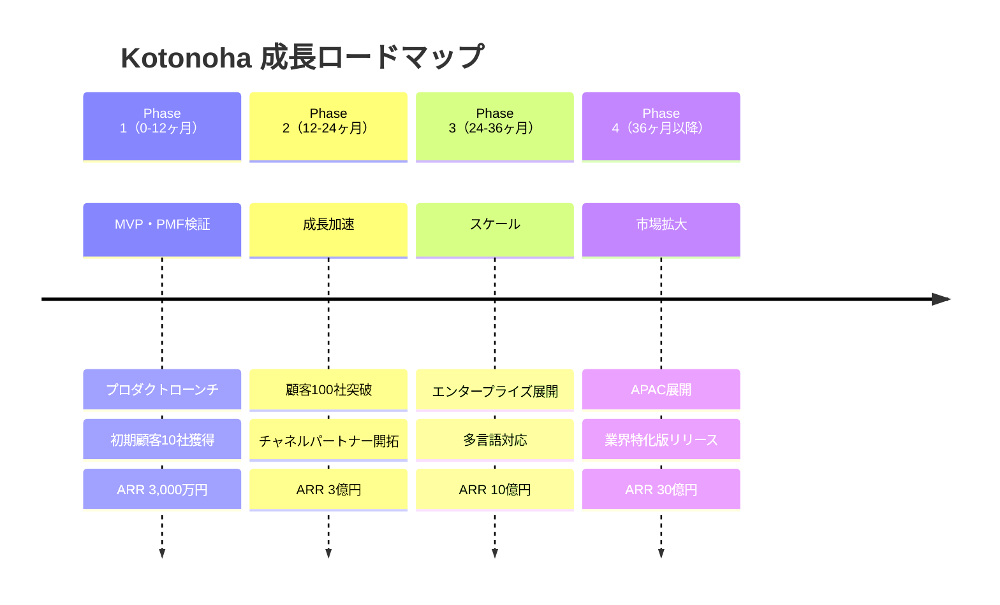

# Kotonoha — 投資家向けドキュメント

## エグゼクティブサマリー

Kotonohaは、企業が保有するナレッジ（マニュアル・FAQ・手順書等）をAIが即座に活用し、顧客対応を自動化するマルチテナント型SaaSプラットフォームです。RAG（Retrieval-Augmented Generation）技術を基盤とし、高精度な回答生成・根拠提示・信頼度スコアリングを実現します。

カスタマーサポート市場のAI化という大きな波の中で、**「導入の容易さ」と「回答品質の継続的改善」**を両立する独自ポジションを確立し、中小〜大企業まで幅広い顧客層を対象とした持続的な成長を目指します。

---

## 市場機会

### グローバル市場規模（TAM / SAM / SOM）

| 指標 | 規模 | 根拠 |
|------|------|------|
| **TAM** | 約2.5兆円 | グローバルのカスタマーサポートAI・チャットボット市場（2026年推定） |
| **SAM** | 約2,500億円 | 日本国内のAIチャットボット・FAQ自動化・カスタマーサポートSaaS市場 |
| **SOM** | 約250億円 | 日本国内の中堅〜大企業向けRAGベースナレッジボット市場（初期ターゲット） |

### 市場成長ドライバー

1. **生成AI普及の加速**: ChatGPT以降、企業のAI導入意欲が急速に高まっている
2. **人手不足の深刻化**: カスタマーサポート人材の採用難・離職率の高さ
3. **DX推進の国策化**: 政府のDX推進施策による企業のデジタル投資拡大
4. **コスト圧力**: インフレ環境下での業務効率化ニーズの増大
5. **顧客期待値の上昇**: 24時間即時対応への期待が標準化

---

## プロダクト概要と差別化要素

### コアアーキテクチャ

### 5つの差別化要素

#### 1. 信頼度スコアによるインテリジェントエスカレーション

単純なAI回答ではなく、回答ごとに信頼度スコアを算出。閾値以下の場合は自動的に人間のサポート担当者にエスカレーションし、**AI回答の品質リスクを最小化**します。

#### 2. 継続的品質改善ループ

低信頼度の回答は自動的に改善リクエストとして蓄積され、管理者が修正するとナレッジベースに反映される**自己改善型のフィードバックループ**を実装。使えば使うほど賢くなるプロダクトです。

#### 3. 根拠提示（ソースアトリビューション）

回答には必ず参照元ドキュメントを提示。企業が社内規定やコンプライアンス要件に基づく正確な回答を求める場面で、**回答の透明性と検証可能性**を担保します。

#### 4. ゼロコード導入（Web Componentウィジェット）

1行のHTMLタグを貼り付けるだけで、既存のWebサイトにチャットボットを埋め込み可能。技術的な障壁を極限まで下げ、**導入リードタイムを最短化**します。

#### 5. マルチテナント・データ分離

組織単位で完全なデータ分離を実現。企業の機密ドキュメントが他テナントに漏洩するリスクをアーキテクチャレベルで排除します。

---

## 技術的優位性

### 技術スタック

| レイヤー | 技術 | 選定理由 |
|---------|------|---------|
| フロントエンド | Nuxt 3 / Vue 3 / Tailwind CSS | SSR対応による高速表示、豊富なエコシステム |
| サーバー | Nitro Server | エッジデプロイ対応、軽量高速 |
| AI/ML | Vertex AI (Gemini 2.5 Flash) | Google Cloudとの統合、高速推論、コスト効率 |
| データベース | Firebase Firestore | リアルタイム同期、自動スケーリング、マルチテナント対応 |
| 認証 | Firebase Auth | エンタープライズ級のセキュリティ、SSO対応 |
| インフラ | Docker / Cloud Run | サーバーレス、自動スケーリング、従量課金 |
| 埋め込み | Web Component | フレームワーク非依存、任意サイトに統合可能 |

### 技術的モート（参入障壁）

1. **RAGパイプラインの最適化ノウハウ**: ドキュメントのチャンキング戦略、埋め込みモデルの選定、リランキングアルゴリズムの調整は実運用を通じてのみ蓄積される知見
2. **フィードバックデータの蓄積**: 運用期間が長いほど改善データが蓄積され、回答精度が向上するネットワーク効果
3. **マルチテナント基盤**: エンタープライズ要件を満たすデータ分離・セキュリティ基盤の構築には大きな初期投資が必要
4. **Google Cloud / Vertex AIとの深い統合**: 最新のAIモデルへの即時アクセスとコスト最適化

---

## 収益モデル

### 価格体系

| プラン | 月額 | 対象 | 主な制限 |
|--------|------|------|---------|
| フリー | 0円 | 個人・検証 | 100回/月、1ドキュメント |
| スターター | 3万円 | 小規模チーム | 5,000回/月、50ドキュメント |
| ビジネス | 10万円 | 中堅企業 | 50,000回/月、500ドキュメント、分析機能 |
| エンタープライズ | 個別見積 | 大企業 | 無制限、SLA保証、専用サポート |

### 収益構造

| 収益源 | 比率（定常時想定） | 説明 |
|--------|-------------------|------|
| サブスクリプション | 70% | 月額課金（主力） |
| 従量課金（超過分） | 15% | プラン上限超過時のAPI呼び出し課金 |
| プロフェッショナルサービス | 10% | 導入支援・カスタマイズ・研修 |
| アドオン | 5% | 追加テナント、高度な分析機能等 |

### ユニットエコノミクス（想定）

| 指標 | 目標値 |
|------|--------|
| CAC（顧客獲得コスト） | 15万円 |
| LTV（顧客生涯価値） | 180万円 |
| LTV/CAC比率 | 12x |
| 月次チャーンレート | 2%以下 |
| 粗利率 | 75%以上 |
| ARR達成目標（3年後） | 10億円 |

---

## 競合分析

### ポジショニングマップ

### 競合比較表

| 特徴 | Kotonoha | シナリオ型ボット | 汎用LLMラッパー | 海外RAGプラットフォーム |
|------|----------|----------------|----------------|---------------------|
| RAG対応 | ○ | × | △ | ○ |
| 信頼度スコア | ○ | × | × | △ |
| 自動エスカレーション | ○ | △ | × | △ |
| 継続的改善ループ | ○ | × | × | × |
| 根拠提示 | ○ | × | △ | ○ |
| 日本語最適化 | ○ | ○ | △ | × |
| 導入の容易さ | ○ | △ | ○ | × |
| データ主権（国内） | ○ | ○ | △ | × |
| 価格競争力 | ○ | ○ | ○ | × |

### Kotonohaの優位ポイント

- **日本市場特化**: 日本語の自然言語処理に最適化、国内データセンター利用
- **フィードバックループ**: 競合にない自己改善メカニズム
- **エスカレーション統合**: AI単体ではなく、人間との協調ワークフロー
- **低い導入障壁**: Web Componentによるゼロコード統合

---

## 成長戦略とマイルストーン

### フェーズ別成長計画

### KPI目標

| 指標 | Year 1 | Year 2 | Year 3 |
|------|--------|--------|--------|
| ARR | 3,000万円 | 3億円 | 10億円 |
| 顧客数 | 10社 | 100社 | 300社 |
| 月間会話数 | 5万回 | 100万回 | 500万回 |
| NPS | 30+ | 45+ | 55+ |
| チャーンレート | <5% | <3% | <2% |
| 従業員数 | 10名 | 30名 | 80名 |

---

## リスクと対策

| リスク | 影響度 | 発生確率 | 対策 |
|--------|--------|---------|------|
| 大手テック企業の参入 | 高 | 中 | 日本市場特化・フィードバックループの深化・スイッチングコストの構築 |
| AI技術の急速な変化 | 中 | 高 | モデル非依存のアーキテクチャ設計、Vertex AI統合による最新モデル即時採用 |
| データセキュリティインシデント | 高 | 低 | マルチテナント分離、暗号化、定期的なセキュリティ監査 |
| PMFの未達 | 高 | 中 | 早期顧客との密な連携、高速なプロダクトイテレーション |
| AI規制の強化 | 中 | 中 | 根拠提示機能による透明性確保、規制動向の継続モニタリング |

---

## 資金使途（想定）

| 用途 | 配分 | 詳細 |
|------|------|------|
| プロダクト開発 | 45% | エンジニア採用、AI/MLチーム強化、インフラ拡張 |
| セールス＆マーケティング | 30% | 営業チーム構築、マーケティング施策、パートナー開拓 |
| カスタマーサクセス | 15% | 導入支援チーム、サポート体制構築 |
| 管理・その他 | 10% | オフィス、法務、会計等 |

---

## まとめ

Kotonohaは以下の理由から、魅力的な投資機会を提供します。

1. **大きく成長する市場**: カスタマーサポートAI市場は年率30%以上で成長
2. **明確な差別化**: 信頼度スコア・自動エスカレーション・継続的改善ループの統合
3. **効率的な収益モデル**: SaaS型サブスクリプション＋従量課金のハイブリッド
4. **技術的モート**: RAGノウハウ・フィードバックデータの蓄積による参入障壁
5. **スケーラブルなアーキテクチャ**: Cloud Run＋Firestoreによる自動スケーリング
6. **日本市場の先行者優位**: 国内特化のRAGカスタマーサポートSaaSとしてのポジション確立

---

*本資料は投資判断の参考情報として作成されたものであり、将来の業績を保証するものではありません。*
