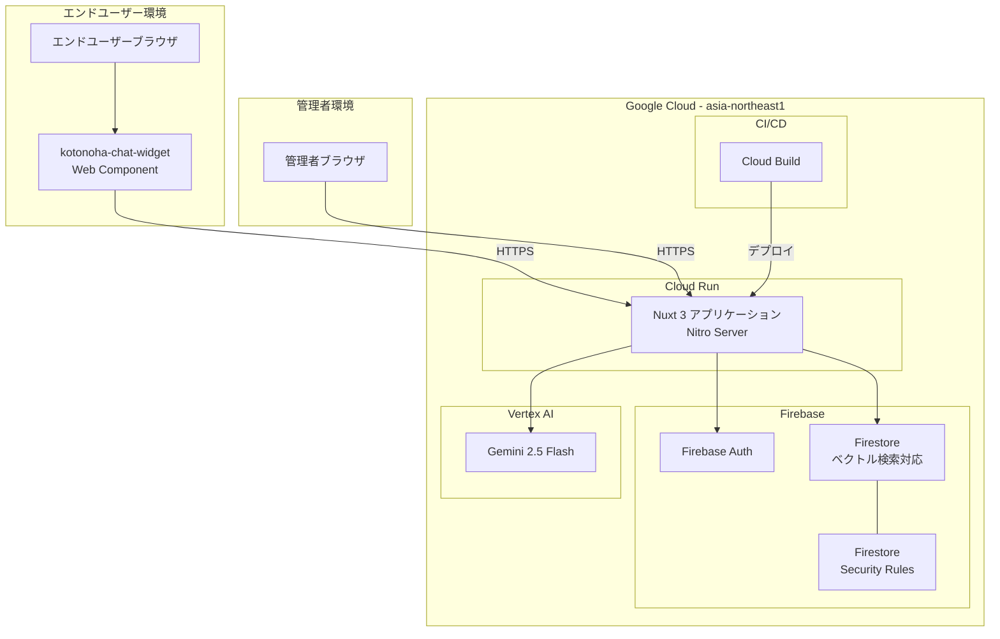
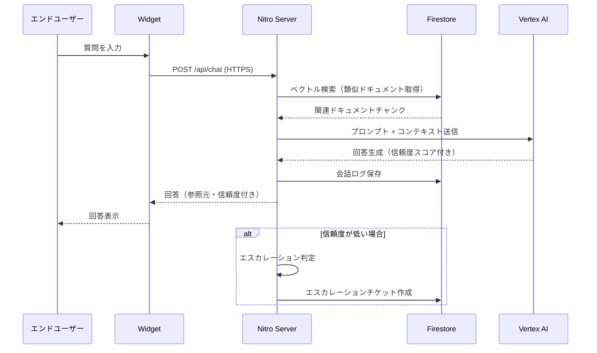
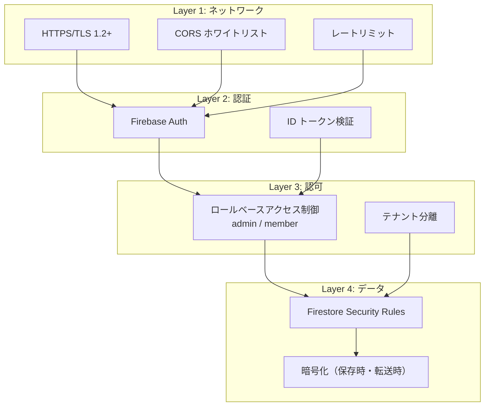
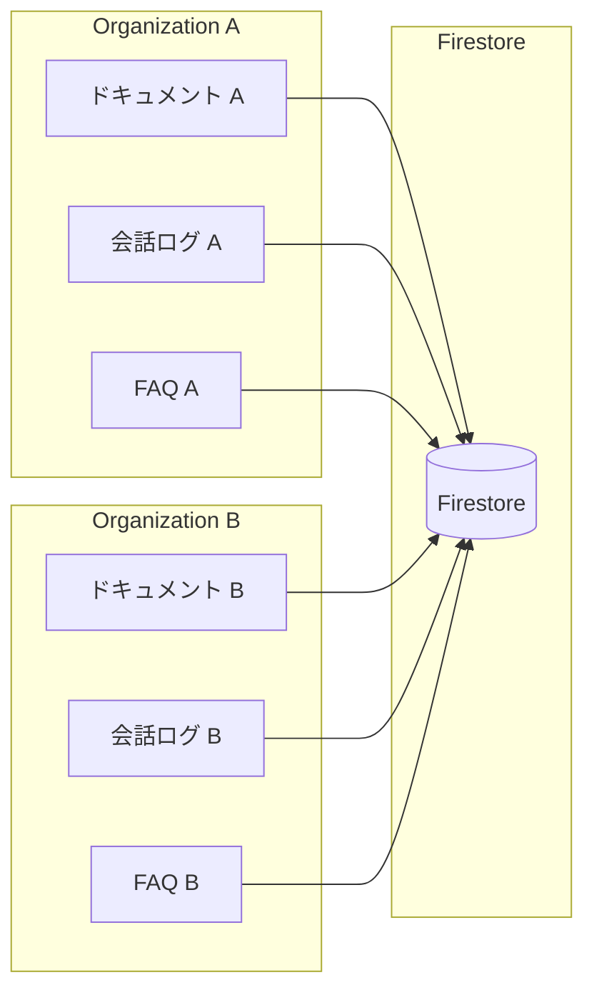
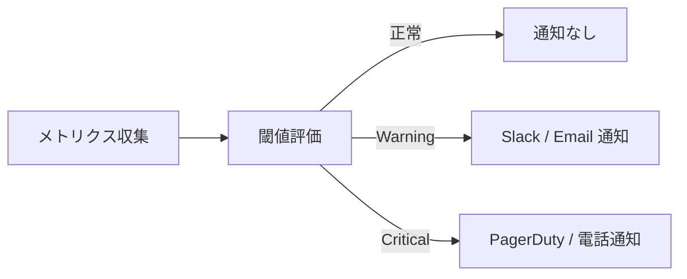
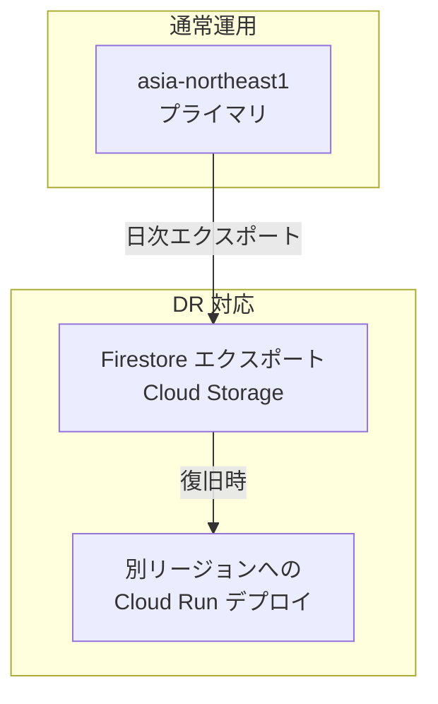

# Kotonoha システム部向け技術ドキュメント

> 本ドキュメントは、Kotonoha（RAG ベース AI カスタマーサポート SaaS）の導入検討・運用において、システム部門が把握すべき技術仕様・セキュリティ要件・運用要件を網羅的に記載したものです。

---

## 目次

1. [システム概要](#システム概要)
2. [技術スタック詳細](#技術スタック詳細)
3. [システムアーキテクチャ](#システムアーキテクチャ)
4. [セキュリティアーキテクチャ](#セキュリティアーキテクチャ)
5. [認証・認可](#認証認可)
6. [データフローと分離](#データフローと分離)
7. [ネットワーク要件](#ネットワーク要件)
8. [インテグレーション要件](#インテグレーション要件)
9. [可用性・SLA](#可用性sla)
10. [パフォーマンス仕様](#パフォーマンス仕様)
11. [監視・アラート](#監視アラート)
12. [バックアップ・リストア](#バックアップリストア)
13. [ディザスタリカバリ](#ディザスタリカバリ)
14. [運用要件](#運用要件)
15. [コンプライアンス・データ管理](#コンプライアンスデータ管理)
16. [導入時のシステム部確認チェックリスト](#導入時のシステム部確認チェックリスト)

---

## システム概要

Kotonoha は、組織のナレッジ（マニュアル、FAQ、手順書等）を AI が学習し、エンドユーザーからの問い合わせに対して根拠付きの回答を自動生成するマルチテナント型 SaaS プラットフォームです。

### 主要機能

| 機能 | 説明 |
|------|------|
| RAG ベース Q&A | ドキュメントを参照した回答生成（参照元・信頼度スコア付き） |
| 自動エスカレーション | 信頼度が低い場合に人間サポートへ自動転送 |
| 管理ダッシュボード | KPI 分析、会話分析、改善追跡、週次レポート |
| ドキュメント管理 | PDF、DOCX、Markdown 等のアップロード・管理 |
| Web Component Widget | `<kotonoha-chat-widget>` タグによる外部サイト埋め込み |
| FAQ 管理 | FAQ の登録・編集・公開 |
| フィードバックループ | 低信頼度 → 改善リクエスト → 管理者修正 → 品質向上 |

---

## 技術スタック詳細

### フロントエンド

| 技術 | バージョン / 詳細 | 用途 |
|------|-----------------|------|
| Nuxt 3 | SSR / CSR ハイブリッド | アプリケーションフレームワーク |
| Vue 3 | Composition API | UI コンポーネント |
| Tailwind CSS | ユーティリティファースト | スタイリング |
| Shadow DOM | Web Components | Widget の CSS 分離 |

### バックエンド

| 技術 | 詳細 | 用途 |
|------|------|------|
| Nitro Server | Nuxt 3 内蔵 | API サーバー |
| Firebase Firestore | NoSQL + ベクトル検索 | データストア・ベクトル DB |
| Vertex AI (Gemini 2.5 Flash) | Google Cloud | LLM 推論 |
| Firebase Auth | Email/Password + Google OAuth | 認証基盤 |

### インフラ・デプロイ

| 技術 | 詳細 | 用途 |
|------|------|------|
| Docker | コンテナ化 | アプリケーションパッケージング |
| Cloud Run | サーバーレスコンテナ | ホスティング・オートスケーリング |
| Cloud Build | CI/CD パイプライン | 自動ビルド・デプロイ |
| リージョン | asia-northeast1（東京） | データ所在地 |

---

## システムアーキテクチャ



### リクエストフロー



---

## セキュリティアーキテクチャ

### 多層防御モデル



### セキュリティ対策一覧

| レイヤー | 対策 | 詳細 |
|---------|------|------|
| 通信 | HTTPS 強制 | TLS 1.2 以上、Cloud Run 標準 |
| 通信 | CORS ホワイトリスト | 許可ドメインの明示的指定 |
| 通信 | レートリミット | API エンドポイント単位での制御 |
| 認証 | Firebase Auth | Email/Password + Google OAuth |
| 認証 | ID トークン検証 | サーバーサイドでの Firebase ID Token 検証 |
| 認可 | RBAC | admin（管理者）/ member（一般メンバー）のロール制御 |
| データ | テナント分離 | 組織（organization）単位でのデータ完全分離 |
| データ | Firestore Security Rules | ドキュメントレベルでのアクセス制御 |
| データ | 保存時暗号化 | Google Cloud 標準（AES-256） |
| データ | 転送時暗号化 | TLS による通信暗号化 |

---

## 認証・認可

### 認証フロー

| 認証方式 | 対象 | 詳細 |
|---------|------|------|
| Email/Password | 管理者・メンバー | Firebase Auth 標準 |
| Google OAuth | 管理者・メンバー | Google Workspace 連携可能 |

### ロールベースアクセス制御

| ロール | 権限 |
|--------|------|
| admin | 全機能へのアクセス、メンバー管理、ドキュメント管理、設定変更 |
| member | ダッシュボード閲覧、会話履歴閲覧、限定的なドキュメント操作 |

### Firestore Security Rules のポイント

- `list`（クエリ）と `get`（単一取得）で異なるルール評価が適用される
- テナント分離は `organizationId` フィールドベースで実装
- 全てのドキュメントアクセスに組織 ID の一致チェックが必須

---

## データフローと分離

### マルチテナントデータ分離



- 各組織のデータは Firestore 内で `organizationId` によって論理的に分離
- Security Rules により、他組織のデータへのアクセスは一切不可
- ベクトル検索も組織 ID でフィルタリングされ、テナント間のデータ漏洩を防止

---

## ネットワーク要件

### 導入組織側で必要な通信許可

| 通信先 | プロトコル | ポート | 用途 |
|--------|----------|--------|------|
| *.run.app | HTTPS | 443 | Cloud Run アプリケーション |
| *.googleapis.com | HTTPS | 443 | Firebase / Google Cloud API |
| *.firebaseio.com | HTTPS / WSS | 443 | Firestore リアルタイム通信 |

### Widget 埋め込み時の追加要件

- Widget を設置するドメインが CORS ホワイトリストに登録されていること
- Content Security Policy（CSP）で Kotonoha ドメインからのスクリプト読み込みを許可すること

---

## インテグレーション要件

### Widget 埋め込み

```html
<kotonoha-chat-widget
  org-id="your-organization-id"
  theme="light"
></kotonoha-chat-widget>
<script src="https://[your-instance].run.app/widget.js"></script>
```

- Shadow DOM による CSS 完全分離（既存サイトへの影響なし）
- カスタマイズ可能なテーマ設定

### API 連携

- Nitro Server が提供する REST API を介した外部システム連携が可能
- 認証には Firebase ID Token を使用

---

## 可用性・SLA

### 可用性設計

| 項目 | 仕様 |
|------|------|
| デプロイ方式 | Cloud Run ローリングアップデート（ゼロダウンタイム） |
| オートスケーリング | Cloud Run 標準（リクエスト数ベース） |
| リージョン | asia-northeast1（東京） |
| データ冗長性 | Firestore マルチリージョンレプリケーション（Google Cloud 管理） |

### SLA 目標

| メトリクス | 目標値 |
|-----------|--------|
| 月間稼働率 | 99.5% 以上（Cloud Run / Firestore SLA に依存） |
| 計画停止 | ゼロダウンタイムデプロイにより原則なし |
| 障害復旧時間（RTO） | 1 時間以内 |
| データ損失許容（RPO） | ほぼゼロ（Firestore リアルタイムレプリケーション） |

---

## パフォーマンス仕様

| メトリクス | 目標値 | 備考 |
|-----------|--------|------|
| チャット応答時間 | 3〜5 秒 | LLM 推論時間を含む |
| ベクトル検索レイテンシ | 500ms 未満 | Firestore ベクトル検索 |
| ダッシュボード表示 | 2 秒以内 | 初回ロード時 |
| Widget 初期化 | 1 秒以内 | スクリプト読み込み + 初期化 |
| 同時接続数 | Cloud Run オートスケーリングにより制限なし | コスト連動 |

---

## 監視・アラート

### 監視対象

| 監視項目 | ツール | アラート条件 |
|---------|--------|------------|
| アプリケーション稼働状況 | Cloud Run メトリクス | コンテナ異常終了、ヘルスチェック失敗 |
| レスポンスタイム | Cloud Run メトリクス | P95 > 10 秒 |
| エラーレート | Cloud Logging | 5xx エラー率 > 1% |
| Firestore 使用量 | Firebase コンソール | 読み取り/書き込み回数の急増 |
| Vertex AI API | Cloud Monitoring | API エラー率、レイテンシ異常 |
| 認証失敗 | Firebase Auth | 短時間での大量認証失敗 |

### 推奨アラート設定



---

## バックアップ・リストア

### Firestore バックアップ

| 項目 | 仕様 |
|------|------|
| 自動バックアップ | Firestore ポイントインタイムリカバリ（PITR） |
| 保持期間 | 最大 7 日間（PITR） |
| エクスポートバックアップ | 日次スケジュールエクスポート（Cloud Storage） |
| エクスポート保持期間 | 30 日間（推奨） |
| リストア方法 | PITR による任意時点復元、またはエクスポートからのインポート |

### バックアップ対象データ

| データ種別 | バックアップ方式 | 備考 |
|-----------|----------------|------|
| ユーザー・組織情報 | Firestore PITR + エクスポート | |
| ドキュメント・ベクトルデータ | Firestore PITR + エクスポート | |
| 会話ログ | Firestore PITR + エクスポート | |
| 認証情報 | Firebase Auth 管理 | Google 管理基盤 |
| アプリケーションコード | Git リポジトリ | Cloud Build 連携 |

---

## ディザスタリカバリ

### DR 戦略



| 項目 | 仕様 |
|------|------|
| RTO（目標復旧時間） | 1 時間以内 |
| RPO（目標復旧時点） | PITR: 数秒 / エクスポート: 最大 24 時間 |
| DR 手順 | Cloud Build による別リージョンデプロイ + Firestore リストア |
| テスト頻度 | 四半期に 1 回の DR 訓練を推奨 |

---

## 運用要件

### 定常運用

| 作業 | 頻度 | 担当 |
|------|------|------|
| Cloud Run メトリクス確認 | 日次 | システム部 |
| エラーログ確認 | 日次 | システム部 |
| Firestore 使用量確認 | 週次 | システム部 |
| セキュリティアップデート適用 | 月次 | システム部 / Kotonoha 運営 |
| バックアップリストアテスト | 四半期 | システム部 |
| DR 訓練 | 四半期 | システム部 |

### アップデート・パッチ適用

- Cloud Build CI/CD パイプラインによる自動デプロイ
- ゼロダウンタイムローリングアップデート
- ロールバックは Cloud Run のリビジョン切り替えで即時対応可能

---

## コンプライアンス・データ管理

### データ所在地

| データ種別 | 保管場所 | リージョン |
|-----------|---------|-----------|
| アプリケーションデータ | Firestore | asia-northeast1（東京） |
| AI 推論データ | Vertex AI | asia-northeast1（東京） |
| アプリケーションログ | Cloud Logging | asia-northeast1（東京） |
| バックアップ | Cloud Storage | asia-northeast1（東京） |

### データ保持・削除ポリシー

- 会話ログ: 組織設定に基づく保持期間（デフォルト 1 年）
- アカウント削除時: 関連する全データを 30 日以内に完全削除
- ドキュメント削除: ベクトルインデックスを含む即座の論理削除 + 30 日後の物理削除

---

## 導入時のシステム部確認チェックリスト

### ネットワーク

- [ ] ファイアウォールで Cloud Run ドメイン（*.run.app）への HTTPS 通信が許可されているか
- [ ] *.googleapis.com への通信が許可されているか
- [ ] *.firebaseio.com への WebSocket 通信が許可されているか
- [ ] プロキシ環境の場合、上記ドメインが除外設定されているか

### セキュリティ

- [ ] CORS ホワイトリストに自社ドメインが登録されているか
- [ ] Widget 埋め込みページの CSP 設定が適切か
- [ ] 社内セキュリティポリシーとの適合性が確認済みか
- [ ] データの国外転送がないことが確認済みか（asia-northeast1）

### 運用

- [ ] 監視・アラートの通知先が設定されているか
- [ ] 障害時の連絡フローが定義されているか
- [ ] バックアップ・リストア手順が文書化されているか
- [ ] DR 手順が文書化されているか

### アカウント管理

- [ ] 管理者アカウントの運用ルールが定義されているか
- [ ] 退職者のアカウント削除フローが定義されているか
- [ ] ロール（admin / member）の割り当て基準が定義されているか

---

> 本ドキュメントに関するお問い合わせは、Kotonoha 技術サポートチームまでご連絡ください。
