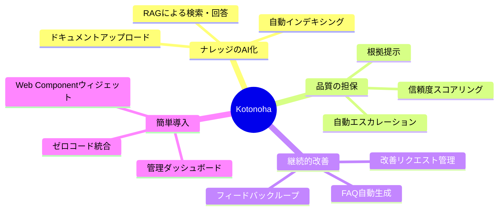
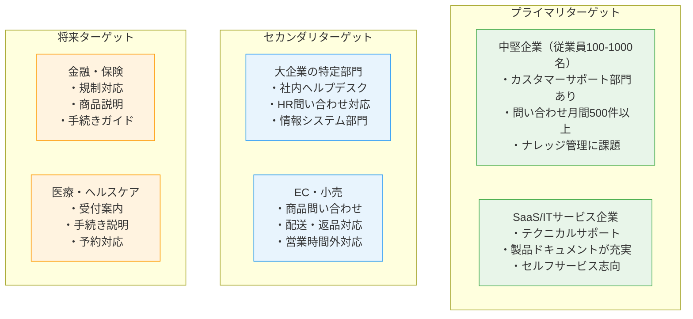
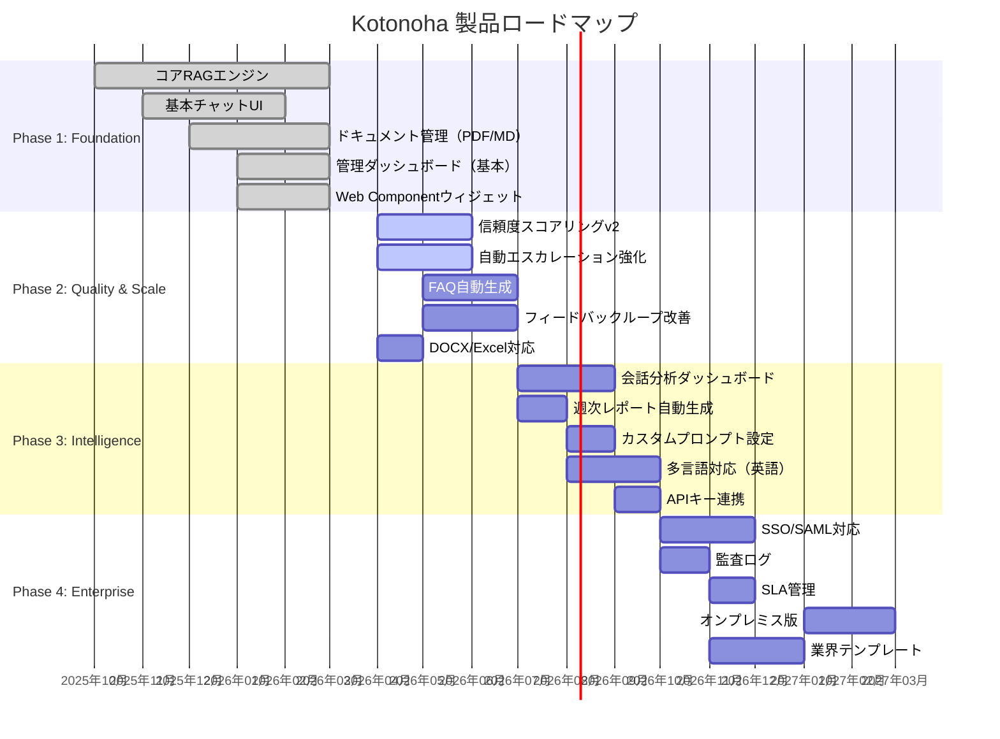
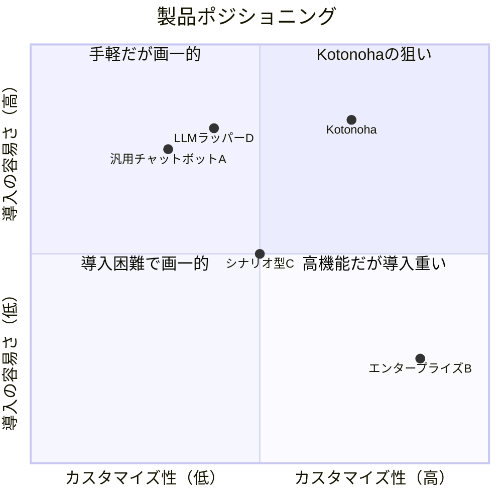
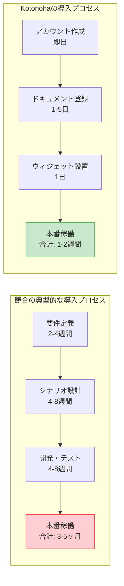
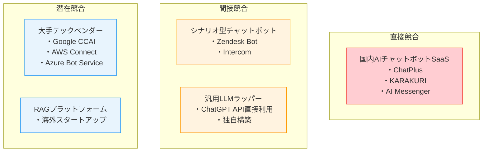
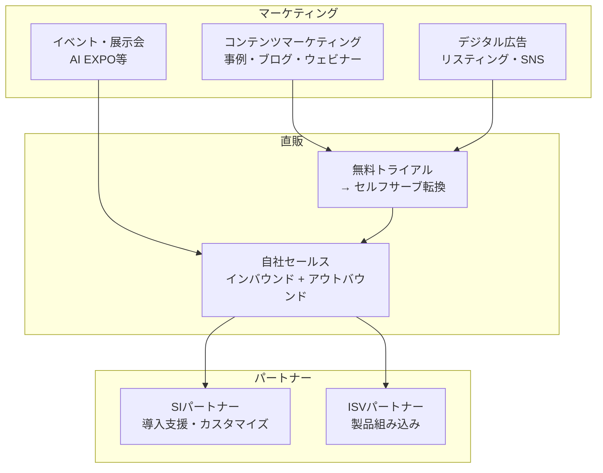

# Kotonoha — 企画部向けドキュメント

## 製品コンセプト

### ビジョン

**「組織のナレッジを、顧客との対話に変える」**

Kotonohaは、企業が蓄積してきたマニュアル・FAQ・手順書などのドキュメント資産を、AIチャットボットを通じて顧客が自然言語で即座にアクセスできる形に変換するSaaSプラットフォームです。

### プロダクトコンセプト



### コアバリュー

| 価値           | 説明                                                    | 従来手法との違い                   |
| -------------- | ------------------------------------------------------- | ---------------------------------- |
| **正確性**     | RAGにより社内ドキュメントに基づいた回答のみを生成       | 汎用AIのハルシネーション問題を解消 |
| **透明性**     | 全回答に根拠ドキュメントと信頼度スコアを付与            | ブラックボックス的な回答を排除     |
| **自律改善**   | 低信頼度回答→改善リクエスト→修正→品質向上の自動サイクル | 手動でのFAQ更新作業を大幅削減      |
| **導入容易性** | HTMLタグ1行でチャットボットを埋め込み可能               | 大規模なシステム開発が不要         |
| **安全性**     | マルチテナント完全分離、組織データの完全管理            | 外部AIへのデータ流出リスクなし     |

---

## ターゲット市場

### プライマリターゲット



### ターゲットペルソナ

#### ペルソナ1: カスタマーサポートマネージャー（田中さん・38歳）

| 項目             | 詳細                                                                             |
| ---------------- | -------------------------------------------------------------------------------- |
| 所属             | 中堅SaaS企業（従業員300名）のCS部門長                                            |
| 課題             | 問い合わせが月間2,000件を超え、チーム8名では対応しきれない。夜間・休日は対応不可 |
| ゴール           | 一次対応を自動化し、チームを複雑な案件に集中させたい                             |
| Kotonohaへの期待 | 導入が簡単で、既存のナレッジベースを活用でき、品質が担保される仕組み             |

#### ペルソナ2: 情報システム部門リーダー（佐藤さん・42歳）

| 項目             | 詳細                                                             |
| ---------------- | ---------------------------------------------------------------- |
| 所属             | 製造業大企業（従業員5,000名）の情シス部門                        |
| 課題             | 社内からのIT関連問い合わせが月間800件。同じ質問の繰り返しが多い  |
| ゴール           | 定型問い合わせをセルフサービス化し、戦略的IT施策に注力したい     |
| Kotonohaへの期待 | セキュリティ要件を満たしつつ、社内ポータルに簡単に統合できること |

#### ペルソナ3: EC事業責任者（鈴木さん・35歳）

| 項目             | 詳細                                                             |
| ---------------- | ---------------------------------------------------------------- |
| 所属             | アパレルEC（従業員50名）の事業責任者                             |
| 課題             | カート放棄率が高い。購入前の商品問い合わせに即座に答えられない   |
| ゴール           | サイト上で即座に商品情報を提供し、コンバージョン率を向上させたい |
| Kotonohaへの期待 | ECサイトに簡単に埋め込め、商品情報を正確に案内できること         |

---

## 機能概要

### 機能マップ

```mermaid
graph TB
    subgraph コア機能
        RAG["RAGエンジン<br/>ドキュメント検索 + AI回答生成"]
        Score["信頼度スコアリング<br/>回答品質の定量評価"]
        Source["根拠提示<br/>参照ドキュメントの表示"]
        Escalate["自動エスカレーション<br/>低信頼度時の人間対応切替"]
    end

    subgraph ナレッジ管理
        DocMgmt["ドキュメント管理<br/>PDF / DOCX / MD 対応"]
        FAQMgmt["FAQ管理<br/>手動作成 + 会話からの自動生成"]
        Feedback["フィードバックループ<br/>改善リクエスト管理"]
    end

    subgraph 管理・分析
        Dashboard["管理ダッシュボード<br/>KPI / 会話分析 / 改善追跡"]
        Report["週次レポート<br/>自動生成"]
        UserMgmt["ユーザー管理<br/>組織 / ロール管理"]
    end

    subgraph 統合・デリバリー
        Widget["Web Componentウィジェット<br/>外部サイト埋め込み"]
        Auth["認証基盤<br/>Firebase Auth"]
        Tenant["マルチテナント<br/>組織単位のデータ分離"]
    end

    RAG --> Score --> Escalate
    RAG --> Source
    DocMgmt --> RAG
    FAQMgmt --> RAG
    Escalate --> Feedback
    Feedback --> DocMgmt
    Dashboard --> Report
```

### 機能詳細

#### コア機能群

| 機能                 | 詳細                                                                                                                                | ユーザー価値                       |
| -------------------- | ----------------------------------------------------------------------------------------------------------------------------------- | ---------------------------------- |
| RAGエンジン          | アップロードされたドキュメントをベクトル化し、ユーザーの質問に対して関連箇所を検索。Vertex AI（Gemini 2.5 Flash）で自然な回答を生成 | 社内ドキュメントに基づく正確な回答 |
| 信頼度スコア         | 回答ごとに0-100の信頼度スコアを算出。閾値は組織ごとにカスタマイズ可能                                                               | 回答品質の定量的な監視・制御       |
| 根拠提示             | 回答の根拠となったドキュメントの該当箇所を表示                                                                                      | 回答の透明性・検証可能性           |
| 自動エスカレーション | 信頼度が閾値を下回る場合、自動的に人間のサポート担当者に転送                                                                        | AIの限界を安全に補完               |

#### ナレッジ管理機能群

| 機能                 | 詳細                                                              | ユーザー価値                   |
| -------------------- | ----------------------------------------------------------------- | ------------------------------ |
| ドキュメント管理     | PDF・DOCX・Markdownなど主要フォーマットに対応。バージョン管理付き | 既存ドキュメントをそのまま活用 |
| FAQ管理              | 手動でのFAQ作成に加え、実際の会話データから自動生成               | FAQ作成の工数を大幅削減        |
| フィードバックループ | 低信頼度回答→改善リクエスト→管理者修正→ナレッジ更新の自動サイクル | 使うほど品質が向上する仕組み   |

#### 管理・分析機能群

| 機能              | 詳細                                                             | ユーザー価値         |
| ----------------- | ---------------------------------------------------------------- | -------------------- |
| KPIダッシュボード | 回答数・解決率・信頼度推移・エスカレーション率をリアルタイム表示 | サポート品質の可視化 |
| 会話分析          | 頻出質問・未解決カテゴリ・トレンドの分析                         | プロダクト改善の示唆 |
| 改善追跡          | 改善リクエストの対応状況・品質改善の推移を追跡                   | 改善活動の進捗管理   |
| 週次レポート      | KPI・トレンド・改善提案を含む週次レポートの自動生成              | 報告業務の効率化     |

---

## 製品ロードマップ

### フェーズ別開発計画



### ロードマップ詳細

#### Phase 1: Foundation（完了）

基盤機能の構築。MVP としてのコア機能をリリースし、初期顧客からのフィードバックを収集。

| 機能               | ステータス | 概要                                                   |
| ------------------ | ---------- | ------------------------------------------------------ |
| コアRAGエンジン    | 完了       | Vertex AI (Gemini 2.5 Flash) を活用したRAGパイプライン |
| 基本チャットUI     | 完了       | リアルタイム対話インターフェース                       |
| ドキュメント管理   | 完了       | PDF・Markdown対応のアップロード・管理                  |
| 管理ダッシュボード | 完了       | 基本KPIの表示                                          |
| Web Component      | 完了       | 外部サイト埋め込み用ウィジェット                       |

#### Phase 2: Quality & Scale（進行中）

回答品質の向上とスケーラビリティの強化。フィードバックループの本格稼働。

| 機能                     | ステータス | 概要                                 |
| ------------------------ | ---------- | ------------------------------------ |
| 信頼度スコアリングv2     | 開発中     | より精緻なスコアリングアルゴリズム   |
| 自動エスカレーション強化 | 開発中     | エスカレーション条件のカスタマイズ   |
| FAQ自動生成              | 計画中     | 会話データからのFAQ自動抽出          |
| フィードバックループ改善 | 計画中     | 改善リクエストの優先度付け・自動分類 |
| DOCX/Excel対応           | 計画中     | 対応フォーマットの拡充               |

#### Phase 3: Intelligence（計画中）

分析・インテリジェンス機能の強化。データドリブンな改善サイクルの実現。

#### Phase 4: Enterprise（計画中）

エンタープライズ要件への対応。大企業向け機能の充実。

---

## 差別化戦略

### ポジショニング



### 差別化の3軸

#### 軸1: 回答品質の担保メカニズム

| 要素                 | Kotonoha         | 競合A        | 競合B      |
| -------------------- | ---------------- | ------------ | ---------- |
| RAG (根拠ベース回答) | 標準搭載         | なし         | オプション |
| 信頼度スコア         | リアルタイム算出 | なし         | バッチ処理 |
| 根拠提示             | 全回答に付与     | なし         | 一部対応   |
| 自動エスカレーション | 信頼度連動       | ルールベース | なし       |
| 継続的改善ループ     | 自動化           | 手動         | なし       |

#### 軸2: 導入・運用の容易さ



#### 軸3: 日本市場最適化

- 日本語の自然言語処理に最適化されたRAGパイプライン
- 国内Google Cloudインフラによるデータ主権の確保
- 日本企業の商習慣に合わせた管理機能
- 日本語によるサポートおよびドキュメント

---

## 競合分析

### 競合カテゴリ別分析



### 詳細比較

| 評価軸               | Kotonoha    | 国内AIチャットボット | シナリオ型 | 大手テックベンダー |
| -------------------- | ----------- | -------------------- | ---------- | ------------------ |
| RAG対応              | ◎           | △                    | ×          | ○                  |
| 信頼度制御           | ◎           | ×                    | ×          | △                  |
| 継続改善ループ       | ◎           | ×                    | ×          | ×                  |
| 導入容易性           | ◎           | ○                    | △          | ×                  |
| 日本語対応           | ◎           | ◎                    | ○          | △                  |
| 価格                 | ○           | ○                    | ○          | △                  |
| エンタープライズ機能 | △（開発中） | ○                    | ○          | ◎                  |
| ブランド認知         | △           | ○                    | ○          | ◎                  |

### 競合への勝ちパターン

| 競合タイプ               | Kotonohaの訴求ポイント                                               |
| ------------------------ | -------------------------------------------------------------------- |
| シナリオ型チャットボット | シナリオ設計不要、自然言語での柔軟な対話、メンテナンス工数の大幅削減 |
| 汎用LLMラッパー          | ハルシネーション防止、根拠提示、エスカレーション、管理ダッシュボード |
| 大手テックベンダー       | 導入の容易さ、コスト優位性、日本市場特化のサポート                   |
| 国内AIチャットボット     | RAGベースの高精度回答、継続的改善ループ、信頼度制御                  |

---

## Go-To-Market戦略

### チャネル戦略



### フェーズ別GTM

| フェーズ | 期間      | 主要チャネル                      | 目標                      |
| -------- | --------- | --------------------------------- | ------------------------- |
| シード   | 0-6ヶ月   | 直販（紹介・ネットワーク）        | 初期顧客10社獲得、PMF検証 |
| アーリー | 6-12ヶ月  | インバウンド + コンテンツ         | 顧客50社、事例3件公開     |
| グロース | 12-24ヶ月 | パートナー + デジタル広告         | 顧客200社、パートナー10社 |
| スケール | 24ヶ月〜  | 全チャネル + エンタープライズ営業 | 顧客500社、ARR10億円      |

---

## 成功指標（KPI）

### プロダクトKPI

| KPI                | 定義                                   | 目標値（Phase 2終了時） |
| ------------------ | -------------------------------------- | ----------------------- |
| 回答精度           | ユーザー評価で「正確」と判定された割合 | 85%以上                 |
| エスカレーション率 | 人間に転送された割合                   | 15%以下                 |
| 平均回答時間       | 質問から回答表示までの時間             | 3秒以内                 |
| ユーザー満足度     | チャット後の評価スコア                 | 4.0/5.0以上             |
| FAQ自動生成採用率  | 自動生成FAQが管理者に承認された割合    | 60%以上                 |

### ビジネスKPI

| KPI                   | 定義                         | 目標値（Year 1） |
| --------------------- | ---------------------------- | ---------------- |
| MRR                   | 月次定期収入                 | 250万円          |
| 顧客数                | アクティブ有料顧客数         | 10社             |
| チャーンレート        | 月次解約率                   | 5%以下           |
| NPS                   | Net Promoter Score           | 30以上           |
| トライアル→有料転換率 | 無料トライアルからの有料転換 | 20%以上          |

---

## まとめ

Kotonohaは、以下の3つの柱で市場での優位性を確立します。

1. **技術的差別化**: RAG + 信頼度制御 + 継続的改善ループという独自の品質担保メカニズム
2. **市場適合性**: 日本市場に特化した自然言語処理と、企業のデータ主権要件への対応
3. **導入障壁の低さ**: ゼロコード統合と最短2週間の導入プロセスで、幅広い企業層にリーチ

Phase 2の品質強化とPhase 3のインテリジェンス機能追加により、市場での確固たるポジションを築きます。
