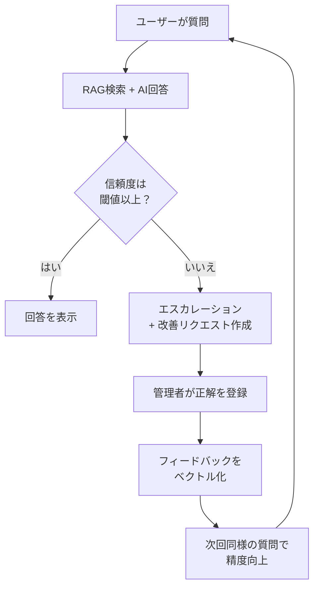
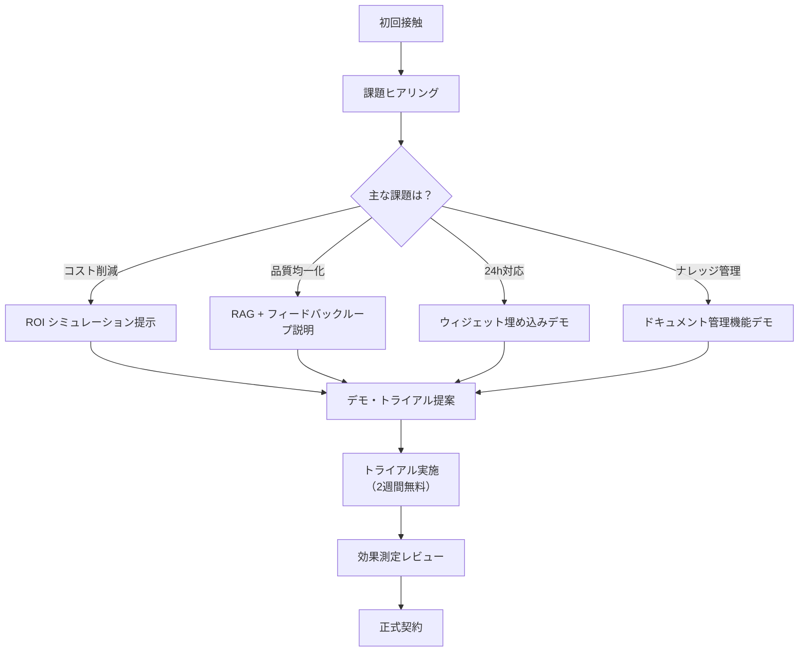

# 営業部向けドキュメント — Kotonoha

> **対象読者:** 営業担当者、プリセールスエンジニア
> **更新日:** 2026-03-29
> **機密区分:** 社内限定

---

## 1. Kotonoha とは

Kotonoha は、**RAG（検索拡張生成）技術を活用した AI チャットボット SaaS プラットフォーム**である。企業の問い合わせ対応業務を AI で自動化し、回答品質の均一化・24時間対応・ナレッジの集約を実現する。

### 一言で伝えるなら

> 「御社のマニュアル・FAQ・社内ドキュメントをそのまま AI に学習させ、顧客対応を自動化するクラウドサービスです。」

---

## 2. 顧客が抱える課題と Kotonoha の解決策

### 2.1 課題一覧

| #   | 課題                           | 具体的な症状                                                | ビジネスインパクト           |
| --- | ------------------------------ | ----------------------------------------------------------- | ---------------------------- |
| 1   | **問い合わせ対応コストの増大** | サポート人員の増加、残業時間の増加、外注コスト上昇          | 人件費の年間 10〜30% 増加    |
| 2   | **回答品質のばらつき**         | 担当者ごとに回答内容が異なる、誤回答による二次対応の発生    | 顧客満足度の低下、クレーム増 |
| 3   | **知識の属人化**               | ベテラン社員の退職でノウハウが喪失、引継ぎコストが膨大      | 事業継続リスク               |
| 4   | **24時間対応ができない**       | 営業時間外の問い合わせに翌営業日まで回答できない            | 機会損失、顧客離れ           |
| 5   | **ナレッジが散在している**     | マニュアル・FAQ・メール・チャット履歴が分散して検索できない | 回答までの時間が長い         |

### 2.2 Kotonoha による解決

```mermaid
graph LR
    subgraph 課題["顧客の課題"]
        A["コスト増大"]
        B["品質ばらつき"]
        C["属人化"]
        D["24h対応不可"]
        E["ナレッジ散在"]
    end

    subgraph 解決["Kotonoha の提供価値"]
        F["AI自動回答で<br/>対応工数 70% 削減"]
        G["RAGベースで<br/>常に一貫した回答"]
        H["ドキュメント一元管理<br/>+ 学習ループ"]
        I["24/365<br/>即時対応"]
        J["ベクトル検索で<br/>横断的ナレッジ活用"]
    end

    A --> F
    B --> G
    C --> H
    D --> I
    E --> J
```



| 課題         | Kotonoha の解決策                                     | 期待効果                |
| ------------ | ----------------------------------------------------- | ----------------------- |
| コスト増大   | AI が一次対応を自動化。人間は高度な問い合わせのみ対応 | 対応工数 50〜70% 削減   |
| 品質ばらつき | 同一ドキュメントに基づく回答で品質を均一化            | 誤回答率を 80% 以上削減 |
| 属人化       | 社内ドキュメントを AI がベクトル化して蓄積            | 退職リスクの軽減        |
| 24h 対応不可 | AI が 24 時間 365 日即時回答                          | 顧客満足度向上          |
| ナレッジ散在 | 全ドキュメントをベクトルDBに集約し横断検索            | 回答速度 10 倍以上      |

---

## 3. 製品の特長・差別化ポイント

### 3.1 競合との差別化マトリクス

| 機能・特長                 | Kotonoha                    | 一般的なチャットボット | 社内FAQ検索ツール |
| -------------------------- | --------------------------- | ---------------------- | ----------------- |
| RAG + ベクトル検索         | **対応**                    | 非対応（ルールベース） | 部分的            |
| フィードバック学習ループ   | **対応（自動改善）**        | 非対応                 | 非対応            |
| Web Component 埋め込み     | **対応（1行で設置）**       | iframe / SDK           | 非対応            |
| マルチテナント             | **完全対応**                | 限定的                 | 非対応            |
| マルチグループ             | **対応（部署別管理）**      | 非対応                 | 非対応            |
| ドキュメント自動チャンク化 | **対応（PDF/DOCX/HTML等）** | 手動入力               | 部分的            |
| 信頼度スコア付き回答       | **対応**                    | 非対応                 | 非対応            |
| 自動エスカレーション       | **対応（閾値ベース）**      | 手動切替               | 非対応            |
| FAQ 自動生成               | **対応（AI生成）**          | 非対応                 | 非対応            |
| 週次レポート（AI分析）     | **対応**                    | CSV出力のみ            | 非対応            |

### 3.2 3つの差別化キーワード

#### RAG + フィードバックループ

単なる FAQ 検索ではなく、社内ドキュメントをベクトル化して類似検索する RAG 技術を採用。さらに、AI が回答できなかった質問を管理者がフィードバックすると、そのフィードバック自体がベクトル化されて次回以降の回答精度が向上する**自動改善ループ**を実装。



#### Web Component 埋め込み

顧客の既存 Web サイトに **HTML タグ 1 行**で AI チャットウィジェットを埋め込める。iframe やサードパーティ SDK の導入が不要で、導入障壁が極めて低い。

```html
<!-- 1行で設置可能 -->
<kotonoha-chat-widget
  api-base-url="https://your-domain.com"
  service-id="your-service-id"
></kotonoha-chat-widget>
```

#### マルチテナント・マルチグループ

1つのプラットフォームで複数の組織（テナント）を完全に分離して運用可能。さらに、組織内の部署・チーム単位（グループ）でサービスやドキュメントを管理でき、大企業での全社導入にも対応。

---

## 4. 価格体系

### 4.1 プラン構成（サブスクリプション型）

| プラン               | Starter   | Business          | Enterprise |
| -------------------- | --------- | ----------------- | ---------- |
| **月額（税抜）**     | 50,000 円 | 150,000 円        | 個別見積   |
| **年間契約割引**     | 10% OFF   | 15% OFF           | 応相談     |
| グループ数           | 1         | 5                 | 無制限     |
| サービス数           | 3         | 10                | 無制限     |
| ドキュメント登録数   | 100       | 500               | 無制限     |
| 月間チャット数       | 1,000     | 10,000            | 無制限     |
| ユーザー数           | 5         | 20                | 無制限     |
| ウィジェット埋め込み | 1 サイト  | 5 サイト          | 無制限     |
| FAQ 自動生成         | -         | 対応              | 対応       |
| 週次レポート         | -         | 対応              | 対応       |
| RAG 診断ツール       | -         | 対応              | 対応       |
| SLA                  | -         | 99.5%             | 99.9%      |
| サポート             | メール    | メール + チャット | 専任担当   |
| カスタム SSO         | -         | -                 | 対応       |

### 4.2 価格の考え方

- **Starter**: まず試したい中小企業・スタートアップ向け。必要最小限の機能で AI チャットボットの効果を実感
- **Business**: 本格導入する中堅企業向け。複数部署での利用とレポート・分析機能を含む
- **Enterprise**: 大企業・金融・官公庁向け。セキュリティ要件・カスタマイズ・SLA を個別対応

### 4.3 ROI シミュレーション例

| 指標               | 導入前   | 導入後（Business プラン） |
| ------------------ | -------- | ------------------------- |
| 月間問い合わせ件数 | 3,000 件 | 3,000 件（変化なし）      |
| AI 自動回答率      | 0%       | 70%                       |
| 人的対応件数       | 3,000 件 | 900 件                    |
| サポート人員       | 5 名     | 2 名                      |
| 月間人件費         | 200 万円 | 80 万円                   |
| Kotonoha 月額      | 0 円     | 15 万円                   |
| **月間削減額**     | -        | **105 万円**              |
| **年間 ROI**       | -        | **約 700%**               |

---

## 5. 想定質問と回答（FAQ）

### Q1: 既存のチャットボットとの違いは何ですか？

**A:** 従来のチャットボットはルールベース（シナリオ型）で、質問パターンを事前に登録する必要があります。Kotonoha は RAG 技術により、社内ドキュメントをそのまま学習するため、**質問パターンの登録作業が不要**です。さらに、フィードバックループにより使えば使うほど回答精度が向上します。

### Q2: どのようなドキュメントに対応していますか？

**A:** PDF、Word（DOCX）、テキスト、Markdown、HTML、CSV に対応しています。既存のマニュアルや FAQ、社内規程をそのままアップロードするだけで利用開始できます。

### Q3: セキュリティは大丈夫ですか？

**A:** 以下の対策を実施しています。

- マルチテナント設計により組織間のデータが完全に分離
- Firebase Authentication による堅牢な認証
- Firestore Security Rules によるアクセス制御
- Cloud Run 上で動作し、Google Cloud のセキュリティ基盤を活用
- 通信は全て TLS 暗号化

### Q4: 導入にどのくらいの期間がかかりますか？

**A:** 最短で **1 週間**で運用開始できます。典型的な導入ステップは以下の通りです。

| ステップ         | 期間    | 内容                                  |
| ---------------- | ------- | ------------------------------------- |
| アカウント作成   | 即日    | 組織登録・管理者アカウント設定        |
| ドキュメント登録 | 1〜3 日 | 既存ドキュメントのアップロード・処理  |
| チューニング     | 2〜5 日 | RAG 診断ツールで回答品質を確認・調整  |
| ウィジェット設置 | 即日    | HTML タグ 1 行を Web サイトに貼り付け |
| 運用開始         | -       | 改善ダッシュボードで継続的に品質向上  |

### Q5: ChatGPT をそのまま使えばいいのでは？

**A:** ChatGPT は汎用 AI であり、**御社固有の情報は学習していません**。Kotonoha は御社のドキュメントのみに基づいて回答するため、正確な情報を提供できます。また、ハルシネーション（嘘の回答）対策として信頼度スコアを表示し、確信が低い場合は自動的にエスカレーションする仕組みがあります。

### Q6: 多言語対応していますか？

**A:** AI エンジンとして Gemini 2.5 Flash を採用しており、多言語のドキュメントを登録して多言語で回答することが技術的に可能です。ただし、UI は現在日本語のみの提供です。

### Q7: 解約はいつでもできますか？

**A:** 月額契約の場合は月末で解約可能です。年間契約の場合は契約期間満了時に更新停止が可能です。データのエクスポート機能も提供しています。

### Q8: API 連携は可能ですか？

**A:** はい。RESTful API を公開しており、既存のシステムやアプリケーションから API 経由でチャット機能を利用できます。Web Component 埋め込みと API 利用の両方に対応しています。

---

## 6. 導入事例テンプレート

### テンプレート構成

```
■ 導入事例：[顧客企業名]

【企業概要】
- 業種: [業種]
- 従業員数: [人数]
- 課題: [導入前の課題を 1〜2 文で記載]

【導入背景】
[3〜5 文で、なぜ Kotonoha を選んだかを記載]

【導入プラン】
[Starter / Business / Enterprise]

【導入効果】
| 指標 | 導入前 | 導入後 | 改善率 |
|------|--------|--------|--------|
| 月間問い合わせ対応時間 | XX 時間 | XX 時間 | XX% 削減 |
| 平均回答時間 | XX 分 | XX 秒 | XX% 短縮 |
| 顧客満足度 | XX% | XX% | XX pt 向上 |
| サポート人員 | XX 名 | XX 名 | XX 名削減 |

【お客様の声】
「[担当者のコメントを引用形式で記載]」
— [役職], [氏名]
```

### 事例テンプレート記入例

```
■ 導入事例：株式会社ABC

【企業概要】
- 業種: IT サービス
- 従業員数: 300 名
- 課題: ヘルプデスクへの問い合わせが月 2,000 件を超え、対応が追いつかない

【導入背景】
社内マニュアルが 500 ページ以上あり、新入社員の教育コストが課題だった。
Kotonoha のドキュメント一括登録機能で既存マニュアルをそのまま学習できる点が決め手となった。

【導入プラン】
Business プラン

【導入効果】
| 指標 | 導入前 | 導入後 | 改善率 |
|------|--------|--------|--------|
| 月間問い合わせ対応時間 | 500 時間 | 150 時間 | 70% 削減 |
| 平均回答時間 | 30 分 | 3 秒 | 99% 短縮 |
| ヘルプデスク人員 | 5 名 | 2 名 | 3 名削減 |

【お客様の声】
「導入後すぐに効果を実感しました。特にフィードバックループで
 AI の回答精度が日に日に上がっていくのが嬉しいです。」
— 情報システム部 部長, 田中太郎
```

---

## 7. 商談シナリオ例

### 7.1 ヒアリングフェーズ



### 7.2 ヒアリング質問リスト

| #   | 質問                                                | 確認ポイント                    |
| --- | --------------------------------------------------- | ------------------------------- |
| 1   | 現在の問い合わせ件数は月間どのくらいですか？        | ボリューム感の把握 → プラン選定 |
| 2   | 問い合わせ対応に何名の担当者がいますか？            | 人的コストの把握 → ROI 算出     |
| 3   | どのような内容の問い合わせが多いですか？            | AI で自動化できる割合の推定     |
| 4   | 社内マニュアルや FAQ は整備されていますか？         | ドキュメントの準備状況確認      |
| 5   | 現在チャットボットや FAQ システムを使っていますか？ | 競合状況の確認                  |
| 6   | 対応時間は何時から何時までですか？                  | 24h 対応ニーズの確認            |
| 7   | Web サイトにチャットを埋め込みたいですか？          | ウィジェット機能の訴求          |
| 8   | セキュリティ要件はありますか？                      | Enterprise プラン提案の判断     |

### 7.3 デモシナリオ（30分構成）

| 時間      | 内容                   | ポイント                                             |
| --------- | ---------------------- | ---------------------------------------------------- |
| 0〜5 分   | 概要説明               | 「御社のドキュメントがそのまま AI の知識になります」 |
| 5〜10 分  | ドキュメント登録デモ   | PDF をドラッグ&ドロップ → 自動チャンク化を見せる     |
| 10〜20 分 | チャットデモ           | 登録したドキュメントの内容を質問 → 出典付きで回答    |
| 20〜25 分 | 管理画面デモ           | ダッシュボード、改善リクエスト、FAQ 自動生成を紹介   |
| 25〜30 分 | ウィジェットデモ + Q&A | Web サイトへの埋め込みを実演                         |

### 7.4 クロージングトーク例

**コスト重視の顧客向け:**

> 「月額 15 万円で、サポート人員を 3 名削減できれば、年間で 1,000 万円以上のコスト削減になります。まずは 2 週間の無料トライアルで効果を実感していただけませんか？」

**品質重視の顧客向け:**

> 「RAG 技術により、誰が質問しても同じドキュメントに基づいた一貫した回答を返します。さらに、間違いがあれば管理者がフィードバックするだけで、翌日から回答精度が上がります。」

**スピード重視の顧客向け:**

> 「HTML タグ 1 行を貼るだけで、御社の Web サイトに AI チャットが追加できます。ドキュメントの登録含めて最短 1 週間で運用開始可能です。」

---

## 8. 提案資料の構成案

### スライド構成（10 枚）

| #   | スライドタイトル     | 内容                                             |
| --- | -------------------- | ------------------------------------------------ |
| 1   | 表紙                 | Kotonoha — AI が御社のナレッジを顧客対応に変える |
| 2   | 課題提起             | 問い合わせ対応の 4 つの課題                      |
| 3   | Kotonoha とは        | 30 秒で理解できる製品概要                        |
| 4   | 仕組み               | RAG + フィードバックループの図解                 |
| 5   | 主要機能             | 管理画面のスクリーンショット付き                 |
| 6   | 導入の簡単さ         | ドキュメント登録 → ウィジェット設置の 3 ステップ |
| 7   | ROI シミュレーション | 顧客のヒアリング情報に基づくカスタマイズ         |
| 8   | プラン・価格         | 3 プラン比較表                                   |
| 9   | 導入スケジュール     | 最短 1 週間のロードマップ                        |
| 10  | 次のステップ         | トライアル申込への誘導                           |

---

## 9. 注意事項・制約事項

### 営業活動における注意点

| #   | 項目             | 注意事項                                                                                    |
| --- | ---------------- | ------------------------------------------------------------------------------------------- |
| 1   | 回答精度の保証   | 「100% 正確な回答」は約束しない。信頼度スコアとエスカレーション機能で品質を担保する旨を説明 |
| 2   | 対応ファイル形式 | PDF, DOCX, TXT, MD, HTML, CSV に限定。画像内テキスト（OCR）は現時点で非対応                 |
| 3   | 言語             | UI は日本語のみ。AI 回答は多言語対応可能だが、公式サポートは日本語                          |
| 4   | オンプレミス     | クラウド（Google Cloud）のみ。オンプレミス提供は Enterprise プランで要相談                  |
| 5   | SLA              | Starter プランには SLA なし。Business 以上で SLA を提供                                     |
| 6   | データ保持       | テナントデータの保持期間、バックアップポリシーについては契約時に明記                        |

---

## 10. 用語集

| 用語                 | 説明                                                                                |
| -------------------- | ----------------------------------------------------------------------------------- |
| RAG                  | Retrieval-Augmented Generation。外部知識を検索してから AI が回答を生成する技術      |
| ベクトル検索         | テキストの意味をベクトル（数値列）に変換し、類似度で検索する技術                    |
| チャンク             | ドキュメントを AI が処理しやすい単位に分割したもの                                  |
| 信頼度スコア         | AI 回答の確信度を 0〜1 の数値で表したもの                                           |
| エスカレーション     | AI が対応できない質問を人間の担当者に引き継ぐこと                                   |
| フィードバックループ | AI の回答を人間が修正し、その修正を AI が学習する循環プロセス                       |
| Web Component        | ブラウザ標準の技術で、任意の Web サイトに独自の HTML タグとして機能を埋め込む仕組み |
| マルチテナント       | 1 つのシステムで複数の組織を安全に分離して運用する設計                              |
