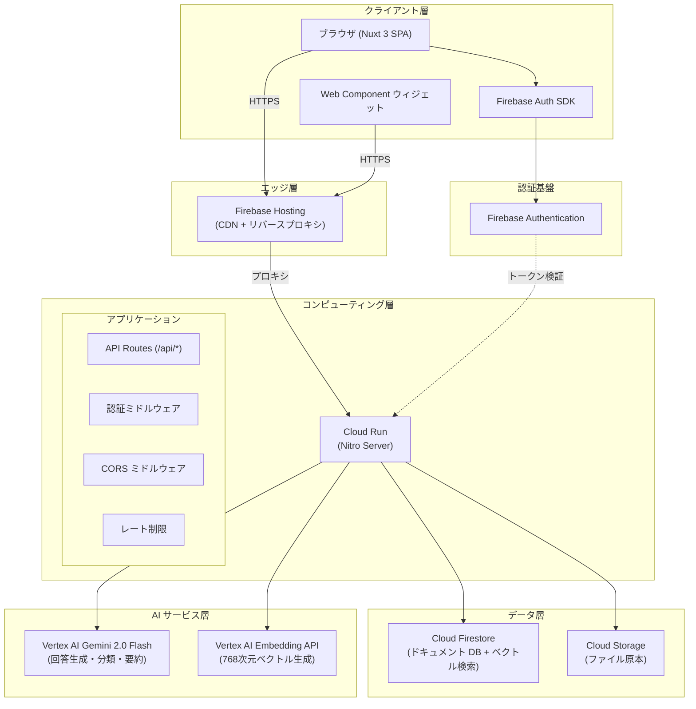
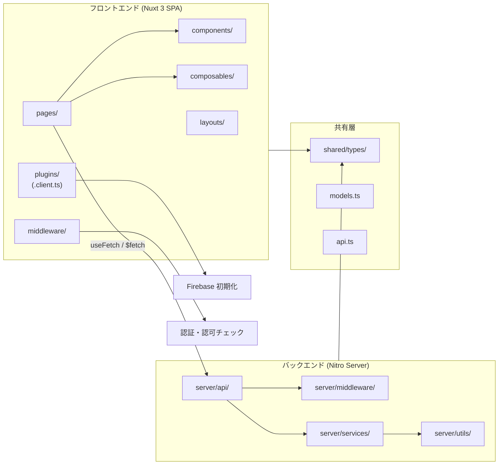
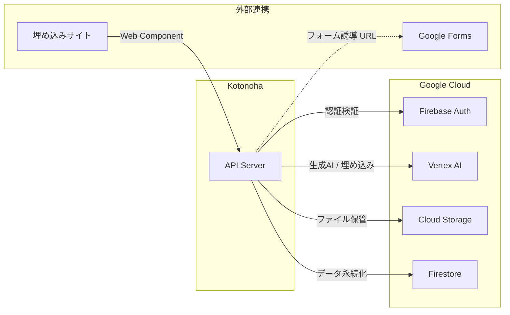
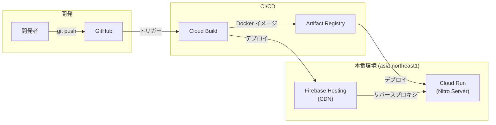
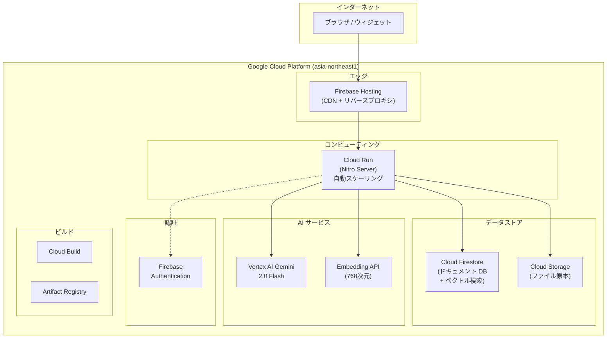
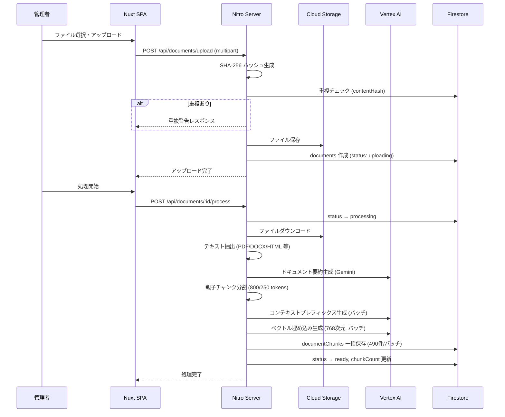
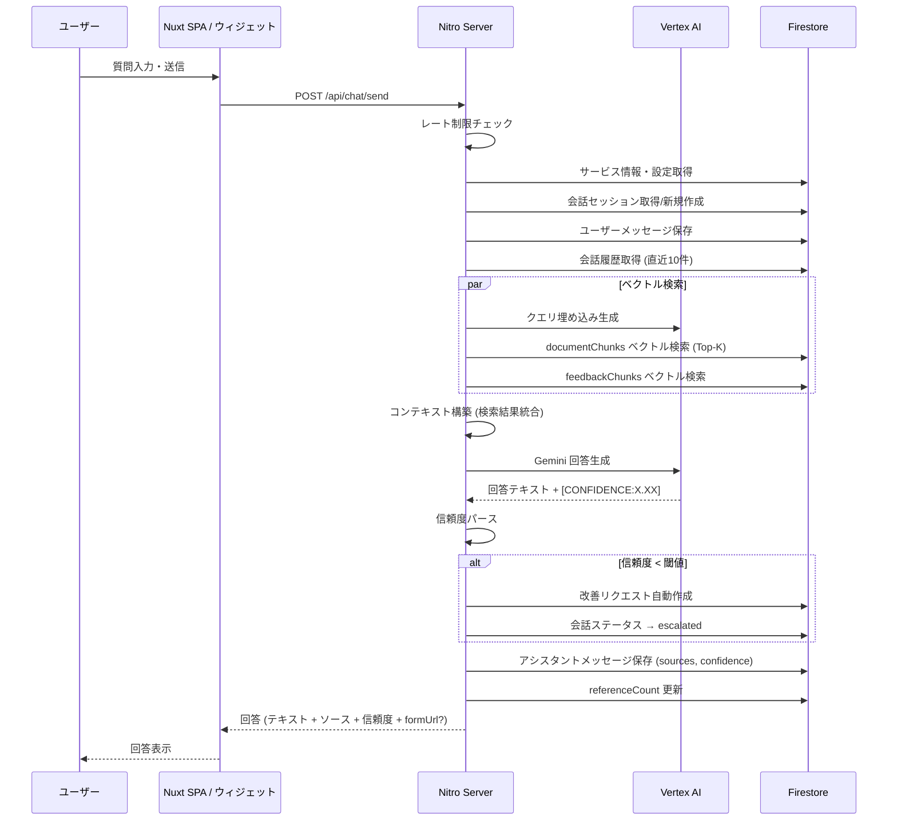
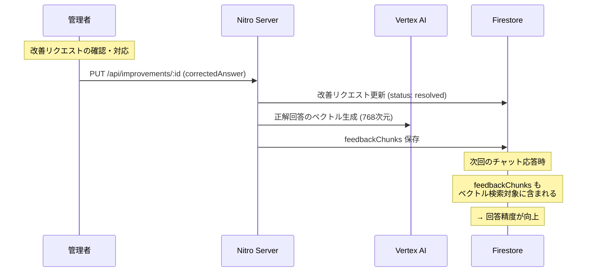
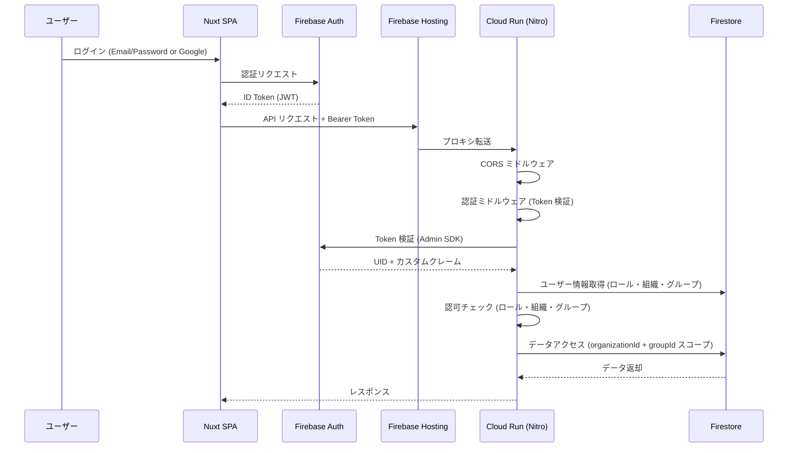
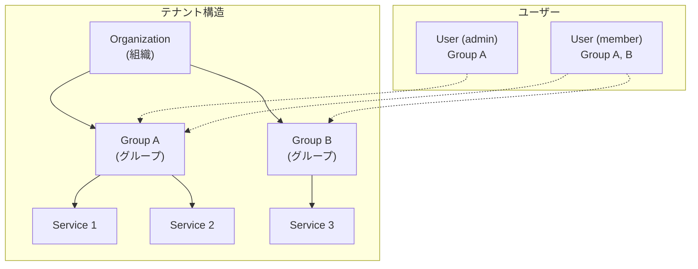

# 基本設計書

> **文書ID:** BD-001
> **対象システム:** Kotonoha — マルチテナント AI チャットボットプラットフォーム
> **作成日:** 2026-03-29
> **ステータス:** 正式版

---

## 1. システム概要

### 1.1 システムの位置づけ

Kotonoha は、組織のナレッジベースを AI チャットボットとして提供するマルチテナント SaaS プラットフォームである。Nuxt 3 フルスタックアプリケーションとして構築し、Google Cloud Platform 上で稼働する。

### 1.2 設計方針

| 方針                   | 説明                                                                        |
| ---------------------- | --------------------------------------------------------------------------- |
| フルスタック Nuxt 3    | フロントエンド（SPA）とバックエンド（Nitro Server）を単一プロジェクトで管理 |
| サーバーレスファースト | Cloud Run による自動スケーリング。インフラ管理を最小化                      |
| マルチテナント分離     | organizationId + groupId による論理分離                                     |
| AI ネイティブ          | RAG パイプライン、フィードバック学習ループを中核に設計                      |
| 段階的スケーリング     | 初期は Firestore Vector Search、大規模化時に Vertex AI Vector Search へ移行 |

---

## 2. システムアーキテクチャ

### 2.1 全体構成図

### 2.2 コンポーネントアーキテクチャ

---

## 3. 技術スタック

### 3.1 技術選定一覧

| カテゴリ           | 技術                       | バージョン | 選定理由                                              |
| ------------------ | -------------------------- | ---------- | ----------------------------------------------------- |
| フレームワーク     | Nuxt 3                     | 3.x        | フルスタック構成、Nitro サーバー内蔵、TypeScript 標準 |
| UI                 | Vue 3                      | 3.x        | Nuxt 3 標準、Composition API によるリアクティブ設計   |
| 言語               | TypeScript                 | 5.x        | 型安全性、フロント・バック共通の型定義                |
| ランタイム         | Node.js                    | 20.x       | Cloud Run 対応、Nitro ランタイム                      |
| 認証               | Firebase Authentication    | -          | マルチプロバイダ対応、ID Token ベース                 |
| データベース       | Cloud Firestore            | -          | スキーマレス、ベクトル検索内蔵、セキュリティルール    |
| ストレージ         | Cloud Storage              | -          | ドキュメント原本の安全な保管                          |
| 生成 AI            | Vertex AI Gemini 2.0 Flash | -          | 高速・低コスト、日本語対応、構造化出力                |
| 埋め込み           | Vertex AI Embedding API    | -          | 768 次元、日本語対応                                  |
| ホスティング       | Cloud Run                  | -          | コンテナベース、自動スケーリング                      |
| CDN                | Firebase Hosting           | -          | CDN + リバースプロキシ                                |
| CI/CD              | Cloud Build                | -          | GCP ネイティブ、Docker ビルド                         |
| コンテナレジストリ | Artifact Registry          | -          | GCP ネイティブ                                        |

### 3.2 主要ライブラリ

| ライブラリ                | 用途                                  |
| ------------------------- | ------------------------------------- |
| firebase / firebase-admin | クライアント SDK / サーバー Admin SDK |
| @google-cloud/vertexai    | Gemini API クライアント               |
| @google-cloud/storage     | Cloud Storage 操作                    |
| pdf-parse                 | PDF テキスト抽出                      |
| mammoth                   | DOCX テキスト抽出                     |
| marked                    | Markdown レンダリング                 |

---

## 4. コンポーネント設計

### 4.1 フロントエンド構成

#### レイアウト

| レイアウト | 説明                                   | 適用画面                     |
| ---------- | -------------------------------------- | ---------------------------- |
| default    | ヘッダー + コンテンツ領域              | ログイン、チャット、会話履歴 |
| admin      | ヘッダー + サイドバー + コンテンツ領域 | 全管理者画面                 |

#### 主要コンポーザブル

| コンポーザブル | 責務                                                     |
| -------------- | -------------------------------------------------------- |
| useAuth        | Firebase Authentication の初期化・状態管理・トークン取得 |
| useChat        | チャット送受信・会話管理                                 |
| useServices    | サービス一覧取得・選択状態管理                           |
| useToast       | 通知トースト表示                                         |

#### プラグイン

| プラグイン         | 実行環境         | 責務                |
| ------------------ | ---------------- | ------------------- |
| firebase.client.ts | クライアントのみ | Firebase SDK 初期化 |

#### ミドルウェア

| ミドルウェア | 責務                                     |
| ------------ | ---------------------------------------- |
| auth         | 認証状態チェック、未認証時のリダイレクト |
| admin        | admin ロール検証、非管理者のリダイレクト |

### 4.2 バックエンド構成

#### サーバーミドルウェア

| ミドルウェア | ファイル  | 責務                                              |
| ------------ | --------- | ------------------------------------------------- |
| CORS         | 0.cors.ts | 公開パスへの CORS ヘッダー付与                    |
| 認証         | auth.ts   | Bearer Token 検証、ユーザー情報のコンテキスト注入 |

#### サービス層

| サービス                    | 責務                                                       |
| --------------------------- | ---------------------------------------------------------- |
| RAG Service                 | ベクトル検索、コンテキスト構築、回答生成                   |
| Embedding Service           | テキストの埋め込みベクトル生成、キャッシュ管理             |
| Document Processing Service | テキスト抽出、チャンク分割、コンテキストプレフィックス生成 |
| Report Service              | 統計集計、AI インサイト生成                                |

#### ユーティリティ

| ユーティリティ | 責務                             |
| -------------- | -------------------------------- |
| constants.ts   | 全定数の一元管理（SoT）          |
| firebase.ts    | Firebase Admin SDK 初期化        |
| firestore.ts   | Firestore クライアント初期化     |
| storage.ts     | Cloud Storage クライアント初期化 |

---

## 5. 外部インターフェース

### 5.1 外部システム連携

### 5.2 インターフェース一覧

| 連携先                  | プロトコル        | 方向   | 用途                                             |
| ----------------------- | ----------------- | ------ | ------------------------------------------------ |
| Firebase Authentication | HTTPS / gRPC      | 双方向 | 認証・トークン検証                               |
| Vertex AI Gemini        | HTTPS             | 送信   | 回答生成、FAQ 生成、レポート生成、カテゴリ分類   |
| Vertex AI Embedding     | HTTPS             | 送信   | ベクトル埋め込み生成                             |
| Cloud Storage           | HTTPS             | 双方向 | ドキュメントファイルのアップロード・ダウンロード |
| Cloud Firestore         | gRPC              | 双方向 | データ永続化・ベクトル検索                       |
| Google Forms            | HTTP リダイレクト | 誘導   | エスカレーション時のフォーム誘導                 |

---

## 6. デプロイメントアーキテクチャ

### 6.1 デプロイメントパイプライン

### 6.2 インフラ構成

### 6.3 環境構成

| 項目                   | 設定                                         |
| ---------------------- | -------------------------------------------- |
| リージョン             | asia-northeast1（東京）                      |
| ランタイム             | Node.js (Cloud Run コンテナ)                 |
| フレームワーク         | Nuxt 3 (Nitro)                               |
| コンテナレジストリ     | Artifact Registry                            |
| CDN                    | Firebase Hosting                             |
| データベース           | Cloud Firestore                              |
| オブジェクトストレージ | Cloud Storage                                |
| 認証                   | Firebase Authentication                      |
| AI                     | Vertex AI (Gemini 2.0 Flash + Embedding API) |
| CI/CD                  | Cloud Build                                  |

---

## 7. データフロー設計

### 7.1 ドキュメント登録フロー

### 7.2 チャット応答フロー

### 7.3 フィードバック学習ループ

---

## 8. セキュリティアーキテクチャ

### 8.1 認証・認可フロー

### 8.2 セキュリティレイヤー

| レイヤー       | 実装                         | 説明                                 |
| -------------- | ---------------------------- | ------------------------------------ |
| ネットワーク   | HTTPS                        | Cloud Run 標準の TLS 終端            |
| エッジ         | Firebase Hosting             | CDN キャッシュ + リバースプロキシ    |
| CORS           | サーバーミドルウェア         | 公開パスのみ許可、その他は制限       |
| 認証           | Firebase Auth + ミドルウェア | ID Token 検証                        |
| 認可           | API ミドルウェア             | ロールベースアクセス制御             |
| データ分離     | Firestore Security Rules     | 組織・グループ単位のアイソレーション |
| ストレージ分離 | Storage Rules                | 管理者のみアップロード可             |
| レート制限     | サーバーミドルウェア         | API 種別ごとの制限                   |

### 8.3 Firestore Security Rules 設計方針

| コレクション        | 読取権限                              | 書込権限                 |
| ------------------- | ------------------------------------- | ------------------------ |
| organizations       | 所属メンバー                          | admin                    |
| users               | 本人のみ                              | 本人のみ                 |
| services            | 認証済みメンバー（公開 API は別パス） | admin                    |
| documents           | 所属組織メンバー                      | admin                    |
| documentChunks      | 所属組織メンバー                      | admin                    |
| conversations       | 本人 or admin                         | 本人のみ作成             |
| messages            | 親会話のアクセス権に準拠              | 親会話のアクセス権に準拠 |
| improvementRequests | admin                                 | admin                    |
| faqs                | admin                                 | admin                    |
| weeklyReports       | admin                                 | admin                    |
| settings            | admin                                 | admin                    |
| feedbackChunks      | admin                                 | admin                    |

---

## 9. Source of Truth (SoT) 宣言

| データ領域         | SoT                                  | キャッシュ/派生                   | 同期方式                   | 復元可能性                       |
| ------------------ | ------------------------------------ | --------------------------------- | -------------------------- | -------------------------------- |
| ユーザー認証情報   | Firebase Auth                        | Firestore users コレクション      | 認証イベントトリガー       | Auth → users で復元可            |
| ドキュメント原本   | Cloud Storage                        | Firestore documents（メタデータ） | アップロード時に同期       | Storage から再取得可             |
| チャンクテキスト   | Firestore documentChunks             | なし                              | ドキュメント処理時に生成   | 原本から再生成可                 |
| ベクトル埋め込み   | Firestore (documentChunks/faqs)      | L2 Firestore キャッシュ (30日)    | 生成時に保存               | Vertex AI で再生成可             |
| 会話履歴           | Firestore (conversations + messages) | なし                              | リアルタイム書込           | SoT 自体（復元不可）             |
| フィードバック     | Firestore feedbackChunks             | なし                              | 改善リクエスト対応時に生成 | improvementRequests から再生成可 |
| 組織設定           | Firestore settings                   | なし                              | 管理画面から更新           | SoT 自体                         |
| 定数・デフォルト値 | server/utils/constants.ts            | なし                              | コードデプロイ             | ソースコードから復元可           |

---

## 10. マルチテナント設計

### 10.1 テナント分離モデル

### 10.2 データ分離方式

- 全コレクションが `organizationId` フィールドを持ち、組織単位でデータを論理分離
- グループ対応コレクションは `groupId` フィールドで更に分離
- ユーザーは `UserGroupMembership` を通じて複数グループに所属可能
- アクティブグループ切替により、操作対象のデータスコープを変更

### 10.3 プラン体系

| プラン   | 説明             |
| -------- | ---------------- |
| free     | 無料プラン       |
| standard | 標準プラン       |
| premium  | プレミアムプラン |

---

## 11. エラーハンドリング方針

### 11.1 エラー分類

| 分類                 | HTTP ステータス | 対応方針                                               |
| -------------------- | --------------- | ------------------------------------------------------ |
| バリデーションエラー | 400             | リクエストパラメータの不正。クライアントに修正を促す   |
| 認証エラー           | 401             | トークン無効/期限切れ。再ログインを促す                |
| 認可エラー           | 403             | 権限不足。アクセス拒否を通知                           |
| リソース未存在       | 404             | 対象リソースが見つからない                             |
| サーバーエラー       | 500             | 内部エラー。ログ出力し、一般的なエラーメッセージを返却 |

### 11.2 グレースフルデグラデーション

- 補助処理（改善リクエスト自動作成、referenceCount 更新等）の失敗は、主要フロー（チャット回答返却）をブロックしない
- AI サービス（Gemini / Embedding）の一時的なエラーは、リトライ後にフォールバックメッセージを返却
- ベクトル検索の失敗時は、Firestore のテキストベースフォールバック検索を試行
