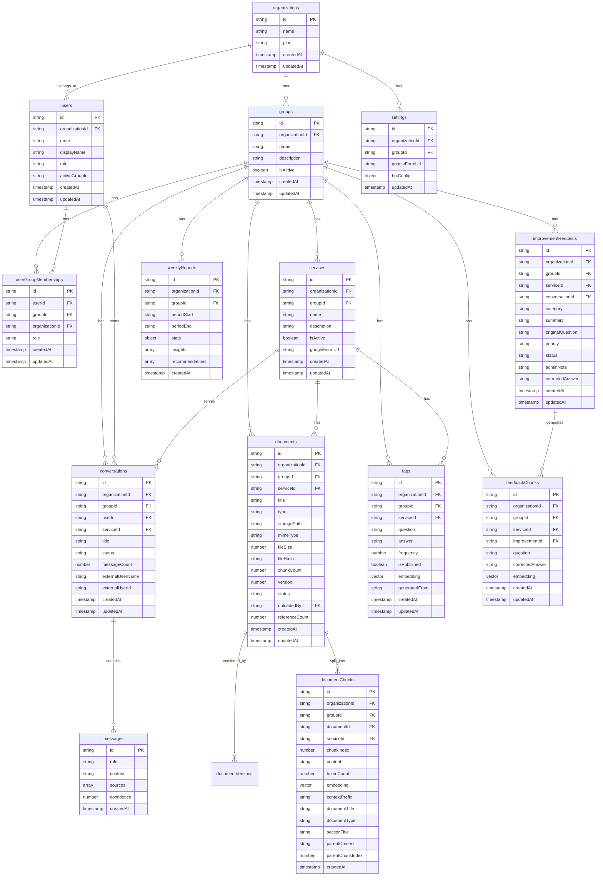
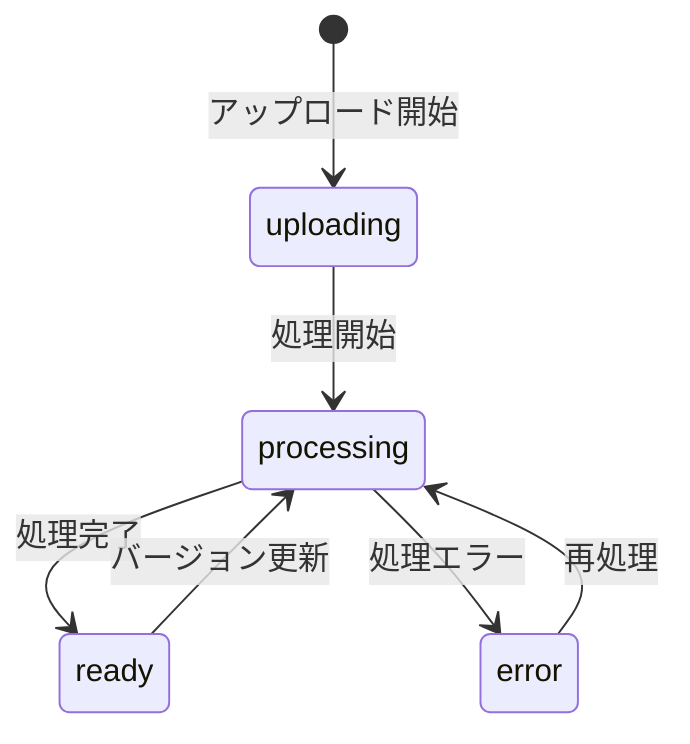
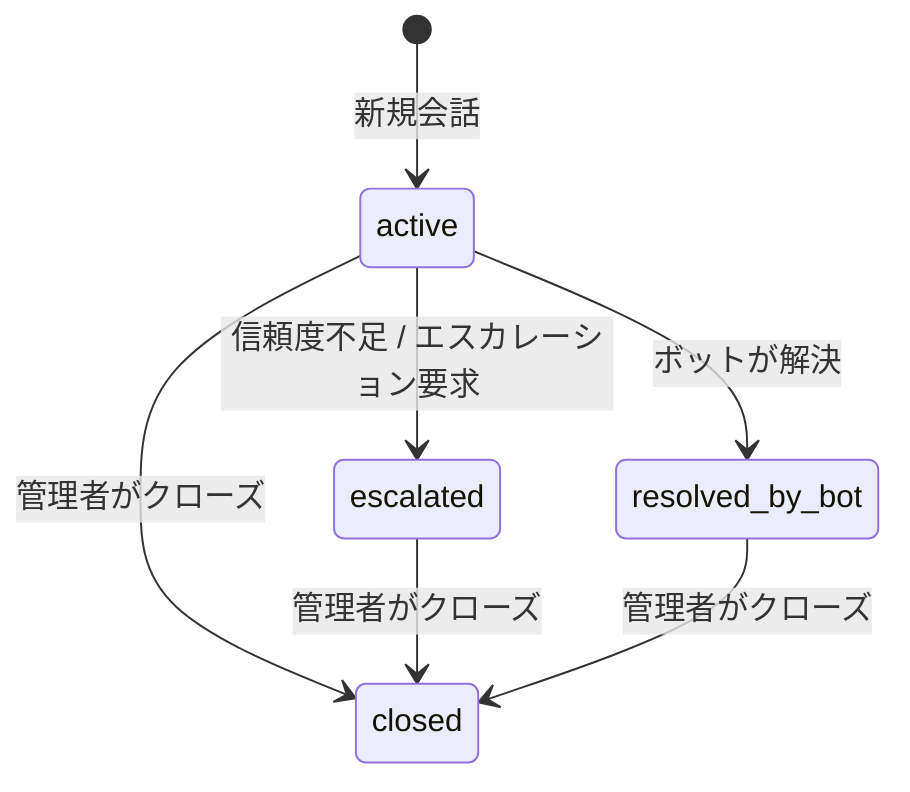
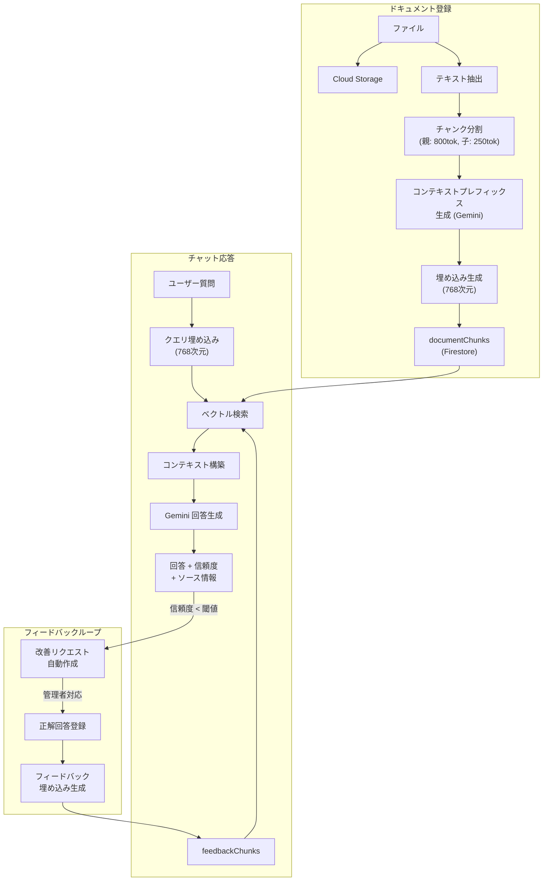
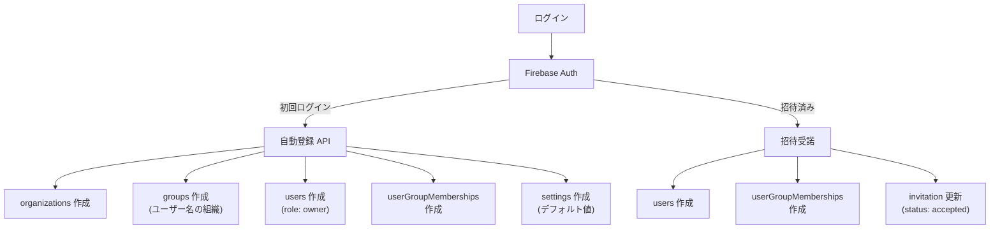

# データ設計書

> **文書ID:** DD-001
> **対象システム:** Kotonoha — マルチテナント AI チャットボットプラットフォーム
> **作成日:** 2026-03-29
> **ステータス:** 正式版

---

## 1. データストア構成

### 1.1 使用データストア

| データストア            | 用途                                                 | 備考                   |
| ----------------------- | ---------------------------------------------------- | ---------------------- |
| Cloud Firestore         | メインデータベース（ドキュメント DB + ベクトル検索） | asia-northeast1        |
| Cloud Storage           | ドキュメントファイル原本の保管                       | マルチリージョン対応可 |
| Firebase Authentication | ユーザー認証情報の管理                               | Firebase 基盤          |

### 1.2 Source of Truth (SoT) 宣言

| データ領域         | SoT                                  | キャッシュ/派生                   | 復元可能性                       |
| ------------------ | ------------------------------------ | --------------------------------- | -------------------------------- |
| ユーザー認証情報   | Firebase Authentication              | Firestore users（プロファイル）   | Auth → users で復元可            |
| ドキュメント原本   | Cloud Storage                        | Firestore documents（メタデータ） | Storage から再取得可             |
| チャンクテキスト   | Firestore documentChunks             | なし                              | ドキュメント原本から再生成可     |
| ベクトル埋め込み   | Firestore (embedding フィールド)     | L2 Firestore キャッシュ (30日)    | Vertex AI で再生成可             |
| 会話履歴           | Firestore (conversations + messages) | なし                              | SoT 自体（復元不可）             |
| フィードバック学習 | Firestore feedbackChunks             | なし                              | improvementRequests から再生成可 |
| 組織設定           | Firestore settings                   | なし                              | SoT 自体                         |

---

## 2. ER 図

### 2.1 全体 ER 図

---

## 3. コレクション定義

### 3.1 organizations（組織）

| フィールド | 型                                      | 必須 | デフォルト | 説明            |
| ---------- | --------------------------------------- | ---- | ---------- | --------------- |
| id         | string                                  | ○    | 自動生成   | ドキュメント ID |
| name       | string                                  | ○    | -          | 組織名          |
| plan       | "starter" \| "business" \| "enterprise" | ○    | "starter"  | 契約プラン      |
| createdAt  | string (ISO 8601)                       | ○    | 現在時刻   | 作成日時        |
| updatedAt  | string (ISO 8601)                       | ○    | 現在時刻   | 更新日時        |

### 3.1.1 contracts（契約）

| フィールド     | 型                                                  | 必須 | デフォルト | 説明            |
| -------------- | --------------------------------------------------- | ---- | ---------- | --------------- |
| id             | string                                              | ○    | 自動生成   | ドキュメント ID |
| organizationId | string                                              | ○    | -          | 組織 ID         |
| planId         | "starter" \| "business" \| "enterprise"             | ○    | -          | 契約プラン      |
| status         | "active" \| "suspended" \| "expired" \| "cancelled" | ○    | "active"   | 契約ステータス  |
| startDate      | string (ISO 8601)                                   | ○    | -          | 契約開始日      |
| endDate        | string (ISO 8601)                                   | ○    | -          | 契約終了日      |
| note           | string                                              | -    | ""         | 備考            |
| createdAt      | string (ISO 8601)                                   | ○    | 現在時刻   | 作成日時        |
| updatedAt      | string (ISO 8601)                                   | ○    | 現在時刻   | 更新日時        |

### 3.2 groups（グループ）

| フィールド     | 型                | 必須 | デフォルト | 説明            |
| -------------- | ----------------- | ---- | ---------- | --------------- |
| id             | string            | ○    | 自動生成   | ドキュメント ID |
| organizationId | string            | ○    | -          | 所属組織 ID     |
| name           | string            | ○    | -          | グループ名      |
| description    | string            | ○    | ""         | 説明            |
| isActive       | boolean           | ○    | true       | 有効フラグ      |
| createdAt      | string (ISO 8601) | ○    | 現在時刻   | 作成日時        |
| updatedAt      | string (ISO 8601) | ○    | 現在時刻   | 更新日時        |

### 3.3 users（ユーザー）

| フィールド     | 型                                    | 必須 | デフォルト        | 説明                  |
| -------------- | ------------------------------------- | ---- | ----------------- | --------------------- |
| id             | string                                | ○    | Firebase Auth UID | Firebase Auth UID     |
| organizationId | string                                | ○    | -                 | 所属組織 ID           |
| email          | string                                | ○    | -                 | メールアドレス        |
| displayName    | string                                | ○    | ""                | 表示名                |
| role           | "system_admin" \| "admin" \| "member" | ○    | "admin"           | ユーザーロール        |
| activeGroupId  | string                                | ×    | -                 | アクティブグループ ID |
| createdAt      | string (ISO 8601)                     | ○    | 現在時刻          | 作成日時              |
| updatedAt      | string (ISO 8601)                     | ○    | 現在時刻          | 更新日時              |

### 3.4 userGroupMemberships（ユーザーグループ紐付け）

| フィールド     | 型                  | 必須 | デフォルト             | 説明             |
| -------------- | ------------------- | ---- | ---------------------- | ---------------- |
| id             | string              | ○    | `${userId}_${groupId}` | 複合キー         |
| userId         | string              | ○    | -                      | ユーザー ID      |
| groupId        | string              | ○    | -                      | グループ ID      |
| organizationId | string              | ○    | -                      | 所属組織 ID      |
| role           | "admin" \| "member" | ○    | -                      | グループ内ロール |
| createdAt      | string (ISO 8601)   | ○    | 現在時刻               | 作成日時         |
| updatedAt      | string (ISO 8601)   | ○    | 現在時刻               | 更新日時         |

### 3.5 services（サービス）

| フィールド     | 型                | 必須 | デフォルト | 説明                           |
| -------------- | ----------------- | ---- | ---------- | ------------------------------ |
| id             | string            | ○    | 自動生成   | ドキュメント ID                |
| organizationId | string            | ○    | -          | 所属組織 ID                    |
| groupId        | string            | ○    | -          | 所属グループ ID                |
| name           | string            | ○    | -          | サービス名                     |
| description    | string            | ○    | ""         | 説明                           |
| isActive       | boolean           | ○    | true       | 有効フラグ                     |
| googleFormUrl  | string            | ×    | -          | エスカレーション先フォーム URL |
| createdAt      | string (ISO 8601) | ○    | 現在時刻   | 作成日時                       |
| updatedAt      | string (ISO 8601) | ○    | 現在時刻   | 更新日時                       |

### 3.6 documents（ドキュメント）

| フィールド     | 型                                                | 必須 | デフォルト  | 説明                           |
| -------------- | ------------------------------------------------- | ---- | ----------- | ------------------------------ |
| id             | string                                            | ○    | 自動生成    | ドキュメント ID                |
| organizationId | string                                            | ○    | -           | 所属組織 ID                    |
| groupId        | string                                            | ○    | -           | 所属グループ ID                |
| serviceId      | string                                            | ○    | -           | 対象サービス ID                |
| title          | string                                            | ○    | -           | ドキュメントタイトル           |
| type           | "business" \| "system"                            | ○    | "business"  | ドキュメント種別               |
| tags           | string[]                                          | ○    | []          | タグ                           |
| storagePath    | string                                            | ○    | -           | Cloud Storage パス             |
| mimeType       | string                                            | ○    | -           | MIME タイプ                    |
| fileSize       | number                                            | ○    | -           | ファイルサイズ（バイト）       |
| fileHash       | string                                            | ○    | -           | SHA-256 ハッシュ（重複検出用） |
| chunkCount     | number                                            | ○    | 0           | 生成チャンク数                 |
| version        | number                                            | ○    | 1           | バージョン番号                 |
| status         | "uploading" \| "processing" \| "ready" \| "error" | ○    | "uploading" | 処理ステータス                 |
| uploadedBy     | string                                            | ○    | -           | アップロードユーザー ID        |
| referenceCount | number                                            | ○    | 0           | 参照カウンター                 |
| createdAt      | string (ISO 8601)                                 | ○    | 現在時刻    | 作成日時                       |
| updatedAt      | string (ISO 8601)                                 | ○    | 現在時刻    | 更新日時                       |

#### ステータス遷移

### 3.7 documentChunks（ドキュメントチャンク）

| フィールド       | 型                     | 必須 | デフォルト | 説明                                            |
| ---------------- | ---------------------- | ---- | ---------- | ----------------------------------------------- |
| id               | string                 | ○    | 自動生成   | ドキュメント ID                                 |
| organizationId   | string                 | ○    | -          | 所属組織 ID                                     |
| groupId          | string                 | ○    | -          | 所属グループ ID                                 |
| documentId       | string                 | ○    | -          | 親ドキュメント ID                               |
| serviceId        | string                 | ○    | -          | 対象サービス ID                                 |
| chunkIndex       | number                 | ○    | -          | チャンク順序                                    |
| content          | string                 | ○    | -          | チャンクテキスト（子チャンク、最大250トークン） |
| tokenCount       | number                 | ○    | -          | 推定トークン数                                  |
| embedding        | vector(768)            | ○    | -          | ベクトル埋め込み（768次元）                     |
| contextPrefix    | string                 | ×    | -          | コンテキストプレフィックス（1〜2文）            |
| documentTitle    | string                 | ×    | -          | 元ドキュメント名                                |
| documentType     | "business" \| "system" | ×    | -          | ドキュメント種別                                |
| tags             | string[]               | ×    | -          | 継承タグ                                        |
| sectionTitle     | string                 | ×    | -          | セクションタイトル                              |
| parentContent    | string                 | ×    | -          | 親チャンクテキスト（最大800トークン）           |
| parentChunkIndex | number                 | ×    | -          | 親チャンクインデックス                          |
| createdAt        | string (ISO 8601)      | ○    | 現在時刻   | 作成日時                                        |

### 3.8 conversations（会話）

| フィールド       | 型                                                       | 必須 | デフォルト | 説明                                               |
| ---------------- | -------------------------------------------------------- | ---- | ---------- | -------------------------------------------------- |
| id               | string                                                   | ○    | 自動生成   | ドキュメント ID                                    |
| organizationId   | string                                                   | ○    | -          | 所属組織 ID                                        |
| groupId          | string                                                   | ○    | -          | 所属グループ ID                                    |
| userId           | string                                                   | ○    | -          | ユーザー ID（ゲストは "anonymous"）                |
| serviceId        | string                                                   | ○    | -          | 対象サービス ID                                    |
| title            | string                                                   | ○    | -          | 会話タイトル（最初の質問から自動設定、最大50文字） |
| status           | "active" \| "resolved_by_bot" \| "escalated" \| "closed" | ○    | "active"   | 会話ステータス                                     |
| messageCount     | number                                                   | ○    | 0          | メッセージ数                                       |
| externalUserName | string                                                   | ×    | -          | ウィジェット経由の外部ユーザー表示名               |
| externalUserId   | string                                                   | ×    | -          | ウィジェット経由の外部ユーザー ID                  |
| createdAt        | string (ISO 8601)                                        | ○    | 現在時刻   | 作成日時                                           |
| updatedAt        | string (ISO 8601)                                        | ○    | 現在時刻   | 更新日時                                           |

#### ステータス遷移

### 3.9 messages（メッセージ — conversations のサブコレクション）

| フィールド | 型                                | 必須 | デフォルト | 説明                                     |
| ---------- | --------------------------------- | ---- | ---------- | ---------------------------------------- |
| id         | string                            | ○    | 自動生成   | ドキュメント ID                          |
| role       | "user" \| "assistant" \| "system" | ○    | -          | 送信者ロール                             |
| content    | string                            | ○    | -          | メッセージ本文                           |
| sources    | MessageSource[]                   | ○    | []         | 参照元ドキュメント情報                   |
| confidence | number \| null                    | ○    | null       | 信頼度スコア（0.0〜1.0、assistant のみ） |
| createdAt  | string (ISO 8601)                 | ○    | 現在時刻   | 作成日時                                 |

#### MessageSource 型

| フィールド    | 型     | 説明                            |
| ------------- | ------ | ------------------------------- |
| documentId    | string | 参照元ドキュメント ID           |
| documentTitle | string | ドキュメント名                  |
| chunkId       | string | 参照チャンク ID                 |
| chunkContent  | string | チャンクテキスト（先頭200文字） |
| similarity    | number | 類似度スコア                    |

### 3.10 improvementRequests（改善リクエスト）

| フィールド       | 型                                                           | 必須 | デフォルト | 説明                         |
| ---------------- | ------------------------------------------------------------ | ---- | ---------- | ---------------------------- |
| id               | string                                                       | ○    | 自動生成   | ドキュメント ID              |
| organizationId   | string                                                       | ○    | -          | 所属組織 ID                  |
| groupId          | string                                                       | ○    | -          | 所属グループ ID              |
| serviceId        | string                                                       | ○    | -          | 対象サービス ID              |
| conversationId   | string                                                       | ○    | -          | 関連会話 ID                  |
| category         | "missing_docs" \| "unclear_docs" \| "new_feature" \| "other" | ○    | -          | AI 分類カテゴリ              |
| summary          | string                                                       | ○    | -          | 要約                         |
| originalQuestion | string                                                       | ×    | -          | 元の質問                     |
| priority         | "high" \| "medium" \| "low"                                  | ○    | "medium"   | 優先度                       |
| status           | "open" \| "in_progress" \| "resolved" \| "dismissed"         | ○    | "open"     | 対応ステータス               |
| adminNote        | string                                                       | ○    | ""         | 管理者メモ                   |
| correctedAnswer  | string                                                       | ○    | ""         | 正解回答（フィードバック用） |
| createdAt        | string (ISO 8601)                                            | ○    | 現在時刻   | 作成日時                     |
| updatedAt        | string (ISO 8601)                                            | ○    | 現在時刻   | 更新日時                     |

### 3.11 faqs（FAQ）

| フィールド     | 型                 | 必須 | デフォルト | 説明            |
| -------------- | ------------------ | ---- | ---------- | --------------- |
| id             | string             | ○    | 自動生成   | ドキュメント ID |
| organizationId | string             | ○    | -          | 所属組織 ID     |
| groupId        | string             | ○    | -          | 所属グループ ID |
| serviceId      | string             | ○    | -          | 対象サービス ID |
| question       | string             | ○    | -          | 質問文          |
| answer         | string             | ○    | -          | 回答文          |
| frequency      | number             | ○    | 0          | 出現頻度        |
| isPublished    | boolean            | ○    | false      | 公開フラグ      |
| embedding      | vector(768)        | ○    | -          | 質問文ベクトル  |
| generatedFrom  | "auto" \| "manual" | ○    | "manual"   | 生成元          |
| createdAt      | string (ISO 8601)  | ○    | 現在時刻   | 作成日時        |
| updatedAt      | string (ISO 8601)  | ○    | 現在時刻   | 更新日時        |

### 3.12 weeklyReports（週次レポート）

| フィールド      | 型                | 必須 | デフォルト | 説明            |
| --------------- | ----------------- | ---- | ---------- | --------------- |
| id              | string            | ○    | 自動生成   | ドキュメント ID |
| organizationId  | string            | ○    | -          | 所属組織 ID     |
| groupId         | string            | ○    | -          | 所属グループ ID |
| periodStart     | string (ISO 8601) | ○    | -          | 集計期間開始日  |
| periodEnd       | string (ISO 8601) | ○    | -          | 集計期間終了日  |
| stats           | ReportStats       | ○    | -          | 統計データ      |
| insights        | string[]          | ○    | []         | AI インサイト   |
| recommendations | string[]          | ○    | []         | 改善推奨事項    |
| createdAt       | string (ISO 8601) | ○    | 現在時刻   | 作成日時        |

#### ReportStats 型

| フィールド              | 型                                  | 説明                 |
| ----------------------- | ----------------------------------- | -------------------- |
| totalConversations      | number                              | 総会話数             |
| resolvedByBot           | number                              | ボット解決数         |
| escalated               | number                              | エスカレーション数   |
| resolutionRate          | number                              | 解決率 (0.0〜1.0)    |
| averageConfidence       | number                              | 平均信頼度           |
| topServices             | { serviceId, serviceName, count }[] | サービス別会話数上位 |
| improvementRequestCount | number                              | 改善リクエスト数     |

### 3.13 settings（設定）

| フィールド     | 型                | 必須 | デフォルト | 説明                   |
| -------------- | ----------------- | ---- | ---------- | ---------------------- |
| id             | string            | ○    | -          | ドキュメント ID        |
| organizationId | string            | ○    | -          | 所属組織 ID            |
| groupId        | string            | ○    | -          | 所属グループ ID        |
| googleFormUrl  | string            | ○    | ""         | グローバルフォーム URL |
| botConfig      | BotConfig         | ○    | (下記参照) | ボット設定             |
| updatedAt      | string (ISO 8601) | ○    | 現在時刻   | 更新日時               |

#### BotConfig 型

| フィールド             | 型      | デフォルト             | 説明                       |
| ---------------------- | ------- | ---------------------- | -------------------------- |
| confidenceThreshold    | number  | 0.6                    | 信頼度閾値                 |
| ragTopK                | number  | 5                      | RAG 検索件数               |
| ragSimilarityThreshold | number  | 0.4                    | RAG 類似度閾値             |
| enableMultiQuery       | boolean | false                  | マルチクエリ有効化         |
| enableHyde             | boolean | false                  | HyDE 有効化                |
| systemPrompt           | string  | (デフォルトプロンプト) | カスタムシステムプロンプト |

### 3.14 feedbackChunks（フィードバックチャンク）

| フィールド      | 型                | 必須 | デフォルト | 説明                  |
| --------------- | ----------------- | ---- | ---------- | --------------------- |
| id              | string            | ○    | 自動生成   | ドキュメント ID       |
| organizationId  | string            | ○    | -          | 所属組織 ID           |
| groupId         | string            | ○    | -          | 所属グループ ID       |
| serviceId       | string            | ○    | -          | 対象サービス ID       |
| improvementId   | string            | ○    | -          | 元の改善リクエスト ID |
| question        | string            | ○    | -          | 元の質問              |
| correctedAnswer | string            | ○    | -          | 正解回答              |
| embedding       | vector(768)       | ○    | -          | 回答ベクトル          |
| createdAt       | string (ISO 8601) | ○    | 現在時刻   | 作成日時              |
| updatedAt       | string (ISO 8601) | ○    | 現在時刻   | 更新日時              |

### 3.15 invitations（招待）

| フィールド     | 型                      | 必須 | デフォルト | 説明                 |
| -------------- | ----------------------- | ---- | ---------- | -------------------- |
| id             | string                  | ○    | 自動生成   | ドキュメント ID      |
| organizationId | string                  | ○    | -          | 所属組織 ID          |
| email          | string                  | ○    | -          | 招待先メールアドレス |
| groupId        | string                  | ○    | -          | 招待先グループ ID    |
| role           | "admin" \| "member"     | ○    | -          | 招待ロール           |
| invitedBy      | string                  | ○    | -          | 招待者ユーザー ID    |
| status         | "pending" \| "accepted" | ○    | "pending"  | 招待ステータス       |
| createdAt      | string (ISO 8601)       | ○    | 現在時刻   | 作成日時             |
| updatedAt      | string (ISO 8601)       | ○    | 現在時刻   | 更新日時             |

---

## 4. ベクトルインデックス定義

| コレクション   | フィールド | 次元数 | インデックス方式 | 距離関数 |
| -------------- | ---------- | ------ | ---------------- | -------- |
| documentChunks | embedding  | 768    | FLAT             | COSINE   |
| faqs           | embedding  | 768    | FLAT             | COSINE   |
| feedbackChunks | embedding  | 768    | FLAT             | COSINE   |

**備考:**

- FLAT インデックスは全件走査のため、大規模データ時はパフォーマンスに注意
- 大規模化時は Vertex AI Vector Search（HNSW インデックス）への移行を計画

---

## 5. 複合インデックス定義

| #   | コレクション         | フィールド構成                                                   | 用途                           |
| --- | -------------------- | ---------------------------------------------------------------- | ------------------------------ |
| 1   | documents            | organizationId ASC, groupId ASC, serviceId ASC, createdAt DESC   | ドキュメント一覧（サービス別） |
| 2   | documentChunks       | organizationId ASC, groupId ASC, serviceId ASC, embedding VECTOR | RAG ベクトル検索               |
| 3   | conversations        | organizationId ASC, groupId ASC, serviceId ASC, updatedAt DESC   | 管理者用会話一覧               |
| 4   | conversations        | userId ASC, createdAt DESC                                       | ユーザー自身の会話一覧         |
| 5   | improvementRequests  | organizationId ASC, groupId ASC, status ASC, createdAt DESC      | 改善リクエスト一覧             |
| 6   | faqs                 | organizationId ASC, groupId ASC, serviceId ASC, isPublished ASC  | FAQ 一覧                       |
| 7   | weeklyReports        | organizationId ASC, groupId ASC, createdAt DESC                  | レポート一覧                   |
| 8   | feedbackChunks       | organizationId ASC, groupId ASC, serviceId ASC, embedding VECTOR | フィードバック ベクトル検索    |
| 9   | userGroupMemberships | userId ASC, organizationId ASC                                   | ユーザーのグループ一覧         |
| 10  | invitations          | organizationId ASC, status ASC                                   | 招待一覧                       |

---

## 6. Firestore Security Rules

### 6.1 アクセス制御マトリクス

| コレクション         | 読取                   | 作成                   | 更新          | 削除  |
| -------------------- | ---------------------- | ---------------------- | ------------- | ----- |
| organizations        | 所属メンバー           | システム (自動登録)    | admin         | ×     |
| groups               | 所属メンバー           | admin                  | admin         | admin |
| users                | 本人のみ               | システム (自動登録)    | 本人のみ      | ×     |
| userGroupMemberships | 所属メンバー           | admin                  | admin         | admin |
| services             | 認証済みメンバー       | admin                  | admin         | admin |
| documents            | 所属グループメンバー   | admin                  | admin         | admin |
| documentChunks       | 所属グループメンバー   | admin                  | admin         | admin |
| conversations        | 本人 or admin          | 本人                   | 本人 or admin | ×     |
| messages             | 親会話のアクセス権準拠 | 親会話のアクセス権準拠 | ×             | ×     |
| improvementRequests  | admin                  | admin / システム       | admin         | ×     |
| faqs                 | admin                  | admin                  | admin         | admin |
| weeklyReports        | admin                  | admin / システム       | ×             | ×     |
| settings             | admin                  | admin                  | admin         | ×     |
| feedbackChunks       | admin                  | admin / システム       | ×             | ×     |
| invitations          | admin                  | admin                  | admin         | admin |

### 6.2 設計方針

- **組織ベース分離:** 全データは `organizationId` でスコープ
- **グループベース分離:** グループ対応データは `groupId` で更に分離
- **list vs get の考慮:** Firestore Security Rules ではクエリ (list) と単一取得 (get) でルール評価が異なる。list では `exists()` / `get()` がクエリ制約から検証不可
- **サーバーサイド優先:** 複雑な認可ロジックはサーバーミドルウェアで処理し、Security Rules は最低限のガードとして機能

---

## 7. データフロー図

### 7.1 ドキュメント登録→チャット応答の全体データフロー

### 7.2 認証・ユーザー登録データフロー

---

## 8. データ保全方針

| 項目           | 方針                                               |
| -------------- | -------------------------------------------------- |
| バックアップ   | Firestore 自動バックアップ（日次）                 |
| ファイル保管   | Cloud Storage 冗長化                               |
| 障害復旧       | Firestore Point-in-Time Recovery                   |
| データ保持期間 | 無期限（明示的削除まで）                           |
| レポート保持   | 90 日（WEEKLY_REPORT_RETENTION_DAYS）              |
| キャッシュ TTL | 埋め込み L2 キャッシュ: 30 日（L2_CACHE_TTL_MS）   |
| 論理削除       | 未採用（物理削除）                                 |
| カスケード削除 | ドキュメント削除時に関連 documentChunks を一括削除 |
