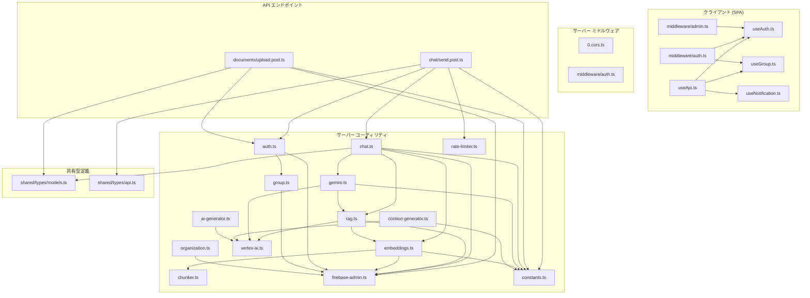
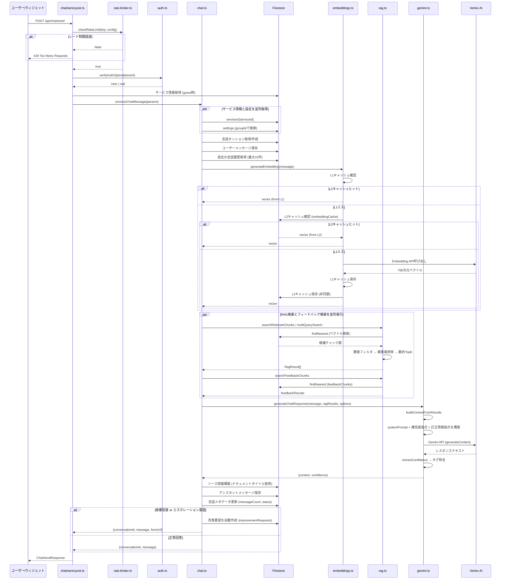
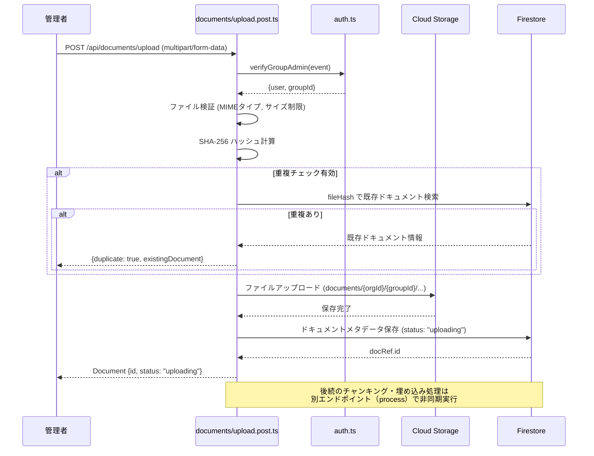
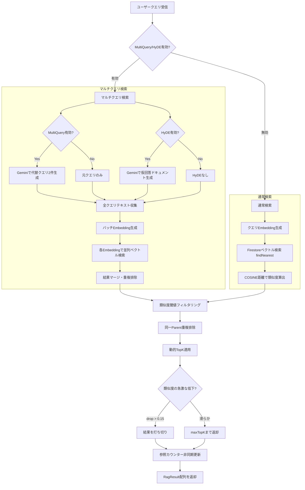
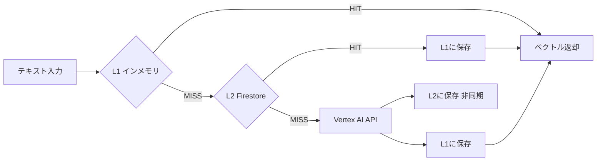

# 詳細設計書

| 項目 | 内容 |
|------|------|
| プロジェクト名 | Kotonoha |
| バージョン | 0.1.0 |
| 最終更新日 | 2026-03-29 |
| ステータス | 初版 |

---

## 1. システム概要

Kotonoha は、マルチテナント対応のAIチャットボットプラットフォームである。組織内のナレッジドキュメントをRAG（Retrieval-Augmented Generation）技術で活用し、社内問い合わせへの自動回答を提供する。

### 1.1 技術スタック

| レイヤー | 技術 |
|----------|------|
| フロントエンド | Nuxt 3（SPA モード）、Vue 3、Tailwind CSS |
| サーバーサイド | Nitro Server（Nuxt 3 内蔵） |
| データベース | Cloud Firestore（ベクトル検索対応） |
| ファイルストレージ | Cloud Storage for Firebase |
| LLM | Vertex AI Gemini 2.5 Flash |
| Embedding | Vertex AI text-multilingual-embedding-002（768次元） |
| 認証 | Firebase Authentication |
| デプロイ | Cloud Run（asia-northeast1） |
| CI/CD | Cloud Build |

---

## 2. モジュール依存関係図



---

## 3. 主要処理フロー

### 3.1 チャットメッセージ処理フロー

チャットメッセージの送信から回答生成までの全体フローを示す。



### 3.2 ドキュメントアップロードフロー



### 3.3 RAG検索フロー（詳細）



---

## 4. モジュール詳細設計

### 4.1 chat.ts — チャット処理コアロジック

**責務:** チャットメッセージ受信から回答生成、会話管理までのオーケストレーション。

| 処理ステップ | 説明 | エラーハンドリング |
|-------------|------|------------------|
| 1. サービス・設定取得 | serviceId、groupId に基づく設定をFirestoreから並列取得 | サービス不在時は 404 |
| 2. 会話セッション管理 | 既存会話の継続 or 新規会話の作成 | 不正な会話IDは 404 |
| 3. ユーザーメッセージ保存 | messages サブコレクションに保存 | - |
| 4. 会話履歴取得 | 直近10件のメッセージを取得 | - |
| 5. Embedding生成 | ユーザーメッセージをベクトル化 | 失敗時はRAGスキップ |
| 6. RAG検索 + フィードバック検索 | 並列実行、関連チャンクと訂正回答を取得 | RAG失敗時は空配列、フィードバック失敗時はFirestoreフォールバック |
| 7. Gemini回答生成 | RAGコンテキスト付きでLLMに問い合わせ | 失敗時は固定メッセージ返却 |
| 8. ソース情報構築 | 参照ドキュメントのタイトルを取得 | - |
| 9. メッセージ保存・ステータス更新 | 回答保存、確信度に基づくエスカレーション判定 | - |

**設定パラメータ（Settings.botConfig経由）:**

| パラメータ | デフォルト値 | 説明 |
|-----------|------------|------|
| confidenceThreshold | 0.6 | エスカレーション閾値 |
| ragTopK | 5 | RAG検索結果の最大件数 |
| ragSimilarityThreshold | 0.4 | 類似度の最低閾値 |
| enableMultiQuery | false | マルチクエリRAGの有効化 |
| enableHyde | false | HyDE（仮想ドキュメント生成）の有効化 |
| systemPrompt | (定数) | カスタムシステムプロンプト |

### 4.2 rag.ts — RAG検索エンジン

**責務:** Firestoreベクトル検索を用いたセマンティック検索と結果の最適化。

**主要アルゴリズム:**

1. **ベクトル検索:** Firestoreの `findNearest` API を使用、COSINE距離で類似度を算出（`similarity = 1 - distance`）
2. **親子チャンク重複排除:** 同一 `parentChunkIndex` のチャンクは最高類似度のもののみ残す
3. **動的TopK:** 類似度スコアの急激な低下（drop > 0.15）を検出して結果を打ち切る
4. **参照カウンター更新:** RAGで参照されたドキュメントの `referenceCount` を非同期でインクリメント

**フィードバックRAG:**
- 管理者が訂正した回答を `feedbackChunks` コレクションにベクトル化して保存
- チャット時にユーザーの質問と類似する訂正回答を検索し、LLMのコンテキストに優先的に含める
- 類似度 > 0.5 の訂正回答のみ使用

### 4.3 embeddings.ts — 埋め込みベクトル生成

**責務:** テキストの768次元ベクトル変換と2層キャッシュ管理。

**2層キャッシュアーキテクチャ:**



| キャッシュ層 | ストレージ | TTL | 最大サイズ | 特性 |
|-------------|-----------|-----|----------|------|
| L1 | インメモリ Map | 30分 | 1,000エントリ | LRU方式、最速 |
| L2 | Firestore `embeddingCache` | 30日 | 制限なし | 永続化、インスタンス間共有 |

**安全弁:**
- Embedding APIのトークン上限（2,048）に対して安全マージン（85%）で切り詰め
- 文字数ベースのハードキャップ（`estimateMaxChars(2048)`）で最終防御
- 空テキストはプレースホルダー `"-"` に置換

### 4.4 gemini.ts — LLM回答生成

**責務:** RAGコンテキストとフィードバック情報を統合したLLM呼び出しと確信度抽出。

**プロンプト構造:**

```
[systemInstruction]
  ├── ベースプロンプト (カスタム or デフォルト)
  ├── 確信度指示 (常に付加)
  └── 訂正情報優先指示 (フィードバックがある場合のみ)

[contents]
  ├── 会話履歴 (role: user/model)
  └── 現在のメッセージ + 参考情報セクション
       ├── RAG検索結果 ([参照N] タイトル - セクション (類似度))
       ├── --- (区切り)
       └── 訂正情報 (管理者が検証済みの回答)
```

**確信度抽出:**
- LLMの出力から `[CONFIDENCE:X.XX]` タグを正規表現で抽出
- タグが見つからない場合はデフォルト値 0.5 を使用
- 出力テキストからタグと参照マーカーを除去してクリーンな回答を返却
- 30秒タイムアウト（`Promise.race` で実装）

### 4.5 chunker.ts — ドキュメントチャンキング

**責務:** テキストの構造を保持したチャンク分割と多形式テキスト抽出。

**チャンキング戦略:**

| 方式 | パラメータ | 用途 |
|------|-----------|------|
| 段落ベース分割 | maxTokens=500, overlap=100 | 基本チャンク |
| 親子チャンク | parent=800, child=250, overlap=50 | 精密検索 + 文脈保持 |

**テキスト抽出対応形式:**

| MIMEタイプ | ライブラリ | 備考 |
|-----------|-----------|------|
| application/pdf | pdf-parse | バイナリ直接解析 |
| application/vnd.openxmlformats-officedocument.wordprocessingml.document | mammoth | テキスト抽出モード |
| text/html | cheerio | script/style除去後にテキスト化 |
| text/csv | 自前パーサー | RFC 4180準拠、BOM対応 |
| text/plain, text/markdown, application/json | - | UTF-8直接読み取り |

### 4.6 context-generator.ts — コンテキストプレフィックス生成

**責務:** Contextual Retrieval用のチャンクコンテキストプレフィックスをバッチ生成。

- ドキュメント全文の要約をGeminiで生成（3,000文字以下はそのまま使用）
- 複数チャンクのプレフィックスを1回のGeminiコールで一括生成（バッチサイズ: 15）
- 並行度3で同時実行し、スループットを確保
- タイムアウトは通常の2倍（60秒）

---

## 5. エラーハンドリング戦略

### 5.1 グレースフルデグラデーション方針

本システムではCLAUDE.mdの「非ブロッキングなエラーハンドリング」原則に基づき、補助処理の失敗がメインフローを阻害しない設計を採用している。

| 処理 | 失敗時の挙動 | 影響 |
|------|------------|------|
| Embedding生成 | RAGをスキップ | LLMは参考情報なしで回答 |
| RAG検索 | 空配列を返却 | LLMは参考情報なしで回答 |
| フィードバックRAG検索 | Firestoreクエリにフォールバック | 直近の訂正回答を代替取得 |
| Firestoreフォールバック | 訂正情報なしで続行 | LLMはRAG結果のみで回答 |
| Gemini API | 固定メッセージを返却 | confidence=0 でエスカレーション |
| 参照カウンター更新 | ログ出力のみ | ドキュメント参照統計が不正確になる |
| L2キャッシュ書き込み | ログ出力のみ | 次回はAPI呼び出しが発生 |

### 5.2 タイムアウト設計

| 処理 | タイムアウト | 備考 |
|------|------------|------|
| Vertex AI Embedding API | 30秒 | `EXTERNAL_API_TIMEOUT_MS` |
| Gemini API (チャット) | 30秒 | `Promise.race` |
| コンテキストプレフィックス生成 | 60秒 | バッチ処理のため2倍 |
| Cloud Run リクエスト全体 | 300秒 | cloudbuild.yaml で設定 |

### 5.3 レート制限

| 対象 | 制限 | キー |
|------|------|------|
| チャットAPI | 10リクエスト/分 | `chat:user:{userId}` or `chat:ip:{ip}` |
| 一般API | 60リクエスト/分 | - |

レート制限はインメモリ Token Bucket方式で実装。Cloud Runの複数インスタンス間では共有されないため、実効制限は `設定値 x max-instances` まで緩和される可能性がある。

---

## 6. データフロー整合性

### 6.1 Source of Truth 宣言

| データ | SoT | キャッシュ | 備考 |
|--------|-----|----------|------|
| ユーザー情報 | Firestore `users` | なし | Firebase Authは認証のみ |
| ドキュメント | Firestore `documents` | Cloud Storage（バイナリ） | メタデータのSoTはFirestore |
| チャンク埋め込み | Firestore `documentChunks.embedding` | L1/L2 embeddingCache | キャッシュはクエリ用のみ |
| 会話・メッセージ | Firestore `conversations` / `messages` | なし | - |
| 改善要望 | Firestore `improvementRequests` | `feedbackChunks`（ベクトル化） | resolved時にfeedbackChunks生成 |
| ボット設定 | Firestore `settings` | なし | - |

### 6.2 データ更新順序

1. **チャットメッセージ保存:** ユーザーメッセージ → RAG/Gemini処理 → アシスタントメッセージ → 会話メタデータ更新
2. **フィードバック反映:** improvementRequests.status → resolved → feedbackChunks にベクトル保存
3. **ドキュメント参照カウント:** RAG検索結果確定 → documents.referenceCount を非同期インクリメント（メインフロー非ブロッキング）
