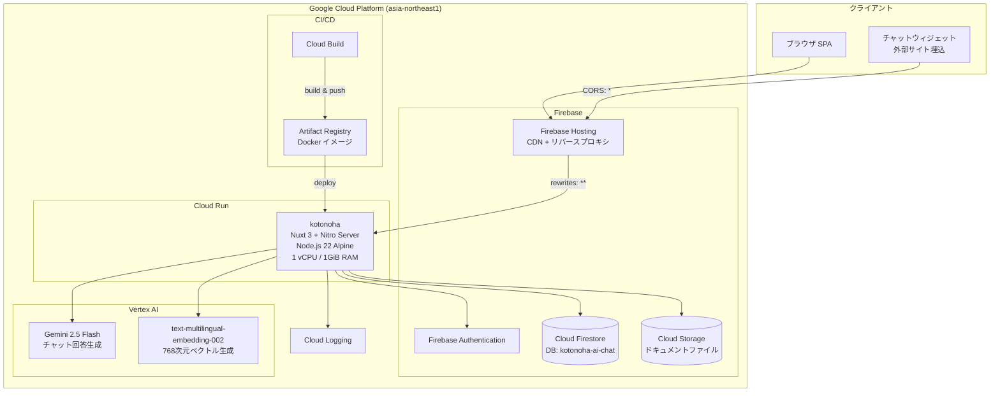
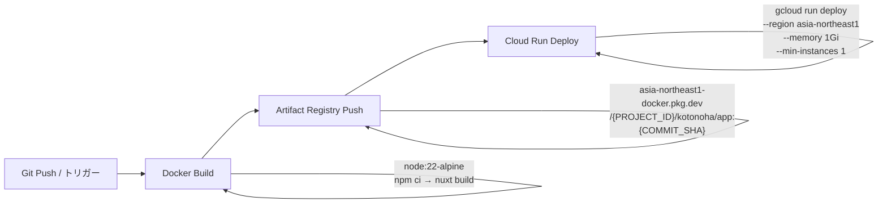

# インフラ設計書

| 項目           | 内容       |
| -------------- | ---------- |
| プロジェクト名 | Kotonoha   |
| バージョン     | 0.1.0      |
| 最終更新日     | 2026-03-29 |
| ステータス     | 初版       |

---

## 1. GCP アーキテクチャ概要

### 1.1 全体構成図



### 1.2 リージョン

| サービス                | リージョン             | 備考                           |
| ----------------------- | ---------------------- | ------------------------------ |
| Cloud Run               | asia-northeast1 (東京) | メインアプリケーション         |
| Cloud Firestore         | asia-northeast1        | 名前付きDB: `kotonoha-ai-chat` |
| Cloud Storage           | asia-northeast1        | バケット: `kotonoha-ai-chat`   |
| Vertex AI               | asia-northeast1        | Gemini + Embedding             |
| Artifact Registry       | asia-northeast1        | Docker イメージ保管            |
| Firebase Hosting        | グローバル CDN         | -                              |
| Firebase Authentication | グローバル             | -                              |

---

## 2. コンピューティング

### 2.1 Cloud Run 設定

| 項目                   | 値                                                                      | 根拠                                                   |
| ---------------------- | ----------------------------------------------------------------------- | ------------------------------------------------------ |
| サービス名             | `kotonoha`                                                              | -                                                      |
| イメージ               | `asia-northeast1-docker.pkg.dev/{PROJECT_ID}/kotonoha/app:{COMMIT_SHA}` | コミットSHA でバージョン管理                           |
| vCPU                   | 1                                                                       | Nitro Server + API処理                                 |
| メモリ                 | 1 GiB                                                                   | Embedding キャッシュ（L1: 最大1,000エントリ）+ PDF解析 |
| 最小インスタンス       | 1                                                                       | コールドスタート回避                                   |
| 最大インスタンス       | 3                                                                       | コスト制御                                             |
| リクエストタイムアウト | 300秒                                                                   | Gemini API のレイテンシ考慮                            |
| 認証                   | `--allow-unauthenticated`                                               | ウィジェットからのゲストアクセス対応                   |
| ポート                 | 8080                                                                    | Node.js デフォルト                                     |

### 2.2 ヘルスチェック

| チェック種別   | パス          | 間隔 | 閾値          | タイムアウト |
| -------------- | ------------- | ---- | ------------- | ------------ |
| Startup Probe  | `/api/health` | 10秒 | 5回失敗で異常 | 5秒          |
| Liveness Probe | `/api/health` | 15秒 | 3回失敗で異常 | 5秒          |

Startup Probe の初期遅延は30秒。Nuxt のビルド出力起動とFirebase Admin SDK 初期化に要する時間を考慮。

### 2.3 コンテナイメージ

```dockerfile
# ビルドステージ: node:22-alpine
#   npm ci → nuxt build
# プロダクションステージ: node:22-alpine
#   .output/ のみコピー（マルチステージビルド）
#   CMD: node .output/server/index.mjs
```

- マルチステージビルドにより、プロダクションイメージにはビルドツールや devDependencies を含まない
- Alpine Linux ベースで軽量化

---

## 3. データベース

### 3.1 Cloud Firestore

| 項目           | 値                 |
| -------------- | ------------------ |
| データベースID | `kotonoha-ai-chat` |
| モード         | Native mode        |
| ロケーション   | asia-northeast1    |

**ベクトル検索:**

- `documentChunks.embedding`: 768次元、COSINE距離
- `feedbackChunks.embedding`: 768次元、COSINE距離
- Firestore の `findNearest` API を使用（専用ベクトルインデックス不要）

**コレクション一覧:**

| コレクション                  | 推定レコード数 | アクセスパターン                             |
| ----------------------------- | -------------- | -------------------------------------------- |
| `organizations`               | 少数           | ID指定読み取り                               |
| `groups`                      | 少数           | organizationId でクエリ                      |
| `users`                       | 少〜中         | ID指定読み取り、認証時                       |
| `userGroupMemberships`        | 少〜中         | userId / groupId でクエリ                    |
| `services`                    | 少〜中         | groupId でクエリ                             |
| `documents`                   | 中             | groupId + serviceId でクエリ                 |
| `documentChunks`              | 多             | ベクトル検索（groupId + serviceId フィルタ） |
| `feedbackChunks`              | 少〜中         | ベクトル検索（groupId + serviceId フィルタ） |
| `embeddingCache`              | 多             | hash ID 指定読み取り（L2キャッシュ）         |
| `conversations`               | 多             | groupId + serviceId + status でクエリ        |
| `conversations/{id}/messages` | 多             | createdAt 降順でクエリ                       |
| `improvementRequests`         | 中             | groupId + serviceId + status でクエリ        |
| `faqs`                        | 少〜中         | groupId + serviceId でクエリ                 |
| `weeklyReports`               | 少             | groupId + periodStart でクエリ               |
| `settings`                    | 少数           | groupId でクエリ                             |
| `invitations`                 | 少数           | organizationId + email でクエリ              |

### 3.2 Cloud Storage

| 項目               | 値                                                            |
| ------------------ | ------------------------------------------------------------- |
| バケット名         | `kotonoha-ai-chat`                                            |
| パス構造           | `documents/{organizationId}/{groupId}/{timestamp}_{filename}` |
| 対応形式           | PDF, DOCX, TXT, Markdown, HTML, CSV, JSON                     |
| ファイルサイズ上限 | 10 MB                                                         |

---

## 4. Firebase Hosting

```json
{
  "hosting": {
    "site": "kotonoha-ai-chat",
    "rewrites": [
      { "source": "**", "run": { "serviceId": "kotonoha", "region": "asia-northeast1" } }
    ],
    "headers": [
      { "source": "/embed/**", "headers": [{ "key": "Access-Control-Allow-Origin", "value": "*" }] }
    ]
  }
}
```

- 全リクエストを Cloud Run にリバースプロキシ
- `/embed/**` パスに CORS ヘッダーを追加（ウィジェット配信用）
- CDN による静的アセットのキャッシュ

---

## 5. CI/CD パイプライン

### 5.1 Cloud Build フロー



**ビルドステップ:**

1. **Docker Build:** `gcr.io/cloud-builders/docker` を使用、コミット SHA をタグとして付与
2. **Docker Push:** Artifact Registry にイメージをプッシュ
3. **Cloud Run Deploy:** `gcloud run deploy` でローリングデプロイ

**デプロイ時の環境変数設定:**

- `NUXT_FIREBASE_DATABASE_ID=kotonoha-ai-chat`
- `NUXT_PUBLIC_FIREBASE_DATABASE_ID=kotonoha-ai-chat`
- その他のシークレットは Cloud Run のサービス設定で管理

**ログ設定:** `CLOUD_LOGGING_ONLY`（ビルドログはCloud Loggingのみ）

### 5.2 サービスアカウント

| サービスアカウント                   | 用途             | 必要権限                                                               |
| ------------------------------------ | ---------------- | ---------------------------------------------------------------------- |
| Cloud Build SA                       | ビルド・デプロイ | Artifact Registry Writer, Cloud Run Admin                              |
| Cloud Run SA (`kotonoha-bot-runner`) | ランタイム       | Firestore Editor, Storage Object Admin, Vertex AI User, Logging Writer |

---

## 6. 環境変数一覧

### 6.1 サーバーサイド専用（秘匿情報）

| 環境変数                         | 説明                              | デフォルト                        | 必須 |
| -------------------------------- | --------------------------------- | --------------------------------- | ---- |
| `NUXT_FIREBASE_PROJECT_ID`       | Firebase プロジェクトID           | -                                 | Yes  |
| `NUXT_FIREBASE_CLIENT_EMAIL`     | サービスアカウントメール          | -                                 | Yes  |
| `NUXT_FIREBASE_PRIVATE_KEY`      | サービスアカウント秘密鍵          | -                                 | Yes  |
| `NUXT_FIREBASE_STORAGE_BUCKET`   | Cloud Storage バケット名          | -                                 | No   |
| `NUXT_FIREBASE_DATABASE_ID`      | Firestore データベースID          | (default)                         | No   |
| `NUXT_VERTEX_AI_LOCATION`        | Vertex AI リージョン              | `asia-northeast1`                 | No   |
| `NUXT_VERTEX_AI_MODEL`           | Gemini モデル名                   | `gemini-2.5-flash`                | No   |
| `NUXT_VERTEX_AI_EMBEDDING_MODEL` | Embedding モデル名                | `text-multilingual-embedding-002` | No   |
| `NUXT_CORS_ALLOWED_ORIGINS`      | CORS 許可オリジン（カンマ区切り） | -                                 | No   |

### 6.2 クライアント公開

| 環境変数                                   | 説明                     | 必須 |
| ------------------------------------------ | ------------------------ | ---- |
| `NUXT_PUBLIC_FIREBASE_API_KEY`             | Firebase API Key         | Yes  |
| `NUXT_PUBLIC_FIREBASE_AUTH_DOMAIN`         | Firebase Auth ドメイン   | Yes  |
| `NUXT_PUBLIC_FIREBASE_PROJECT_ID`          | Firebase プロジェクトID  | Yes  |
| `NUXT_PUBLIC_FIREBASE_STORAGE_BUCKET`      | Storage バケット名       | Yes  |
| `NUXT_PUBLIC_FIREBASE_MESSAGING_SENDER_ID` | FCM Sender ID            | Yes  |
| `NUXT_PUBLIC_FIREBASE_APP_ID`              | Firebase App ID          | Yes  |
| `NUXT_PUBLIC_FIREBASE_DATABASE_ID`         | Firestore データベースID | No   |

---

## 7. スケーリング設計

### 7.1 水平スケーリング

| パラメータ       | 値                   | 備考                           |
| ---------------- | -------------------- | ------------------------------ |
| 最小インスタンス | 1                    | コールドスタート回避           |
| 最大インスタンス | 3                    | コスト制御（段階的に増加可能） |
| CPU割当          | リクエスト処理中のみ | Cloud Run デフォルト           |

**スケーリング制約:**

- レート制限がインメモリのため、max-instances=3 では実効制限が最大3倍に緩和される
- Vertex AI API クォータが二次防御として機能
- L1 Embedding キャッシュはインスタンス間で共有されないが、L2（Firestore）で補完

### 7.2 ボトルネック分析

| 処理                     | レイテンシ | ボトルネック要因          | 対策                             |
| ------------------------ | ---------- | ------------------------- | -------------------------------- |
| Embedding生成            | 100-500ms  | Vertex AI API呼び出し     | 2層キャッシュ                    |
| RAG検索                  | 200-800ms  | Firestoreベクトル検索     | initialTopK最適化、動的TopK      |
| Gemini回答生成           | 1-10秒     | LLM推論時間               | タイムアウト30秒、フォールバック |
| ドキュメントチャンキング | 数秒-数分  | PDF解析 + バッチEmbedding | 非同期処理                       |

---

## 8. 監視・運用

### 8.1 ログ設計

| レベル          | 用途               | 例                                                     |
| --------------- | ------------------ | ------------------------------------------------------ |
| `console.info`  | 正常系メトリクス   | RAGチャンク数、キャッシュヒット、Embedding次元数       |
| `console.warn`  | 詳細な処理トレース | 類似度スコア、動的TopKカット、プレフィックス生成結果   |
| `console.error` | 異常系（回復可能） | Embedding失敗、RAG失敗、Gemini失敗、フォールバック発動 |

全ログは Cloud Logging に集約される（`options.logging: CLOUD_LOGGING_ONLY`）。

### 8.2 監視項目

| メトリクス                           | 閾値      | アクション                         |
| ------------------------------------ | --------- | ---------------------------------- |
| Cloud Run リクエストレイテンシ (p99) | > 10秒    | Gemini API レイテンシ確認          |
| Cloud Run エラー率 (5xx)             | > 5%      | ログ確認、Vertex AI ステータス確認 |
| Cloud Run インスタンス数             | = max (3) | max-instances の引き上げ検討       |
| Firestore 読み取り回数               | 急増      | N+1クエリやキャッシュミス調査      |
| Vertex AI API エラー率               | > 1%      | クォータ確認、リージョン障害確認   |

### 8.3 ヘルスチェックエンドポイント

`GET /api/health` — Cloud Run のスタートアップ・ライブネスプローブで使用。

---

## 9. バックアップ・災害復旧

### 9.1 Firestore

| 項目             | 方針                                                         |
| ---------------- | ------------------------------------------------------------ |
| 自動バックアップ | Firestore のPITR（Point-in-Time Recovery）を有効化推奨       |
| エクスポート     | 定期的な `gcloud firestore export` をCloud Storageに保存推奨 |
| RPO              | PITRで最大1時間                                              |

### 9.2 Cloud Storage

| 項目                       | 方針                             |
| -------------------------- | -------------------------------- |
| オブジェクトバージョニング | 有効化推奨（誤削除対策）         |
| ライフサイクル管理         | 古いバージョンは90日後に削除推奨 |

### 9.3 Embeddingキャッシュ

L2キャッシュ（`embeddingCache` コレクション）は30日TTLで自動期限切れ。復元不要（Vertex AI APIから再生成可能）。

---

## 10. コスト見積もり（概算）

| サービス                | 想定利用量                          | 月額概算（USD） | 備考                     |
| ----------------------- | ----------------------------------- | --------------- | ------------------------ |
| Cloud Run               | min=1, max=3, 1vCPU/1GiB            | $30-80          | 常時1インスタンス稼働    |
| Cloud Firestore         | 読み取り10万回/日、書き込み1万回/日 | $10-30          | ベクトル検索含む         |
| Cloud Storage           | 10GB                                | $0.3            | ドキュメントファイル保管 |
| Vertex AI Gemini        | 1000会話/日                         | $50-150         | 入出力トークン量に依存   |
| Vertex AI Embedding     | 5000回/日                           | $5-15           | L2キャッシュで削減       |
| Firebase Authentication | 1000 MAU                            | 無料            | 無料枠内                 |
| Firebase Hosting        | -                                   | 無料            | 無料枠内                 |
| Cloud Build             | 120分/日                            | 無料            | 無料枠内（120分/日）     |
| **合計**                |                                     | **$95-275**     | 小〜中規模想定           |

注: 上記は小〜中規模（1,000会話/日）の概算。実際のコストはトラフィック量、ドキュメント数、LLMのトークン消費量に大きく依存する。
