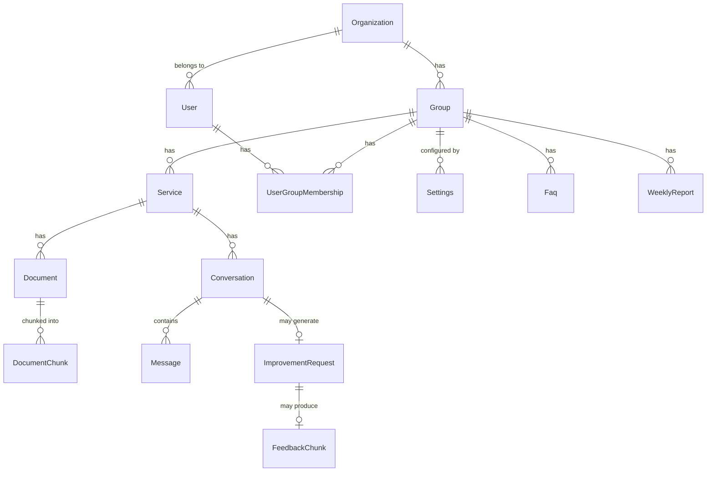

# PG設計書（プログラム設計書）

| 項目           | 内容       |
| -------------- | ---------- |
| プロジェクト名 | Kotonoha   |
| バージョン     | 0.1.0      |
| 最終更新日     | 2026-03-29 |
| ステータス     | 初版       |

---

## 1. 型システム概要

### 1.1 型定義の配置

```
shared/types/
├── models.ts    # Firestore ドキュメントモデル型（サーバー・クライアント共有）
└── api.ts       # API リクエスト/レスポンス型（サーバー・クライアント共有）
```

`shared/types/` ディレクトリは Nuxt の `shared` レイヤーとして自動インポートされ、サーバーサイド・クライアントサイドの両方から参照可能である。

### 1.2 命名規則

| 対象                     | 規則                            | 例                                           |
| ------------------------ | ------------------------------- | -------------------------------------------- |
| 型名                     | PascalCase                      | `ChatSendRequest`, `RagResult`               |
| 関数名                   | camelCase                       | `processChatMessage`, `generateEmbedding`    |
| 定数名                   | UPPER_SNAKE_CASE                | `DEFAULT_RAG_TOP_K`, `MAX_UPLOAD_SIZE_BYTES` |
| ファイル名（サーバー）   | kebab-case                      | `firebase-admin.ts`, `rate-limiter.ts`       |
| ファイル名（composable） | camelCase（use接頭辞）          | `useAuth.ts`, `useApi.ts`                    |
| Firestoreコレクション    | camelCase                       | `documentChunks`, `improvementRequests`      |
| 環境変数（サーバー）     | NUXT\_ + UPPER_SNAKE_CASE       | `NUXT_FIREBASE_PROJECT_ID`                   |
| 環境変数（クライアント） | NUXT*PUBLIC* + UPPER_SNAKE_CASE | `NUXT_PUBLIC_FIREBASE_API_KEY`               |

---

## 2. 共有型定義カタログ

### 2.1 Firestore モデル型 (shared/types/models.ts)

#### エンティティ一覧

| 型名                  | コレクション                  | 説明                             | 主要フィールド                                                     |
| --------------------- | ----------------------------- | -------------------------------- | ------------------------------------------------------------------ |
| `Organization`        | `organizations`               | 組織（最上位テナント）           | `plan: "starter" \| "business" \| "enterprise"`                    |
| `Contract`            | `contracts`                   | 契約（組織ごとの契約履歴）       | `organizationId`, `planId`, `status`, `startDate`, `endDate`       |
| `Group`               | `groups`                      | グループ（組織内の部門・チーム） | `organizationId`, `isActive`                                       |
| `UserGroupMembership` | `userGroupMemberships`        | ユーザー・グループ紐付け         | ID形式: `${userId}_${groupId}`                                     |
| `User`                | `users`                       | ユーザー                         | `role: "owner" \| "system_admin" \| "admin" \| "member"`           |
| `Service`             | `services`                    | サービス（チャットボット単位）   | `groupId`, `googleFormUrl?`                                        |
| `Document`            | `documents`                   | ドキュメント                     | `status: "uploading" \| "processing" \| "ready" \| "error"`        |
| `DocumentChunk`       | `documentChunks`              | ドキュメントチャンク             | `embedding: number[]` (768次元), `parentContent?`                  |
| `Conversation`        | `conversations`               | 会話                             | `status: "active" \| "resolved_by_bot" \| "escalated" \| "closed"` |
| `Message`             | `conversations/{id}/messages` | メッセージ（サブコレクション）   | `role`, `sources[]`, `confidence`                                  |
| `ImprovementRequest`  | `improvementRequests`         | 改善要望                         | `category`, `priority`, `correctedAnswer`                          |
| `Faq`                 | `faqs`                        | FAQ                              | `embedding: number[]`, `generatedFrom: "auto" \| "manual"`         |
| `WeeklyReport`        | `weeklyReports`               | 週次レポート                     | `stats: ReportStats`, `insights[]`                                 |
| `Settings`            | `settings`                    | 設定                             | `botConfig: BotConfig`                                             |
| `FeedbackChunk`       | `feedbackChunks`              | フィードバックチャンク           | `embedding: number[]`, `correctedAnswer`                           |
| `Invitation`          | `invitations`                 | 招待                             | `status: "pending" \| "accepted"`                                  |

#### マルチテナント構造



#### 補助型

```typescript
/** メッセージの参照元 */
interface MessageSource {
  documentId: string;
  documentTitle: string;
  chunkId: string;
  chunkContent: string; // 先頭200文字
  similarity: number;
}

/** ボット設定 */
interface BotConfig {
  confidenceThreshold: number; // 0.0-1.0
  ragTopK: number; // 1-20
  ragSimilarityThreshold: number; // 0.0-1.0
  enableMultiQuery: boolean;
  enableHyde: boolean;
  systemPrompt: string;
}

/** レポート統計 */
interface ReportStats {
  totalConversations: number;
  resolvedByBot: number;
  escalated: number;
  resolutionRate: number;
  averageConfidence: number;
  topServices: { serviceId: string; serviceName: string; count: number }[];
  improvementRequestCount: number;
}
```

### 2.2 API型定義 (shared/types/api.ts)

| 型名                       | 用途                           | 主要フィールド                                                |
| -------------------------- | ------------------------------ | ------------------------------------------------------------- |
| `PaginationParams`         | ページネーションパラメータ     | `page?`, `limit?`                                             |
| `PaginatedResponse<T>`     | ページネーション付きレスポンス | `items[]`, `total`, `hasMore`                                 |
| `ChatSendRequest`          | チャットメッセージ送信         | `serviceId`, `message`, `conversationId?`                     |
| `ChatSendResponse`         | チャットメッセージ応答         | `conversationId`, `message`, `formUrl?`                       |
| `DocumentUploadMeta`       | ドキュメントアップロード       | `serviceId`, `title`, `type`                                  |
| `ServiceUpsertRequest`     | サービスCRUD                   | `name`, `description`, `isActive?`                            |
| `ImprovementUpdateRequest` | 改善要望更新                   | `category?`, `priority?`, `status?`, `correctedAnswer?`       |
| `FaqUpsertRequest`         | FAQ CRUD                       | `serviceId`, `question`, `answer`                             |
| `SettingsUpdateRequest`    | 設定更新                       | `googleFormUrl?`, `botConfig?`                                |
| `DashboardSummary`         | ダッシュボード集計             | `totalConversations`, `resolutionRate`, `topReferencedDocs[]` |
| `ServiceDashboardSummary`  | サービス別集計                 | `serviceId`, `totalConversations`, `conversationTrend[]`      |
| `ConversationFilter`       | 会話検索フィルタ               | `serviceId?`, `status?`, `keyword?`, `startDate?`             |

---

## 3. サーバーサイドモジュール設計

### 3.1 server/utils/firebase-admin.ts

**責務:** Firebase Admin SDK の初期化とシングルトン提供。

```typescript
// エクスポート関数
function getAdminFirestore(): Firestore; // databaseId指定対応
function getAdminAuth(): Auth;
function getAdminStorage(): Storage;
```

- 初回呼び出し時に `ensureInitialized()` でサービスアカウント認証を実行
- `NUXT_FIREBASE_DATABASE_ID` が設定されている場合、名前付きデータベースを使用
- 必須環境変数が不足している場合は 503 エラーを返却

### 3.2 server/utils/vertex-ai.ts

**責務:** Vertex AI クライアントの初期化とモデルインスタンス提供。

```typescript
function getVertexAI(): VertexAI; // シングルトン
function getGenerativeModel(): GenerativeModel; // モデルインスタンス
```

- `@google-cloud/vertexai` SDK を使用
- サービスアカウント認証情報を `googleAuthOptions` に渡す
- モデル名は `NUXT_VERTEX_AI_MODEL`（デフォルト: `gemini-2.5-flash`）

### 3.3 server/utils/auth.ts

**責務:** リクエスト認証・認可の検証ユーティリティ群。

```typescript
// 認証
async function verifyAuth(event: H3Event): Promise<User>;
async function verifyAuthOptional(event: H3Event): Promise<User | null>;

// 認可
async function verifySystemAdmin(event: H3Event): Promise<User>;
async function verifyGroupMember(event: H3Event): Promise<{ user: User; groupId: string }>;
async function verifyGroupAdmin(event: H3Event): Promise<{ user: User; groupId: string }>;

// グループID解決
async function resolveGroupId(event: H3Event, user: User): Promise<string>;
```

**resolveGroupId のグループID優先順位:**

1. `X-Group-Id` リクエストヘッダー
2. `?groupId` クエリパラメータ
3. `user.activeGroupId`

**権限チェック階層:**

- `system_admin`: 全グループにアクセス可能（メンバーシップ検証バイパス）
- グループ管理者: `userGroupMemberships` の `role === "admin"` を検証
- グループメンバー: `userGroupMemberships` の存在を検証

### 3.4 server/utils/chat.ts

**責務:** チャット処理のコアオーケストレーション。

```typescript
interface ChatCoreParams {
  organizationId: string;
  groupId: string;
  serviceId: string;
  message: string;
  userId: string;
  conversationId?: string;
  externalUserName?: string;
  externalUserId?: string;
  skipEscalation?: boolean;
}

interface ChatCoreResult {
  conversationId: string;
  message: { content: string; sources: MessageSource[]; confidence: number };
  formUrl?: string;
}

async function processChatMessage(params: ChatCoreParams): Promise<ChatCoreResult>;
```

- `send.post.ts` と `learn.post.ts` から共通利用される設計
- `skipEscalation: true` 時はエスカレーション（改善要望自動作成）をスキップ

### 3.5 server/utils/rag.ts

**責務:** ベクトル検索ベースのRAGとフィードバックRAG。

```typescript
interface RagResult {
  chunk: DocumentChunk;
  similarity: number;
}

// ドキュメントRAG
async function searchRelevantChunks(query: string, options: {...}): Promise<RagResult[]>
function buildContextFromResults(results: RagResult[]): string

// フィードバックRAG
async function storeFeedbackEmbedding(params: {...}): Promise<void>
async function removeFeedbackEmbedding(improvementId: string): Promise<void>
async function searchFeedbackChunks(query: string, options: {...}): Promise<{...}[]>

// マルチクエリ + HyDE
async function generateAlternativeQueries(query: string, count?: number): Promise<string[]>
async function generateHypotheticalDocument(query: string): Promise<string>
async function multiQuerySearch(query: string, options: {...}): Promise<RagResult[]>
```

**内部関数:**

- `deduplicateByParent(results)`: 同一 parentChunkIndex の重複排除
- `applyDynamicTopK(results, maxTopK)`: 類似度分布に基づく動的結果数調整
- `incrementDocumentReferences(db, results)`: 参照カウンターの非同期バッチ更新

### 3.6 server/utils/embeddings.ts

**責務:** テキストのベクトル埋め込み生成と2層キャッシュ管理。

```typescript
async function generateEmbedding(text: string): Promise<number[]>; // 単一テキスト
async function generateEmbeddings(texts: string[]): Promise<number[][]>; // バッチ（最大250件 / 合計18,000トークン以下）
```

**内部関数:**

- `getAuthClient()`: Google Auth Library のシングルトン
- `textToHash(text)`: SHA-256 の先頭32文字をキャッシュキーとして使用
- `getCachedEmbedding(text)` / `setCachedEmbedding(text, vector)`: L1キャッシュ操作
- `getL2CachedEmbedding(text)` / `setL2CachedEmbedding(text, vector)`: L2キャッシュ操作

### 3.7 server/utils/gemini.ts

**責務:** Gemini API を用いたチャット回答生成。

```typescript
interface GeminiResponse {
  content: string;
  confidence: number;
}

async function generateChatResponse(
  userMessage: string,
  ragResults: RagResult[],
  options?: {
    systemPrompt?: string;
    conversationHistory?: { role: "user" | "assistant"; content: string }[];
    feedbackContext?: string;
  },
): Promise<GeminiResponse>;
```

**内部関数:**

- `extractConfidence(text)`: `[CONFIDENCE:X.XX]` タグから確信度を抽出（0.0-1.0）

### 3.8 server/utils/chunker.ts

**責務:** テキストのチャンク分割と多形式テキスト抽出。

```typescript
// チャンキング
interface TextChunk { content: string; chunkIndex: number; tokenCount: number }
interface ParentChildChunk extends TextChunk {
  parentContent: string; parentChunkIndex: number; sectionTitle?: string
}

function splitTextIntoChunks(text: string, options?: {...}): TextChunk[]
function splitTextIntoParentChildChunks(text: string, options?: {...}): ParentChildChunk[]

// トークン推定
function estimateTokenCount(text: string): number
function estimateMaxChars(tokenBudget: number): number

// テキスト抽出
async function extractText(buffer: Buffer, mimeType: string): Promise<string>
async function extractTextFromPdf(buffer: Buffer): Promise<string>
async function extractTextFromDocx(buffer: Buffer): Promise<string>
async function extractTextFromHtml(buffer: Buffer): Promise<string>
function extractTextFromCsv(buffer: Buffer): string

// セクション検出
function detectSectionTitle(text: string): string | undefined
```

### 3.9 server/utils/rate-limiter.ts

**責務:** インメモリ Token Bucket レート制限。

```typescript
function checkRateLimit(key: string, config: { maxRequests: number; windowMs: number }): boolean;
```

- バケットサイズ上限: 10,000エントリ
- 5分ごとにアクセスのないエントリをクリーンアップ
- Cloud Runインスタンス単位で動作（分散ロックなし）

### 3.10 server/utils/context-generator.ts

**責務:** Contextual Retrieval 用のチャンクコンテキストプレフィックス生成。

```typescript
async function generateDocumentSummary(fullText: string, documentTitle: string): Promise<string>;
async function generateContextPrefixBatch(
  documentSummary: string,
  chunkContents: string[],
): Promise<string[]>;
```

- バッチサイズ: 15チャンク/APIコール (`CONTEXT_PREFIX_BATCH_SIZE`)
- 同時実行数: 3
- 番号付き出力のパーサーを内蔵

### 3.11 server/utils/ai-generator.ts

**責務:** Gemini に構造化 JSON レスポンスを要求する汎用ヘルパー。

```typescript
async function generateStructuredJson<T>(systemPrompt: string, userMessage: string): Promise<T>;
```

- `json` コードブロック or 直接 JSON を正規表現で抽出
- FAQ 自動生成、レポート生成、改善要望分類で共通利用

### 3.12 server/utils/group.ts

**責務:** グループ管理ユーティリティ。

```typescript
async function findOrCreateDefaultGroup(
  organizationId: string,
  db?: Firestore,
  groupName?: string,
): Promise<string>;
async function getUserGroupMemberships(
  userId: string,
  db?: Firestore,
): Promise<UserGroupMembership[]>;
async function getUserGroups(userId: string, db?: Firestore): Promise<{ group; membership }[]>;
async function isGroupMember(userId: string, groupId: string, db?: Firestore): Promise<boolean>;
async function isGroupAdmin(userId: string, groupId: string, db?: Firestore): Promise<boolean>;
async function addUserToGroup(
  userId: string,
  groupId: string,
  organizationId: string,
  role: string,
  db?: Firestore,
): Promise<void>;
```

- `addUserToGroup` は冪等: 既存メンバーの場合は role のみ更新し、createdAt は保護

### 3.13 server/utils/organization.ts

**責務:** 組織管理ユーティリティ。

```typescript
async function findOrCreateDefaultOrganization(db?: Firestore, name?: string): Promise<string>;
```

- 既存組織がなければ指定された名前（省略時「デフォルト組織」）で free プランの組織を自動作成
- 既存組織がある場合は `name` を無視して既存組織IDを返す（冪等）

### 3.14 server/utils/constants.ts

**責務:** サーバーサイド共通定数の Single Source of Truth。

| 定数名                             | 値        | 説明                           |
| ---------------------------------- | --------- | ------------------------------ |
| `DEFAULT_CONFIDENCE_THRESHOLD`     | 0.6       | エスカレーション閾値           |
| `DEFAULT_RAG_TOP_K`                | 5         | RAG検索結果最大件数            |
| `DEFAULT_RAG_SIMILARITY_THRESHOLD` | 0.4       | 類似度最低閾値                 |
| `BATCH_SIZE_LIMIT`                 | 490       | Firestore バッチ操作上限       |
| `MAX_UPLOAD_SIZE_BYTES`            | 10MB      | ファイルアップロード上限       |
| `EXTERNAL_API_TIMEOUT_MS`          | 30,000    | 外部API タイムアウト           |
| `MAX_CHAT_MESSAGE_LENGTH`          | 10,000    | チャットメッセージ最大長       |
| `CHAT_HISTORY_LIMIT`               | 10        | 会話履歴取得件数               |
| `FEEDBACK_RAG_TOP_K`               | 3         | フィードバックRAG検索件数      |
| `FEEDBACK_FALLBACK_LIMIT`          | 5         | フォールバック件数             |
| `MAX_SYSTEM_PROMPT_LENGTH`         | 10,000    | システムプロンプト最大長       |
| `CHAT_RATE_LIMIT`                  | 10req/60s | チャットAPIレート制限          |
| `DEFAULT_RATE_LIMIT`               | 60req/60s | 一般APIレート制限              |
| `L2_CACHE_TTL_MS`                  | 30日      | L2キャッシュTTL                |
| `ESCALATION_KEYWORDS`              | (20語)    | エスカレーション意図キーワード |

---

## 4. APIエンドポイント設計

### 4.1 chat/send.post.ts

```typescript
// POST /api/chat/send
// 認証: 任意（ゲストアクセス可）
// レート制限: 10req/min (per user or IP)
// リクエスト: ChatSendRequest
// レスポンス: ChatSendResponse

export default defineEventHandler(async (event): Promise<ChatSendResponse> => { ... })
```

**処理フロー:**

1. 任意認証 (`verifyAuthOptional`)
2. バリデーション（serviceId必須、メッセージ長上限 10,000文字）
3. レート制限チェック（認証済みはユーザーID、未認証はIP）
4. 外部ユーザー情報のサニタイズ（ヘッダーから取得、制御文字除去、200文字切り詰め）
5. organizationId / groupId の導出（認証済み: ユーザー情報、ゲスト: サービス情報）
6. `processChatMessage` 呼び出し

### 4.2 documents/upload.post.ts

```typescript
// POST /api/documents/upload
// 認証: グループ管理者以上
// リクエスト: multipart/form-data (file, serviceId, title, type, tags, skipDuplicateCheck)
// レスポンス: Document | { duplicate: true, existingDocument }

export default defineEventHandler(async (event) => { ... })
```

**処理フロー:**

1. グループ管理者認証 (`verifyGroupAdmin`)
2. multipart/form-data パース
3. MIMEタイプ検証（7種類対応）
4. ファイルサイズ検証（上限 10MB）
5. SHA-256 ハッシュ計算 → 重複チェック
6. Cloud Storage アップロード
7. Firestore メタデータ保存（status: "uploading"）

---

## 5. クライアントサイドモジュール設計

### 5.1 composables/useAuth.ts

**責務:** Firebase Authentication の状態管理と認証操作。

```typescript
function useAuth(): {
  user: ComputedRef<User | null>;
  firebaseUser: ComputedRef<FirebaseUser | null>;
  loading: ComputedRef<boolean>;
  initializing: ComputedRef<boolean>;
  isAdmin: ComputedRef<boolean>;
  isSystemAdmin: ComputedRef<boolean>;
  isAuthenticated: ComputedRef<boolean>;
  getIdToken(): Promise<string>;
  loginWithEmail(email: string, password: string): Promise<void>;
  loginWithGoogle(): Promise<void>;
  logout(): Promise<void>;
};
```

- グローバルリアクティブ状態 (`reactive<AuthState>`) で認証状態を管理
- `onAuthStateChanged` で Firebase Auth の状態変更を監視（初回のみ登録）
- 未登録ユーザーは `/api/auth/register` で自動登録
- `isAdmin` は `system_admin` ロール or グループレベルの admin を考慮

### 5.2 composables/useApi.ts

**責務:** 認証付きAPI呼び出しヘルパー。

```typescript
function useApi(): {
  apiFetch<T>(url: string, options?: FetchOptions): Promise<T>;
};
```

- 認証済みの場合は `Authorization: Bearer {token}` を自動付与
- `X-Group-Id` ヘッダーにアクティブグループIDを自動付与
- エラー時はステータスコードに応じたトースト通知を自動表示（4xx / 5xx / ネットワークエラー）

### 5.3 composables/useGroup.ts

**責務:** グループ状態管理。

```typescript
function useGroup(): {
  groups: ComputedRef<Group[]>;
  memberships: ComputedRef<UserGroupMembership[]>;
  activeGroupId: ComputedRef<string | null>;
  currentGroup: ComputedRef<Group | null>;
  currentMembership: ComputedRef<UserGroupMembership | null>;
  hasGroups: ComputedRef<boolean>;
  isGroupAdmin: ComputedRef<boolean>;
  loading: ComputedRef<boolean>;
  fetchGroups(): Promise<void>;
  setMemberships(memberships: UserGroupMembership[]): void;
  setActiveGroupId(groupId: string | null): void;
  switchGroup(groupId: string): Promise<void>;
};
```

### 5.4 composables/useNotification.ts

**責務:** トースト通知の管理。

```typescript
interface Notification {
  id: number;
  message: string;
  type: "success" | "error" | "info";
}

function useNotification(): {
  notifications: Ref<Notification[]>;
  show(message: string, type?: "success" | "error" | "info"): void;
  dismiss(id: number): void;
};
```

- エラー通知: 8秒自動消去
- その他: 5秒自動消去
- インクリメンタルIDで通知を管理

---

## 6. サーバーミドルウェア設計

### 6.1 0.cors.ts（CORS ミドルウェア）

**実行順:** Nitro ミドルウェアで最初に実行（ファイル名 `0.` プレフィックス）。

**公開パス（全オリジン許可）:**

- `/embed/**`
- `/api/chat/send`
- `/api/services`
- `/api/settings/form-url`

**許可ヘッダー:** `Content-Type`, `Authorization`, `x-kotonoha-user-name`, `x-kotonoha-user-id`

**プリフライト:** `OPTIONS` メソッドに対して 204 を返却。`Access-Control-Max-Age: 86400`（24時間キャッシュ）。

### 6.2 auth.ts（サーバー認証ミドルウェア）

**実行順:** CORS ミドルウェアの後。

**スキップ対象（認証不要パス）:**

- `/api/auth/register`
- `/api/services` （クエリ付きも含む）
- `/api/settings/form-url`
- `/api/chat/send`
- `/api/health`

**処理:** `Authorization: Bearer` ヘッダーの存在チェックのみ。トークンの詳細な検証は各エンドポイントハンドラーで実施。

---

## 7. クライアントミドルウェア設計

### 7.1 auth.ts（認証ミドルウェア）

- 認証状態の初期化完了を `watch` で待機
- 未認証ユーザーは `/login` にリダイレクト
- 利用規約未同意は `/consent` にリダイレクト（`/apply` は除外: 申請フォーム内で同意記録）
- 無所属ユーザー（`organizationId` が空）の処理:
  - 承認待ち申請あり (`hasPendingApplication`) かつ `/admin` へのアクセス → 許可（制限付き表示）
  - それ以外 → `/apply` にリダイレクト
  - `/apply`, `/pending`, `/consent`, `/terms`, `/privacy` は常に許可
- グループ未割当の非 system_admin は `/no-group` にリダイレクト
- system_admin でグループ未割当の場合は `/admin/system/groups` にリダイレクト

### 7.2 admin.ts（管理者ミドルウェア）

- 認証状態の初期化完了を待機
- 無所属 + 承認待ち申請あり: `/admin` ルートのみ許可、サブページは `/admin` へリダイレクト
- 無所属 + 申請なし: `/apply` にリダイレクト
- 非管理者は `/chat` にリダイレクト
- `isAdmin` は `system_admin` ロール or グループ管理者を含む
