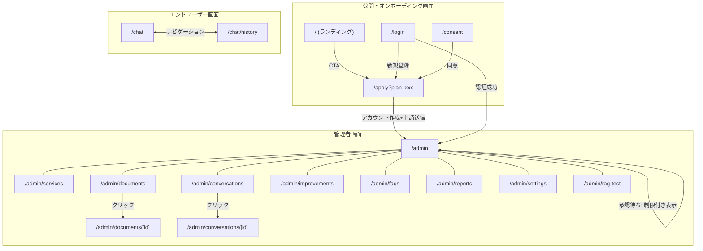
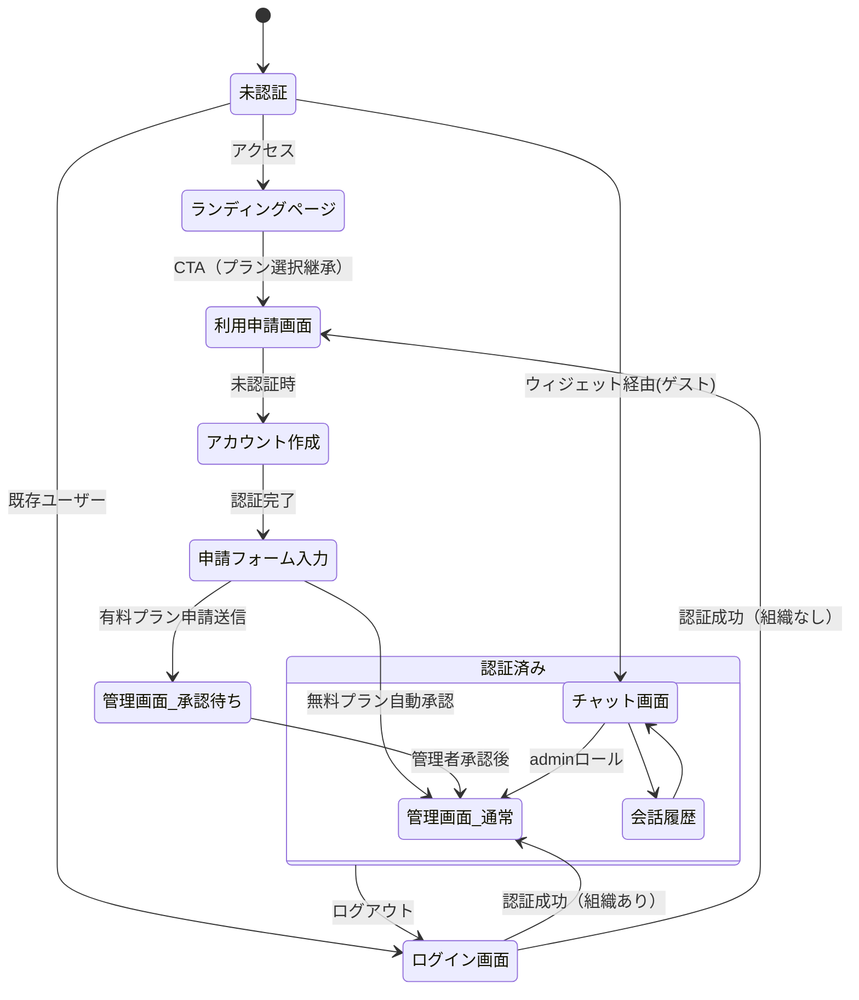
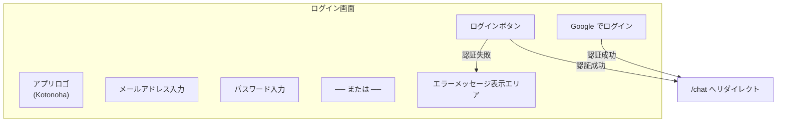
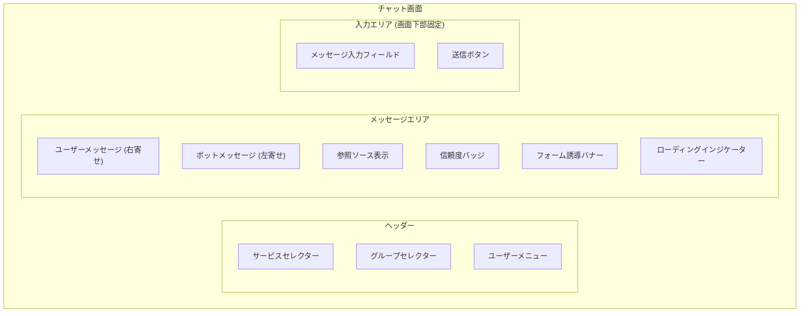
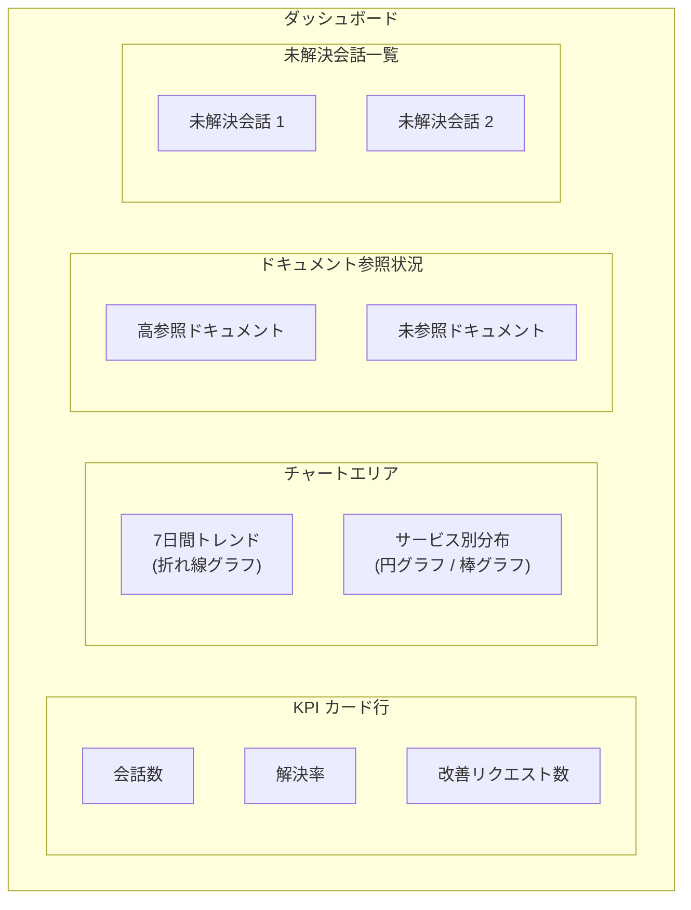
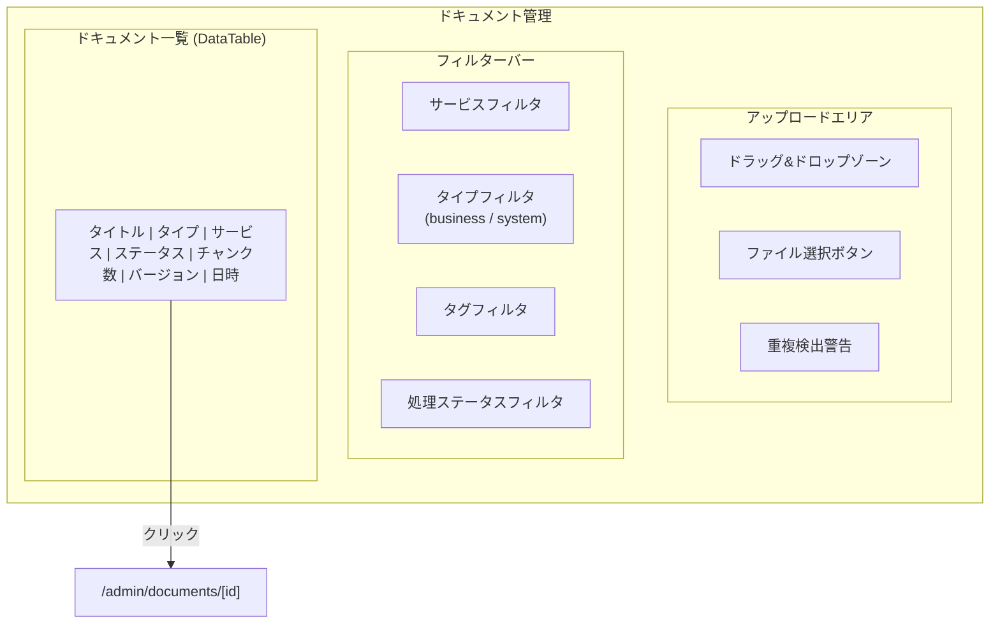
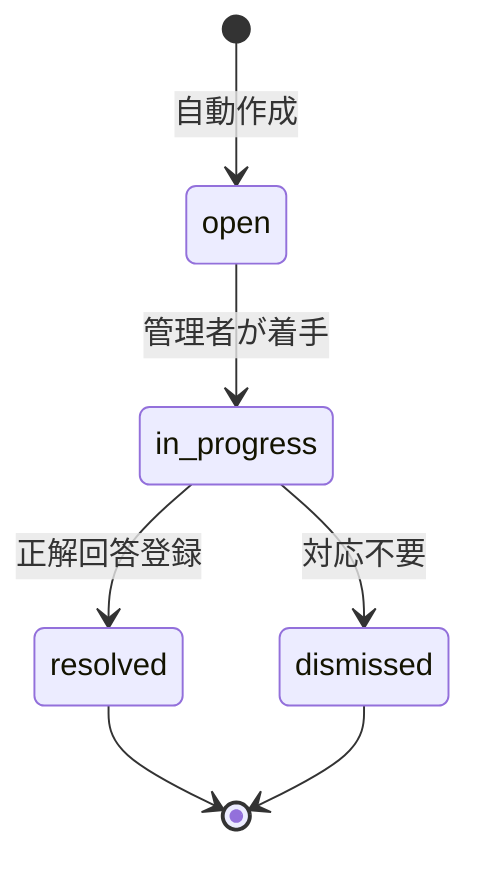
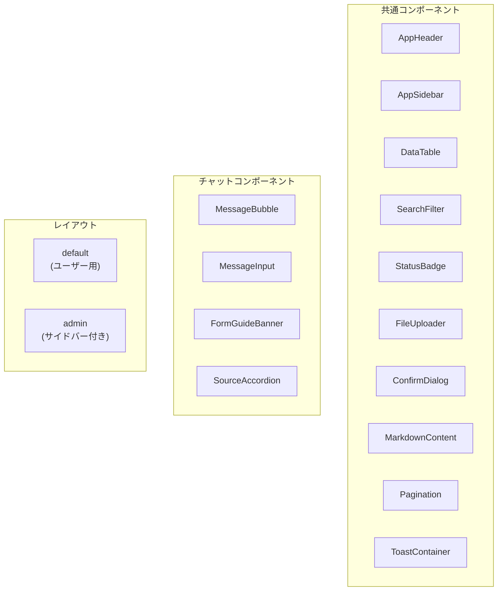
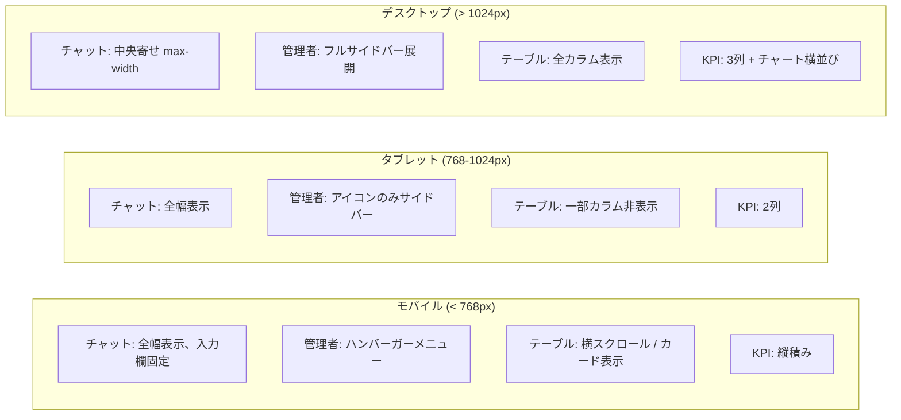

# 画面設計書

> **文書ID:** SD-001
> **対象システム:** Kotonoha — マルチテナント AI チャットボットプラットフォーム
> **作成日:** 2026-03-29
> **ステータス:** 正式版

---

## 1. 画面一覧

### 1.1 公開画面・オンボーディング画面

| 画面ID | 画面名             | URL           | 認証 | 概要                                         |
| ------ | ------------------ | ------------- | ---- | -------------------------------------------- |
| PB-1   | ランディングページ | /             | 不要 | サービス紹介・料金プラン・CTA                |
| PB-2   | 利用申請画面       | /apply        | 不要 | アカウント作成 + 組織情報 + プラン選択 + 申請 |
| PB-3   | ログイン画面       | /login        | 不要 | 既存ユーザー認証                             |
| PB-4   | 利用規約同意画面   | /consent      | 必須 | 利用規約・プライバシーポリシー同意（招待経由用） |
| PB-5   | 利用規約           | /terms        | 不要 | 利用規約の表示                               |
| PB-6   | プライバシーポリシー | /privacy     | 不要 | プライバシーポリシーの表示                   |

### 1.2 エンドユーザー画面

| 画面ID | 画面名       | URL           | 認証 | 概要                      |
| ------ | ------------ | ------------- | ---- | ------------------------- |
| EU-1   | チャット画面 | /chat         | 任意 | AI チャットボットとの対話 |
| EU-2   | 会話履歴画面 | /chat/history | 必須 | 過去の会話一覧・再表示    |

### 1.3 管理者画面

| 画面ID | 画面名           | URL                       | 認証  | 概要                             |
| ------ | ---------------- | ------------------------- | ----- | -------------------------------- |
| AD-1   | ダッシュボード   | /admin                    | admin | KPI・状況俯瞰                    |
| AD-2   | サービス管理     | /admin/services           | admin | サービスの CRUD                  |
| AD-3   | ドキュメント管理 | /admin/documents          | admin | ドキュメントのアップロード・管理 |
| AD-4   | ドキュメント詳細 | /admin/documents/[id]     | admin | ドキュメントの詳細・チャンク確認 |
| AD-5   | 会話一覧         | /admin/conversations      | admin | 全会話の一覧・検索               |
| AD-6   | 会話詳細         | /admin/conversations/[id] | admin | 個別会話のメッセージ確認         |
| AD-7   | 改善管理         | /admin/improvements       | admin | 改善リクエストの管理             |
| AD-8   | FAQ 管理         | /admin/faqs               | admin | FAQ の生成・編集・公開管理       |
| AD-9   | レポート         | /admin/reports            | admin | 週次レポートの表示・生成         |
| AD-10  | 設定             | /admin/settings           | admin | ボット設定・フォーム URL 管理    |
| AD-11  | RAG 診断         | /admin/rag-test           | admin | RAG 動作のテスト・診断           |

---

## 2. 画面遷移図

### 2.1 全体遷移図



### 2.2 認証フロー遷移図



---

## 3. 画面詳細設計

### 3.1 EU-1: ログイン画面 (`/login`)

#### 画面レイアウト



#### 入力項目

| 項目           | 型       | 必須 | バリデーション     |
| -------------- | -------- | ---- | ------------------ |
| メールアドレス | text     | ○    | メール形式チェック |
| パスワード     | password | ○    | 最低6文字以上      |

#### 動作仕様

| イベント                  | 動作                                                   |
| ------------------------- | ------------------------------------------------------ |
| ログインボタン押下        | Firebase Auth メール/パスワード認証実行                |
| Google ログインボタン押下 | Firebase Auth Google OAuth フロー開始                  |
| 認証成功                  | /chat へリダイレクト。初回ログイン時は自動ユーザー登録 |
| 認証失敗                  | エラーメッセージをインライン表示                       |
| 認証済み状態でアクセス    | /chat へリダイレクト                                   |

---

### 3.2 EU-2: チャット画面 (`/chat`)

#### 画面レイアウト



#### UI 要素仕様

| 要素                    | 仕様                                                                     |
| ----------------------- | ------------------------------------------------------------------------ |
| サービスセレクター      | ヘッダー内ドロップダウン。アクティブグループのサービス一覧を表示         |
| グループセレクター      | ヘッダー内ドロップダウン。所属グループの切替                             |
| メッセージバブル (user) | 右寄せ配置。プライマリカラー背景                                         |
| メッセージバブル (bot)  | 左寄せ配置。Markdown レンダリング対応                                    |
| 参照ソース表示          | ボット回答下部に展開可能なアコーディオン。ドキュメント名・類似度(%) 表示 |
| 信頼度バッジ            | ボット回答の信頼度をカラーバッジで表示（高: 緑、中: 黄、低: 赤）         |
| フォーム誘導バナー      | 信頼度が閾値未満の場合に表示。Google フォームへのリンク付き              |
| ローディング            | AI 回答生成中にスケルトンアニメーション表示                              |
| メッセージ入力          | テキストエリア。Enter で送信、Shift+Enter で改行。最大 10,000 文字       |
| 送信ボタン              | テキストエリア右端。入力が空の場合は非活性                               |

---

### 3.3 EU-3: 会話履歴画面 (`/chat/history`)

#### UI 要素仕様

| 要素               | 仕様                                                                 |
| ------------------ | -------------------------------------------------------------------- |
| 会話リスト         | 日時降順で表示。タイトル（最初の質問）、ステータスバッジ、日時を表示 |
| ステータスフィルタ | active / resolved_by_bot / escalated / closed / 全て                 |
| 会話選択           | クリックでチャット画面に遷移し、該当会話を再表示                     |

---

### 3.4 AD-1: ダッシュボード (`/admin`)

#### 画面レイアウト



#### UI 要素仕様

| 要素               | 仕様                                                  |
| ------------------ | ----------------------------------------------------- |
| KPI カード         | 会話数、解決率(%)、改善リクエスト数をカード形式で表示 |
| 7日間トレンド      | 直近7日間の会話数推移を折れ線グラフで表示             |
| サービス分布       | サービス別の会話数・解決率を棒グラフで表示            |
| 高参照ドキュメント | 参照回数上位のドキュメントを表示                      |
| 未参照ドキュメント | 参照されていないドキュメントの件数・一覧              |
| 未解決会話一覧     | 未解決の会話をリスト表示。クリックで会話詳細へ遷移    |

---

### 3.5 AD-2: サービス管理 (`/admin/services`)

#### UI 要素仕様

| 要素           | 仕様                                                            |
| -------------- | --------------------------------------------------------------- |
| サービス一覧   | DataTable でサービスを一覧表示（名前、説明、有効状態、作成日）  |
| 新規作成ボタン | ダイアログでサービス作成フォームを表示                          |
| 編集           | インライン編集またはダイアログ。名前、説明、Google フォーム URL |
| 有効/無効切替  | トグルスイッチ                                                  |
| 削除           | 確認ダイアログ表示後に削除実行                                  |

#### 入力バリデーション

| 項目                | バリデーション         |
| ------------------- | ---------------------- |
| サービス名          | 必須、空白不可         |
| 説明                | 任意                   |
| Google フォーム URL | 任意、URL 形式チェック |

---

### 3.6 AD-3: ドキュメント管理 (`/admin/documents`)

#### 画面レイアウト



#### 入力バリデーション（アップロード）

| 項目           | バリデーション                                            |
| -------------- | --------------------------------------------------------- |
| ファイル       | 必須。対応形式: PDF / DOCX / TXT / MD / CSV / HTML / JSON |
| ファイルサイズ | 最大 10MB                                                 |
| サービス       | 必須。ドロップダウン選択                                  |
| タイトル       | 必須                                                      |
| タイプ         | business / system。デフォルト: business                   |
| タグ           | 任意。カンマ区切りまたは JSON 配列                        |

---

### 3.7 AD-4: ドキュメント詳細 (`/admin/documents/[id]`)

#### UI 要素仕様

| 要素           | 仕様                                                                       |
| -------------- | -------------------------------------------------------------------------- |
| メタ情報       | タイトル、タイプ、ファイルサイズ、ステータス、バージョン、チャンク数       |
| チャンク一覧   | チャンクインデックス順に表示。コンテキストプレフィックス・内容・トークン数 |
| バージョン履歴 | バージョン番号、更新日時、ファイル情報                                     |
| ロールバック   | バージョン選択でロールバック実行                                           |
| 再処理         | 処理ボタンでチャンク再生成（インクリメンタルモード対応）                   |
| 更新           | 新しいファイルをアップロードしてバージョン更新                             |

---

### 3.8 AD-5: 会話一覧 (`/admin/conversations`)

#### UI 要素仕様

| 要素               | 仕様                                                                    |
| ------------------ | ----------------------------------------------------------------------- |
| 会話テーブル       | DataTable: タイトル、ユーザー、サービス、ステータス、メッセージ数、日時 |
| サービスフィルタ   | ドロップダウン選択                                                      |
| ステータスフィルタ | active / resolved_by_bot / escalated / closed                           |
| 日付フィルタ       | 開始日・終了日のデートピッカー                                          |
| キーワード検索     | テキスト入力                                                            |
| ページネーション   | ページ番号、1ページあたり件数選択                                       |

---

### 3.9 AD-6: 会話詳細 (`/admin/conversations/[id]`)

#### UI 要素仕様

| 要素           | 仕様                                                     |
| -------------- | -------------------------------------------------------- |
| メタ情報       | 会話タイトル、ユーザー、サービス、ステータス、作成日時   |
| メッセージ履歴 | 時系列表示。ユーザー/ボットのメッセージバブル            |
| 信頼度スコア   | 各ボット回答に信頼度スコアをカラーバッジで表示           |
| 参照ソース     | ボット回答ごとに参照ドキュメント・チャンク・類似度を表示 |

---

### 3.10 AD-7: 改善管理 (`/admin/improvements`)

#### ステータス遷移



#### UI 要素仕様

| 要素            | 仕様                                                           |
| --------------- | -------------------------------------------------------------- |
| リクエスト一覧  | DataTable: カテゴリ、質問要約、優先度、ステータス、日時        |
| カテゴリバッジ  | missing_docs / unclear_docs / new_feature / other を色分け表示 |
| 優先度バッジ    | high(赤) / medium(黄) / low(灰)                                |
| ステータス変更  | ドロップダウン選択                                             |
| 正解回答入力    | テキストエリア。フィードバック登録時にベクトル化               |
| 管理者メモ      | テキストエリア                                                 |
| AI カテゴリ分類 | 一括自動分類ボタン                                             |

---

### 3.11 AD-8: FAQ 管理 (`/admin/faqs`)

#### UI 要素仕様

| 要素             | 仕様                                                                  |
| ---------------- | --------------------------------------------------------------------- |
| FAQ 一覧         | DataTable: 質問、回答（プレビュー）、サービス、頻度、公開状態、生成元 |
| 自動生成ボタン   | 会話データから AI が FAQ 候補を生成                                   |
| 手動作成ボタン   | ダイアログでFAQ作成フォームを表示                                     |
| インライン編集   | 質問・回答のインライン編集                                            |
| 公開切替         | トグルスイッチ                                                        |
| サービスフィルタ | ドロップダウン選択                                                    |
| 削除             | 確認ダイアログ表示後に削除                                            |

#### 入力バリデーション

| 項目     | バリデーション |
| -------- | -------------- |
| サービス | 必須           |
| 質問     | 必須、空白不可 |
| 回答     | 必須、空白不可 |

---

### 3.12 AD-9: レポート (`/admin/reports`)

#### UI 要素仕様

| 要素         | 仕様                                                            |
| ------------ | --------------------------------------------------------------- |
| レポート一覧 | 日付降順でレポートカードを表示                                  |
| レポート詳細 | 選択したレポートの統計データ、AI インサイト、改善推奨事項を表示 |
| 生成ボタン   | 手動でレポート生成を実行                                        |
| 統計表示     | 会話数、解決率、平均信頼度、サービス別統計                      |

---

### 3.13 AD-10: 設定 (`/admin/settings`)

#### UI 要素仕様

| 要素               | 仕様                                    |
| ------------------ | --------------------------------------- |
| 信頼度閾値         | スライダー（0.0〜1.0）。デフォルト: 0.6 |
| RAG Top-K          | 数値入力。デフォルト: 5                 |
| RAG 類似度閾値     | スライダー（0.0〜1.0）。デフォルト: 0.4 |
| マルチクエリ有効化 | トグルスイッチ                          |
| HyDE 有効化        | トグルスイッチ                          |
| システムプロンプト | テキストエリア（最大 10,000 文字）      |
| フォーム URL       | URL 入力フィールド                      |

#### 入力バリデーション

| 項目               | バリデーション   |
| ------------------ | ---------------- |
| 信頼度閾値         | 0.0〜1.0 の数値  |
| RAG Top-K          | 1 以上の整数     |
| RAG 類似度閾値     | 0.0〜1.0 の数値  |
| システムプロンプト | 最大 10,000 文字 |
| フォーム URL       | URL 形式チェック |

---

### 3.14 AD-11: RAG 診断 (`/admin/rag-test`)

#### UI 要素仕様

| 要素                   | 仕様                                                               |
| ---------------------- | ------------------------------------------------------------------ |
| テストクエリ入力       | テキストエリア。検索クエリを入力                                   |
| 実行ボタン             | RAG パイプラインを実行                                             |
| 検索結果表示           | ヒットしたチャンクを類似度スコア降順で表示                         |
| チャンク詳細           | コンテキストプレフィックス、チャンク内容、元ドキュメント名、類似度 |
| コンテキストプレビュー | AI に渡されるコンテキスト全文のプレビュー                          |

---

## 4. コンポーネント構成

### 4.1 コンポーネント階層図



### 4.2 共通コンポーネント仕様

| コンポーネント  | 説明                                                                      | Props                     | 使用画面               |
| --------------- | ------------------------------------------------------------------------- | ------------------------- | ---------------------- |
| AppHeader       | アプリヘッダー。ロゴ、ナビ、サービス/グループセレクター、ユーザーメニュー | -                         | 全画面                 |
| AppSidebar      | 管理者サイドバーナビゲーション                                            | collapsed: boolean        | AD-1〜AD-11            |
| DataTable       | ソート・フィルタ・ページネーション対応テーブル                            | columns, data, sortable   | AD-2〜AD-8             |
| SearchFilter    | 検索・フィルタリングコントロール群                                        | filters: FilterConfig[]   | AD-3, AD-5, AD-7       |
| StatusBadge     | ステータスをカラーバッジで表示                                            | status, variant           | AD-3〜AD-7             |
| FileUploader    | ドラッグ&ドロップ対応ファイルアップロード                                 | accept, maxSize           | AD-3                   |
| ConfirmDialog   | 確認ダイアログ                                                            | title, message, onConfirm | 全管理者画面           |
| MarkdownContent | Markdown テキストレンダリング                                             | content: string           | EU-2, AD-6             |
| Pagination      | ページネーションコントロール                                              | total, page, limit        | AD-3, AD-5, AD-7, AD-8 |
| ToastContainer  | 通知トースト表示                                                          | -                         | 全画面                 |

### 4.3 チャット専用コンポーネント

| コンポーネント  | 説明                                                                                     |
| --------------- | ---------------------------------------------------------------------------------------- |
| MessageBubble   | メッセージ表示。role (user/assistant) で左右・スタイル分離。信頼度バッジ・ソース表示内包 |
| MessageInput    | テキスト入力 + 送信ボタン。Enter 送信、Shift+Enter 改行                                  |
| FormGuideBanner | フォーム誘導バナー。Google フォームへのリンク付き                                        |
| SourceAccordion | 参照元ドキュメント・チャンクのアコーディオン表示                                         |

---

## 5. レスポンシブ対応

### 5.1 ブレークポイント定義

| 名前 | 画面幅        | 分類         |
| ---- | ------------- | ------------ |
| sm   | < 768px       | モバイル     |
| md   | 768px〜1024px | タブレット   |
| lg   | > 1024px      | デスクトップ |

### 5.2 レスポンシブ対応方針



### 5.3 画面別レスポンシブ仕様

| 画面                  | モバイル (< 768px)                  | タブレット (768-1024px) | デスクトップ (> 1024px)               |
| --------------------- | ----------------------------------- | ----------------------- | ------------------------------------- |
| チャット (EU-2)       | 全幅表示、入力欄画面下部固定        | 全幅表示                | 中央寄せ、max-width 制限              |
| サイドバー            | ハンバーガーメニュー → オーバーレイ | アイコンのみの縮小表示  | フルサイドバー（テキスト + アイコン） |
| DataTable             | 横スクロール or カード表示          | 優先度低カラム非表示    | 全カラム表示                          |
| ダッシュボード (AD-1) | KPI 縦積み、チャート縦積み          | KPI 2列、チャート縦積み | KPI 3列、チャート横並び               |
| アップロード (AD-3)   | 全幅ドロップゾーン                  | 全幅ドロップゾーン      | コンテンツ幅内ドロップゾーン          |

---

## 6. 外部埋め込みウィジェット

### 6.1 Web Component 仕様

| 項目           | 仕様                                                    |
| -------------- | ------------------------------------------------------- |
| タグ名         | `<kotonoha-chat>`                                       |
| Shadow DOM     | v1（スタイル分離）                                      |
| 属性           | `api-base-url` (必須)、`service-id` (必須)              |
| CSS Variables  | `--kotonoha-primary-color`、`--kotonoha-font-family` 等 |
| JavaScript API | `resetConversation()`、`send(msg)`                      |

### 6.2 埋め込み例

```html
<kotonoha-chat
  api-base-url="https://example.com"
  service-id="service-xxx"
  style="--kotonoha-primary-color: #3b82f6;"
></kotonoha-chat>
```
