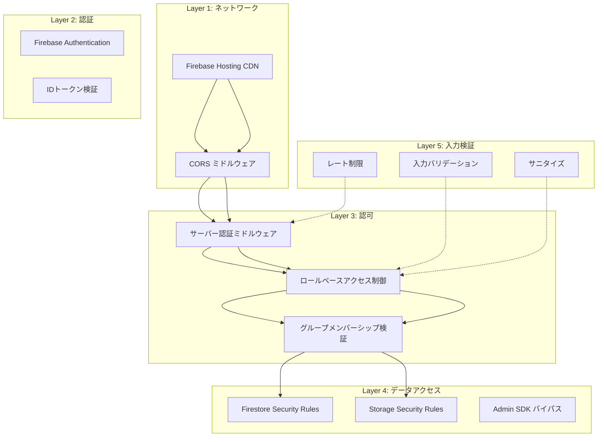
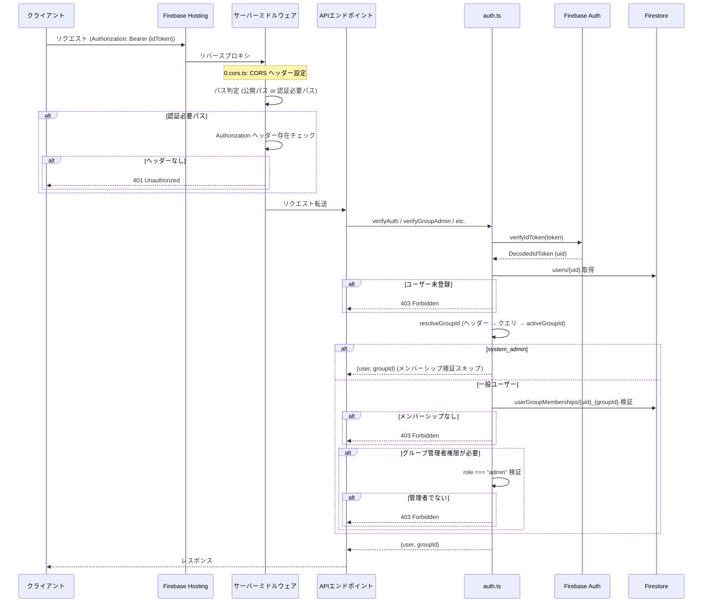

# セキュリティ設計書

| 項目 | 内容 |
|------|------|
| プロジェクト名 | Kotonoha |
| バージョン | 0.1.0 |
| 最終更新日 | 2026-03-29 |
| ステータス | 初版 |

---

## 1. セキュリティアーキテクチャ概要

### 1.1 多層防御モデル



### 1.2 認証・認可フロー



---

## 2. 認証設計

### 2.1 認証方式

| 方式 | 対象 | 実装 |
|------|------|------|
| Email/Password | 管理者・内部ユーザー | Firebase Authentication `signInWithEmailAndPassword` |
| Google OAuth | 管理者・内部ユーザー | Firebase Authentication `signInWithPopup(GoogleAuthProvider)` |
| ゲスト（無認証） | ウィジェット利用者 | トークンなしでアクセス可、`verifyAuthOptional` で処理 |

### 2.2 IDトークン検証

サーバーサイドでは Firebase Admin SDK の `verifyIdToken` を使用してIDトークンを検証する。

```
Authorization: Bearer {Firebase ID Token}
```

- トークンの署名検証、有効期限チェック、発行者検証を Firebase Admin SDK が実施
- 検証成功後、`users` コレクションからユーザー情報を取得
- ユーザーが Firestore に未登録の場合は 403 を返却（自動登録は `/api/auth/register` エンドポイントで実施）

### 2.3 ゲストアクセス

ウィジェットからのチャットAPIアクセスは認証不要。以下の識別情報をヘッダーで受け取る。

| ヘッダー | 説明 | サニタイズ |
|---------|------|----------|
| `x-kotonoha-user-name` | 外部ユーザー表示名 | 制御文字除去、200文字切り詰め |
| `x-kotonoha-user-id` | 外部ユーザーID | 制御文字除去、200文字切り詰め |

ゲストユーザーのIDは `ext:{externalUserId}` または `guest` として内部管理される。

---

## 3. 認可設計

### 3.1 ロール定義

| ロール | スコープ | 権限 |
|--------|---------|------|
| `system_admin` | システム全体 | 全操作可能、全グループアクセス、メンバーシップ検証バイパス |
| `admin` | グループスコープ | グループ管理者権限（ドキュメント管理、サービス管理、設定変更、改善要望管理） |
| `member` | グループスコープ | チャット利用、FAQ閲覧、自身の会話履歴閲覧 |
| ゲスト | サービススコープ | チャットAPIのみ（認証不要） |

### 3.2 アクセス制御マトリクス

#### サーバーサイド API

| エンドポイント | ゲスト | member | admin | system_admin | 検証関数 |
|---------------|--------|--------|-------|-------------|---------|
| `POST /api/chat/send` | OK | OK | OK | OK | `verifyAuthOptional` |
| `GET /api/services` | OK | OK | OK | OK | なし（公開） |
| `GET /api/settings/form-url` | OK | OK | OK | OK | なし（公開） |
| `GET /api/health` | OK | OK | OK | OK | なし（公開） |
| `POST /api/auth/register` | - | OK | OK | OK | トークンのみ |
| `GET /api/auth/me` | - | OK | OK | OK | `verifyAuth` |
| `GET /api/conversations` | - | OK | OK | OK | `verifyGroupMember` |
| `GET /api/documents` | - | OK | OK | OK | `verifyGroupMember` |
| `POST /api/documents/upload` | - | - | OK | OK | `verifyGroupAdmin` |
| `DELETE /api/documents/{id}` | - | - | OK | OK | `verifyGroupAdmin` |
| `POST /api/services` | - | - | OK | OK | `verifyGroupAdmin` |
| `PUT /api/settings` | - | - | OK | OK | `verifyGroupAdmin` |
| `GET /api/improvement-requests` | - | - | OK | OK | `verifyGroupAdmin` |
| システム管理API | - | - | - | OK | `verifySystemAdmin` |

#### クライアントサイド ルーティング

| パス | ミドルウェア | アクセス条件 |
|------|------------|------------|
| `/login` | なし | 未認証のみ |
| `/chat/**` | `auth` | 認証済み + グループ所属 |
| `/admin/**` | `auth` + `admin` | 管理者（system_admin or group admin） |
| `/admin/system/**` | `auth` + `admin` | system_admin のみ（UIレベルで制御） |
| `/no-group` | `auth` | 認証済み + グループ未割当 |

### 3.3 グループメンバーシップ検証

グループIDの解決順序:
1. `X-Group-Id` リクエストヘッダー
2. `?groupId` クエリパラメータ
3. `user.activeGroupId`

メンバーシップの検証:
- `userGroupMemberships/{userId}_{groupId}` ドキュメントの存在確認
- 組織の一致も検証（クロス組織アクセス防止）
- `system_admin` はメンバーシップ検証をバイパス

---

## 4. Firestore Security Rules 分析

### 4.1 ヘルパー関数

| 関数 | 説明 | 使用される get/exists |
|------|------|---------------------|
| `isAuthenticated()` | `request.auth != null` | なし |
| `getUserData()` | `users/{auth.uid}` を取得 | `get()` |
| `belongsToOrg(orgId)` | ユーザーの organizationId が一致するか | `get()` |
| `isAdmin()` | ロールが admin or system_admin | `get()` |
| `isSystemAdmin()` | ロールが system_admin | `get()` |
| `belongsToGroup(groupId)` | グループメンバーシップが存在し組織が一致するか | `exists()` + `get()` x2 |
| `isGroupAdmin(groupId)` | グループ管理者かつ組織一致か | `get()` x2 |
| `isOrgAdmin(orgId)` | 組織管理者か（後方互換） | `get()` |

### 4.2 コレクション別ルール

| コレクション | read | create | update | delete | 備考 |
|-------------|------|--------|--------|--------|------|
| `organizations` | 所属組織メンバー | - | system_admin + 所属組織 | - | |
| `groups` | グループメンバー or system_admin | - | system_admin + 所属組織 | - | |
| `userGroupMemberships` | 自身 or system_admin | - | system_admin + 所属組織 | - | |
| `users` | 自身のみ | 自身のみ | 自身 or system_admin（同一組織） | - | |
| `services` | 組織所属 + (グループメンバー or system_admin) | グループ管理者 or system_admin | グループ管理者 or system_admin | グループ管理者 or system_admin | |
| `documents` | 組織所属 + (グループメンバー or system_admin) | グループ管理者 or system_admin | グループ管理者 or system_admin | グループ管理者 or system_admin | |
| `documentChunks` | 組織所属 + (グループメンバー or system_admin) | **サーバーのみ** | **サーバーのみ** | **サーバーのみ** | `allow write: if false` |
| `feedbackChunks` | 組織所属 + (グループメンバー or system_admin) | **サーバーのみ** | **サーバーのみ** | **サーバーのみ** | `allow write: if false` |
| `embeddingCache` | **サーバーのみ** | **サーバーのみ** | **サーバーのみ** | **サーバーのみ** | `allow read, write: if false` |
| `conversations` | 自身 or system_admin or グループ管理者 | グループメンバー or system_admin | 自身 or system_admin or グループ管理者 | - | |
| `conversations/.../messages` | 会話所有者 or system_admin or グループ管理者 | **サーバーのみ** | **サーバーのみ** | **サーバーのみ** | 親会話のアクセス権を継承 |
| `improvementRequests` | system_admin or グループ管理者 | **サーバーのみ** | **サーバーのみ** | **サーバーのみ** | |
| `faqs` | 組織所属 + (グループメンバー or system_admin) | グループ管理者 or system_admin | グループ管理者 or system_admin | グループ管理者 or system_admin | |
| `weeklyReports` | system_admin or グループ管理者 | **サーバーのみ** | **サーバーのみ** | **サーバーのみ** | |
| `invitations` | system_admin + 所属組織 | **サーバーのみ** | **サーバーのみ** | **サーバーのみ** | |
| `settings` | 組織所属 + (グループメンバー or system_admin) | グループ管理者 or system_admin | グループ管理者 or system_admin | グループ管理者 or system_admin | |

### 4.3 サーバーサイドのみの書き込み

以下のコレクションはクライアントからの書き込みを一切禁止し、Admin SDK（サーバーサイド）経由でのみ操作する。

- `documentChunks` — チャンキング・Embedding処理はサーバーで実行
- `feedbackChunks` — フィードバックRAG用ベクトルはサーバーで生成
- `embeddingCache` — L2キャッシュはサーバーで管理
- `conversations/.../messages` — メッセージはサーバーで作成
- `improvementRequests` — エスカレーション時にサーバーで自動作成
- `weeklyReports` — レポート生成はサーバーで実行
- `invitations` — 招待管理はサーバーで実行

---

## 5. Storage Security Rules 分析

```
match /documents/{organizationId}/{allPaths=**} {
  allow read: if request.auth != null
    && firestore.get(/databases/kotonoha-ai-chat/documents/users/$(request.auth.uid))
       .data.organizationId == organizationId;
  allow write: if false;
}

match /{allPaths=**} {
  allow read, write: if false;
}
```

| ルール | 説明 |
|--------|------|
| ドキュメント読み取り | 認証済み + 同一組織のユーザーのみ |
| ドキュメント書き込み | クライアントからは一切禁止（Admin SDKのみ） |
| その他のパス | 全操作禁止 |

**クロステナントアクセス防止:** パス中の `{organizationId}` と Firestore の `users` ドキュメントの `organizationId` を照合し、他組織のドキュメントへのアクセスを防止。

---

## 6. CORS ポリシー

### 6.1 公開パス（全オリジン許可）

| パス | 理由 |
|------|------|
| `/embed/**` | ウィジェットは任意のサードパーティサイトに埋め込まれる |
| `/api/chat/send` | ウィジェットからのチャットAPIアクセス |
| `/api/services` | ウィジェットのサービス情報取得 |
| `/api/settings/form-url` | ウィジェットのフォームURL取得 |

```
Access-Control-Allow-Origin: *
Access-Control-Allow-Methods: GET, POST, OPTIONS
Access-Control-Allow-Headers: Content-Type, Authorization, x-kotonoha-user-name, x-kotonoha-user-id
Access-Control-Max-Age: 86400
```

### 6.2 管理系パス

管理系APIはCORS ミドルウェアの対象外。Firebase Hosting 経由の同一オリジンアクセスを前提とし、ブラウザのSame-Origin Policyで保護。

---

## 7. 入力検証・サニタイズ

### 7.1 入力検証一覧

| 入力 | 検証 | 制限値 |
|------|------|--------|
| チャットメッセージ | 空チェック + 長さ制限 | 最大 10,000 文字 |
| システムプロンプト | 長さ制限（サーバー側で切り詰め） | 最大 10,000 文字 |
| 会話タイトル | メッセージから自動生成、長さ制限 | 最大 50 文字 |
| アップロードファイル | MIMEタイプ + サイズ | 7種類、最大 10 MB |
| 外部ユーザー名/ID | 制御文字除去 + 長さ制限 | `[\r\n\0<>]` 除去、最大 200 文字 |
| サービスID | 存在チェック（Firestore） | - |
| グループID | メンバーシップ検証 | - |

### 7.2 許可MIMEタイプ

```typescript
const ALLOWED_MIME_TYPES = [
  "application/pdf",
  "application/vnd.openxmlformats-officedocument.wordprocessingml.document",
  "text/plain",
  "text/markdown",
  "text/csv",
  "text/html",
  "application/json",
  "application/octet-stream",
];
```

### 7.3 ファイル重複チェック

SHA-256 ハッシュによるファイル内容の重複検出。同一グループ内で同じハッシュのファイルが存在する場合、管理者に通知し上書きの可否を確認。

---

## 8. レート制限

### 8.1 設定

| 対象 | 制限 | ウィンドウ | キー |
|------|------|----------|------|
| チャットAPI | 10リクエスト | 60秒 | `chat:user:{userId}` or `chat:ip:{ip}` |
| 一般API | 60リクエスト | 60秒 | カスタム |

### 8.2 実装特性

- **方式:** インメモリ Token Bucket
- **スコープ:** Cloud Run インスタンス単位（分散ロックなし）
- **制約:** max-instances=3 の場合、実効レート制限は設定値の最大3倍
- **二次防御:** Vertex AI API クォータがバックプレッシャーとして機能
- **将来改善:** Firestore/Redis ベースの分散レート制限への移行を Phase 8 で検討

### 8.3 メモリ管理

- バケットサイズ上限: 10,000 エントリ
- 5分ごとに未アクセスエントリをクリーンアップ
- サイズ超過時は古いエントリから削除

---

## 9. 秘匿情報管理

### 9.1 環境変数による管理

| 秘匿情報 | 環境変数 | 保管場所 |
|---------|---------|---------|
| Firebase Admin 秘密鍵 | `NUXT_FIREBASE_PRIVATE_KEY` | Cloud Run 環境変数 / Secret Manager |
| Firebase Admin メール | `NUXT_FIREBASE_CLIENT_EMAIL` | Cloud Run 環境変数 |
| Firebase API Key | `NUXT_PUBLIC_FIREBASE_API_KEY` | クライアント公開（制限付き） |

### 9.2 秘密鍵の取り扱い

- サーバーサイド専用の環境変数（`NUXT_` プレフィックス、`PUBLIC` なし）はクライアントバンドルに含まれない
- `NUXT_PUBLIC_` プレフィックスの変数はブラウザに公開されるため、Firebase API Key のリファラー制限を設定推奨
- `.env.example` にはサンプル値を記載（本番シークレットは含まない）

### 9.3 サービスアカウント

Cloud Run ランタイムには専用サービスアカウント（`kotonoha-bot-runner`）を使用し、最小権限の原則に基づく。

必要な IAM ロール:
- `roles/datastore.user` (Firestore)
- `roles/storage.objectAdmin` (Cloud Storage)
- `roles/aiplatform.user` (Vertex AI)
- `roles/logging.logWriter` (Cloud Logging)

---

## 10. エスカレーション制御

### 10.1 低確信度検出

チャット回答の確信度が閾値（デフォルト: 0.6）未満、またはユーザーメッセージにエスカレーションキーワードが含まれる場合:

1. 会話ステータスを `escalated` に更新
2. `improvementRequests` に自動でレコードを作成
3. Google Form URL がある場合はレスポンスに含める

### 10.2 エスカレーションキーワード

「人間につないで」「担当者に繋いで」「お問い合わせ窓口」「オペレーターに繋いで」など20語のキーワードリスト。部分一致で検出。

---

## 11. セキュリティ上の注意事項と改善候補

### 11.1 現状の制約

| 項目 | 現状 | リスク | 改善案 |
|------|------|--------|--------|
| レート制限 | インメモリ（インスタンス単位） | max-instances倍のリクエストが通過しうる | Redis/Firestore ベースの分散レート制限 |
| CORS | 公開パスは全オリジン許可 | 悪意あるサイトからのAPI呼び出し | レート制限 + サービスIDの存在検証で緩和 |
| IDトークン失効 | Firebase デフォルト（1時間） | トークン漏洩時の影響時間 | カスタムクレーム + 短いTTL |
| Firestoreルール | list操作で exists/get が多い | Security Rulesの評価コスト | カスタムクレームへの移行検討 |

### 11.2 推奨セキュリティ対策（未実装）

- **WAF:** Cloud Armor による DDoS 防御・IP制限
- **CSP:** Content-Security-Policy ヘッダーの設定
- **監査ログ:** 管理操作の Cloud Audit Logs 有効化
- **脆弱性スキャン:** Artifact Registry のコンテナイメージスキャン
- **Secret Manager:** 環境変数から Secret Manager への移行
