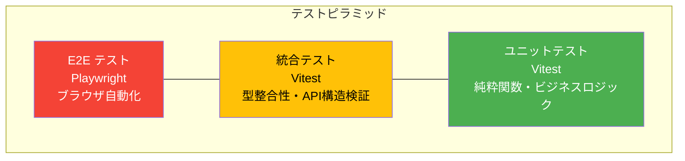
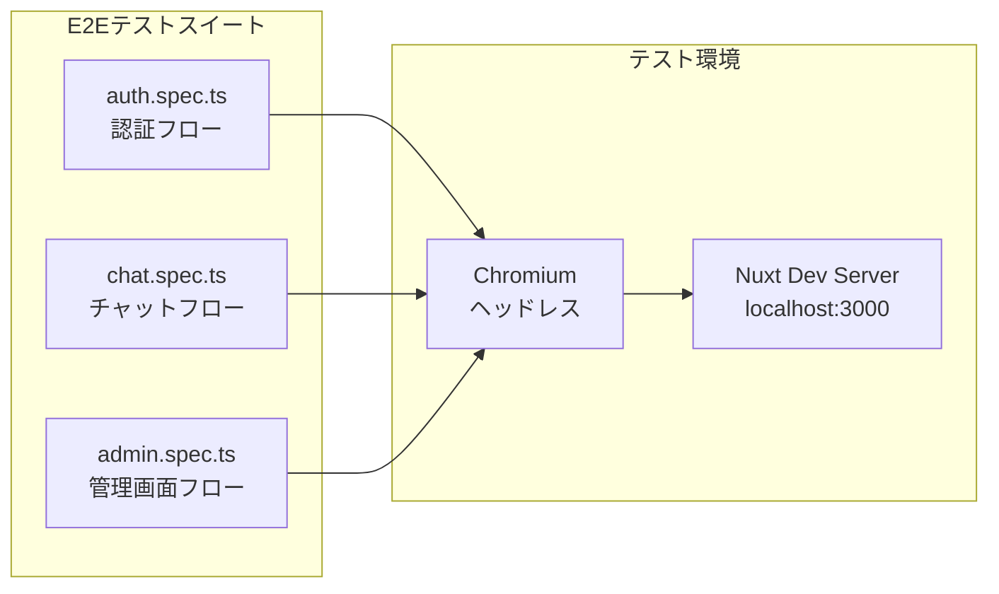
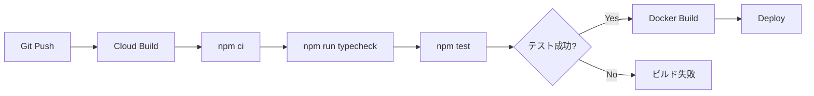

# テスト設計書

| 項目           | 内容       |
| -------------- | ---------- |
| プロジェクト名 | Kotonoha   |
| バージョン     | 0.1.0      |
| 最終更新日     | 2026-03-29 |
| ステータス     | 初版       |

---

## 1. テスト戦略概要

### 1.1 テストピラミッド



| レイヤー       | フレームワーク | 対象                         | 実行環境 | 実行頻度       |
| -------------- | -------------- | ---------------------------- | -------- | -------------- |
| ユニットテスト | Vitest         | 純粋関数、ビジネスロジック   | Node.js  | 開発中常時、CI |
| 統合テスト     | Vitest         | 型定義の整合性、API構造      | Node.js  | CI             |
| E2Eテスト      | Playwright     | ブラウザ操作、ユーザーフロー | Chromium | CI、リリース前 |

### 1.2 テスト方針

1. **外部依存のモック:** Firebase Admin SDK、Vertex AI API はモックで代替し、ユニットテストの独立性を確保
2. **型安全性の検証:** TypeScript の型定義ファイルがインポート可能であることを統合テストで確認
3. **グレースフルデグラデーションの検証:** エラーハンドリングのフォールバック動作をユニットテストで確認
4. **最小限のE2E:** ページの到達可能性とクリティカルパスのみをE2Eで確認

---

## 2. テスト環境構成

### 2.1 ディレクトリ構造

```
tests/
├── unit/                      # ユニットテスト
│   ├── chunker.test.ts        # チャンキング・テキスト抽出
│   ├── gemini.test.ts         # Gemini 回答生成・確信度抽出
│   └── ai-generator.test.ts   # AI構造化JSON生成
├── integration/               # 統合テスト
│   └── api.test.ts            # API型定義の整合性
└── e2e/                       # E2Eテスト
    ├── auth.spec.ts           # 認証フロー
    ├── chat.spec.ts           # チャットフロー
    └── admin.spec.ts          # 管理画面フロー
```

### 2.2 設定ファイル

#### vitest.config.ts

```typescript
import { defineConfig } from "vitest/config";
import { resolve } from "path";

export default defineConfig({
  test: {
    include: ["tests/unit/**/*.test.ts", "tests/integration/**/*.test.ts"],
    environment: "node",
  },
  resolve: {
    alias: {
      "~~": resolve(__dirname),
      "~~/": resolve(__dirname) + "/",
    },
  },
});
```

- テスト実行環境: Node.js
- パスエイリアス: `~~` → プロジェクトルート（Nuxt のエイリアスと統一）
- 対象: `tests/unit/` と `tests/integration/` 配下の `*.test.ts`

#### playwright.config.ts

```typescript
import { defineConfig } from "@playwright/test";

export default defineConfig({
  testDir: "./tests/e2e",
  timeout: 30000,
  retries: 0,
  use: {
    baseURL: "http://localhost:3000",
    headless: true,
  },
  projects: [{ name: "chromium", use: { browserName: "chromium" } }],
  webServer: {
    command: "npm run dev",
    url: "http://localhost:3000",
    reuseExistingServer: true,
    timeout: 60000,
  },
});
```

- テスト対象ブラウザ: Chromium のみ
- テストタイムアウト: 30秒
- ウェブサーバー: `npm run dev` を自動起動（既存サーバーがあれば再利用）
- リトライ: なし（フレーキーテストの隠蔽を防止）

### 2.3 npm スクリプト

| コマンド             | 説明                                                    |
| -------------------- | ------------------------------------------------------- |
| `npm test`           | Vitest でユニット・統合テストを一括実行（`vitest run`） |
| `npm run test:watch` | Vitest をウォッチモードで実行                           |
| `npm run test:e2e`   | Playwright でE2Eテストを実行                            |

---

## 3. ユニットテスト詳細

### 3.1 chunker.test.ts

**テスト対象:** `server/utils/chunker.ts`

| テストスイート        | テストケース                                   | 検証内容               |
| --------------------- | ---------------------------------------------- | ---------------------- |
| `estimateTokenCount`  | 日本語テキストのトークン数を推定する           | 7文字 x 1.5 = 11       |
|                       | 英語テキストのトークン数を推定する             | 2単語 x 1.3 = 3        |
|                       | 日英混合テキストを処理する                     | トークン数 > 0         |
|                       | 空文字列は0を返す                              | 0                      |
| `splitTextIntoChunks` | 空テキストは空配列を返す                       | `[]`                   |
|                       | 短いテキストは1チャンクになる                  | length=1, content一致  |
|                       | 段落境界でチャンクを分割する                   | length >= 2            |
|                       | chunkIndexが連番になる                         | 0, 1, 2, ...           |
|                       | 各チャンクのtokenCountが設定される             | > 0                    |
| `extractText`         | text/plain のバッファからテキストを抽出する    | UTF-8文字列一致        |
|                       | text/markdown のバッファからテキストを抽出する | UTF-8文字列一致        |
|                       | 未対応のMIMEタイプでエラーをスローする         | "未対応のファイル形式" |

**モック:** なし（純粋関数のテスト）

### 3.2 gemini.test.ts

**テスト対象:** `server/utils/gemini.ts`

| テストスイート         | テストケース                                | 検証内容                   |
| ---------------------- | ------------------------------------------- | -------------------------- |
| `generateChatResponse` | 通常の回答と確信度を返す                    | content + confidence=0.85  |
|                        | 確信度タグがない場合はデフォルト値0.5を返す | confidence=0.5             |
|                        | 確信度0.0を正しく抽出する                   | confidence=0               |
|                        | 確信度1.0を正しく抽出する                   | confidence=1.0             |
|                        | 回答テキストから確信度タグを除去する        | `[CONFIDENCE:]` なし       |
|                        | 空のレスポンスを処理する                    | content="", confidence=0.5 |

**モック:**

```typescript
vi.mock("~~/server/utils/vertex-ai", () => ({
  getGenerativeModel: vi.fn(() => ({
    generateContent: vi.fn(),
  })),
}));

vi.mock("~~/server/utils/rag", () => ({
  buildContextFromResults: vi.fn(() => "mocked context"),
}));
```

- `getGenerativeModel`: Vertex AI SDK をモック化、`generateContent` の戻り値をテストケースごとに設定
- `buildContextFromResults`: RAGコンテキスト構築を固定文字列でモック化

### 3.3 ai-generator.test.ts

**テスト対象:** `server/utils/ai-generator.ts`

**モック:** `getGenerativeModel` をモック化し、JSON出力のパース動作を検証。

---

## 4. 統合テスト詳細

### 4.1 api.test.ts

**テスト対象:** `shared/types/api.ts`, `shared/types/models.ts`

| テストスイート             | テストケース                                      | 検証内容                        |
| -------------------------- | ------------------------------------------------- | ------------------------------- |
| `API Types`                | ChatSendRequest の型が正しく定義されている        | インポート成功                  |
|                            | モデル型が正しく定義されている                    | インポート成功                  |
| `Shared Types Consistency` | DashboardSummary の必須フィールドが定義されている | インポート成功                  |
|                            | ImprovementRequest のステータスが正しい型を持つ   | 4ステータス、4カテゴリ、3優先度 |
|                            | BotConfig のデフォルト値が妥当である              | 閾値範囲チェック                |

**設計意図:**

- Firebase Admin SDK が必要な完全な統合テストは Firebase エミュレータ環境で実行する想定
- 現在の統合テストは型定義の整合性チェックと構造検証に限定
- TypeScript のコンパイル時型チェックを補完するランタイム検証

---

## 5. E2Eテスト詳細

### 5.1 テスト構成



### 5.2 chat.spec.ts

| テストスイート   | テストケース                      | 検証内容                      |
| ---------------- | --------------------------------- | ----------------------------- |
| `チャットフロー` | ログインページからアクセス可能    | `/login` ページが表示される   |
|                  | チャット履歴ページのURLが存在する | `/chat/history` が 404 でない |

### 5.3 auth.spec.ts

認証フローのE2E検証。ログインページの表示、ログイン操作、リダイレクト動作を確認。

### 5.4 admin.spec.ts

管理画面フローのE2E検証。管理者ページの到達可能性、主要UIの表示を確認。

---

## 6. テストカバレッジ方針

### 6.1 優先度マトリクス

| モジュール        | ユニットテスト | 統合テスト | E2E      | 優先度 | 理由                     |
| ----------------- | -------------- | ---------- | -------- | ------ | ------------------------ |
| `chunker.ts`      | 実装済み       | -          | -        | 高     | 純粋関数、テスト容易     |
| `gemini.ts`       | 実装済み       | -          | -        | 高     | 確信度抽出が重要         |
| `ai-generator.ts` | 実装済み       | -          | -        | 中     | JSON パース              |
| `rag.ts`          | 未実装         | -          | -        | 高     | 検索品質に直結           |
| `embeddings.ts`   | 未実装         | -          | -        | 中     | キャッシュロジック       |
| `chat.ts`         | 未実装         | -          | -        | 高     | コアオーケストレーション |
| `auth.ts`         | 未実装         | -          | -        | 高     | セキュリティ             |
| `rate-limiter.ts` | 未実装         | -          | -        | 中     | Token Bucket             |
| 型定義            | -              | 実装済み   | -        | 中     | 型整合性                 |
| 認証フロー        | -              | -          | 実装済み | 高     | クリティカルパス         |
| チャットフロー    | -              | -          | 実装済み | 高     | クリティカルパス         |
| 管理画面          | -              | -          | 実装済み | 中     | 管理者向け               |

### 6.2 カバレッジ目標

| レイヤー       | 現状           | 目標                      | 備考                       |
| -------------- | -------------- | ------------------------- | -------------------------- |
| ユニットテスト | 一部実装       | ステートメント 80%        | 純粋関数を優先             |
| 統合テスト     | 型チェックのみ | Firebase エミュレータ対応 | Phase 8                    |
| E2Eテスト      | スモーク程度   | クリティカルパス 100%     | ログイン→チャット→回答確認 |

---

## 7. モック戦略

### 7.1 モック対象と方針

| 依存               | モック方法                                  | 理由                    |
| ------------------ | ------------------------------------------- | ----------------------- |
| Vertex AI SDK      | `vi.mock("~~/server/utils/vertex-ai")`      | 外部API呼び出しを避ける |
| Firebase Admin SDK | `vi.mock("~~/server/utils/firebase-admin")` | Firestore接続を避ける   |
| RAGモジュール      | `vi.mock("~~/server/utils/rag")`            | ベクトル検索依存を除去  |

### 7.2 モックパターン

```typescript
// パターン1: モジュールモック（トップレベル）
vi.mock("~~/server/utils/vertex-ai", () => ({
  getGenerativeModel: vi.fn(() => ({
    generateContent: vi.fn(),
  })),
}));

// パターン2: テストケース毎にモック値を変更
function mockGeminiResponse(text: string) {
  const mock = getGenerativeModel as ReturnType<typeof vi.fn>;
  mock.mockReturnValue({
    generateContent: vi.fn().mockResolvedValue({
      response: {
        candidates: [{ content: { parts: [{ text }] } }],
      },
    }),
  });
}
```

---

## 8. テスト実行とCI統合

### 8.1 ローカル実行

```bash
# ユニット + 統合テスト（1回実行）
npm test

# ウォッチモード（開発中）
npm run test:watch

# E2Eテスト（devサーバー自動起動）
npm run test:e2e
```

### 8.2 CI パイプライン統合



**推奨CI設定（未実装）:**

```yaml
# cloudbuild.yaml に追加推奨
steps:
  # テスト実行
  - name: "node:22-alpine"
    entrypoint: "sh"
    args:
      - "-c"
      - "npm ci && npm run typecheck && npm test"

  # 以降: 既存のDocker Build + Deploy
```

### 8.3 テスト実行順序

1. **TypeScript 型チェック** (`npm run typecheck`) — コンパイルエラーの早期検出
2. **ESLint** (`npm run lint`) — コード品質チェック
3. **ユニットテスト** (`npm test`) — ビジネスロジックの動作検証
4. **E2Eテスト** (`npm run test:e2e`) — ブラウザ操作の動作検証（オプション）

---

## 9. テスト追加ガイドライン

### 9.1 新規テスト作成時の指針

1. **ファイル配置:** テスト対象に対応するディレクトリに配置
   - 純粋関数 → `tests/unit/`
   - API/型整合性 → `tests/integration/`
   - ブラウザ操作 → `tests/e2e/`

2. **命名規則:**
   - ユニット/統合: `{module}.test.ts`
   - E2E: `{feature}.spec.ts`

3. **テストの独立性:** 各テストケースは他のテストに依存しない。共有状態はテスト前にリセット。

4. **日本語テスト名:** テスト名は日本語で記述し、テスト対象の動作を明確にする。

### 9.2 モック追加時の注意

- モックは `vi.mock()` でモジュールレベルで宣言
- テストケース毎に戻り値を変更する場合は、ヘルパー関数を作成
- 外部APIのモックは実際のレスポンス構造に合わせる

### 9.3 Firebase エミュレータ統合（将来計画）

Firebase エミュレータを用いた統合テストの拡充を計画中。

```bash
# 将来の統合テスト実行イメージ
firebase emulators:exec "npm run test:integration"
```

対象:

- Firestore Security Rules のテスト
- チャットAPIのエンドツーエンド処理
- ドキュメントアップロード → チャンキング → RAG検索の一連のフロー
- レート制限の動作検証
